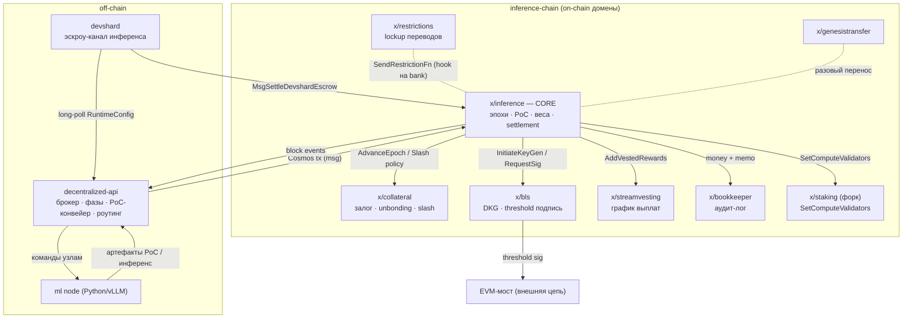

# Архитектура Gonka — взгляд через призму DDD

> **Слой репозитория:** `8a35022` · тег `v0.2.13-devshard-v2` · 2026-06-19
> **Источник:** [github.com/gonka-ai/gonka](https://github.com/gonka-ai/gonka) (склонировано в `repo/`)
> **Метод:** Domain-Driven Design — стратегический (Context Map, классификация поддоменов, Ubiquitous Language) и тактический (агрегаты, инварианты, доменные сервисы).

Этот документ — точка входа. Глубокие разборы вынесены в [`architecture/`](architecture/):

| Документ | Содержание |
|---|---|
| [00 · Единая карта системы](architecture/00-system-map.md) | 🗺️ Мастер-диаграмма всех компонентов и потоков + flow-схемы (власть, инференс, эпоха, devshard, мост). |
| [01 · Core: Proof of Compute](architecture/01-core-proof-of-compute.md) | Ядро домена. Эпохи, PoC 2.0, валидация инференса (SPRT), вес→консенсус. |
| [02 · Supporting contexts](architecture/02-supporting-contexts.md) | BLS-порог, collateral, streamvesting, restrictions, genesistransfer, bookkeeper. |
| [03 · Orchestration (dapi)](architecture/03-orchestration-dapi.md) | Off-chain оркестратор: broker, фазовый трекер, PoC-конвейер, инференс-роутинг. |
| [04 · Devshard (payment channel)](architecture/04-devshard-payment-channel.md) | Эскроу-канал для стримингового инференса. Заголовочная фича v0.2.13. |
| [05 · Экономика](architecture/05-economics.md) | Токеномика V2: bitcoin-эмиссия, collateral, vesting, динамическое ценообразование. |
| [06 · Каталог идей](architecture/06-ideas-catalog.md) | Переносимые инженерные идеи, извлечённые из кода. |
| [07 · ML-узел (Python)](architecture/07-mlnode-compute.md) | Математика PoC (расстояние на сфере), две реализации PoC, валидация, vLLM-сервинг, обучение. |
| [08 · Мост и протокол](architecture/08-bridge-and-protocol.md) | EVM-мост end-to-end (BLS-авторизация) + каталог proto-сообщений (Published Language). |
| [09 · Тесты и эволюция](architecture/09-testing-and-evolution.md) | Testermint, upgrade-каденция, судьба обучения (удалено в v0.2.12). |
| [10 · Глубокие механизмы](architecture/10-deep-mechanisms.md) | Динамическое ценообразование (EIP-1559), devshard gossip/recovery, genesis guardian (вето без контроля). |
| [11 · Продвинутые подсистемы](architecture/11-advanced-subsystems.md) | PoC-делегирование (N→1), анатомия апгрейда v0.2.12, bandwidth-лимитер (честная доля узла). |

> 🔍 **[REVIEW.md](REVIEW.md)** — состязательная верификация всех доков против кода: что подтверждено, 4 исправленные ошибки, непроверяемое.

---

## 1. Что такое Gonka (одним абзацем)

Gonka — децентрализованная инфраструктура для AI-инференса (и в перспективе обучения), построенная на форке Cosmos SDK. Её центральная идея — **Proof of Compute 2.0**: право голоса валидатора (consensus power) определяется *доказанной вычислительной мощностью GPU*, а не количеством застейканных токенов. «Бесполезная» работа классического PoW заменена на работу с трансформер-моделями, релевантную реальной нагрузке сети. Почти 100% вычислений уходят на AI-задачи, а не на охрану блокчейна. Сеть состоит из трёх типов узлов: **chain** (блокчейн/консенсус), **dapi** (off-chain оркестратор) и **ml node** (GPU-воркеры на Python/vLLM).

```
        Пользователь / Разработчик
                  │  OpenAI-совместимый HTTP
                  ▼
        ┌───────────────────────┐        gRPC/HTTP      ┌──────────────┐
        │  decentralized-api    │ ───────────────────►  │   ml node    │
        │  (dapi, оркестратор)  │ ◄───────────────────  │(PyTorch/vLLM)│
        └───────────┬───────────┘     артефакты PoC     └──────────────┘
                    │ Cosmos tx / events
                    ▼
        ┌───────────────────────┐
        │   inference-chain     │   форк Cosmos SDK + CometBFT
        │   (chain, консенсус)  │   власть = compute, не токены
        └───────────────────────┘
```

---

## 2. Стратегический дизайн: классификация поддоменов

DDD требует прежде всего отделить **то, что даёт конкурентное преимущество** (Core), от служебного (Supporting) и от заменяемого готовыми решениями (Generic).

| Поддомен | Тип | Где живёт | Почему так классифицирован |
|---|---|---|---|
| **Proof of Compute 2.0** (эпохи, веса, валидация инференса) | **Core** | `inference-chain/x/inference` | Это и есть Gonka. Уникальный механизм «compute = власть». |
| **Devshard** (эскроу-канал инференса) | **Core (растущий)** | `devshard/` + `x/inference/keeper/devshard_*` | Новое ядро монетизации: low-latency инференс без on-chain на каждый запрос. |
| **Off-chain оркестрация** (dapi) | **Core** | `decentralized-api/` | Связывает консенсус и GPU; вся «умная» логика выборки/верификации здесь. |
| **Collateral** (залог и слэшинг) | **Supporting** | `x/collateral` | Поддерживает экономику PoC, но это понятная финансовая механика. |
| **BLS threshold signing** (мост) | **Supporting** | `x/bls` | Криптографический сервис для cross-chain моста. |
| **Streamvesting** (вестинг наград) | **Supporting** | `x/streamvesting` | Экономический планировщик выплат. |
| **Restrictions** (lockup на bootstrap) | **Supporting** | `x/restrictions` | Временная политика на период запуска. |
| **Genesis transfer** (миграция founder-аккаунтов) | **Supporting** | `x/genesistransfer` | Одноразовая операционная нужда. |
| **Bookkeeper** (аудит-лог денег) | **Generic** | `x/bookkeeper` | Декоратор над `x/bank` ради структурного лога. |
| **Консенсус, банк, gov, group, staking** | **Generic (форкнутый)** | `cosmos-sdk` форк | Берётся готовым; правится только там, где требует PoC. |

**Ключевой архитектурный приём:** Cosmos SDK `x/staking` *перепрошит* так, чтобы `voting power = PoC score` (а не `tokens / PowerReduction`). `PowerReduction` снижен с 1 000 000 до 1, бондинг токенов обойдён, `Slash` не сжигает токены, а уменьшает абстрактную «compute power» и через хук уведомляет `x/collateral`, который и применяет реальный финансовый штраф. См. [01](architecture/01-core-proof-of-compute.md) и `docs/cosmos_changes.md`.

---

## 3. Context Map (карта ограниченных контекстов)



### Отношения между контекстами (язык DDD)

- **`x/inference` → спутниковые модули: Customer–Supplier с дирижированием.** Один «мастер-часовой» (`EndBlock` инференса) на границе эпохи явно дёргает кейперы collateral/bls/streamvesting/staking. Ошибки **соседних модулей** (collateral/vesting/BLS/compute-result) глушатся: эмитят `epoch_error`-событие и продолжают (`module.go:633,662,743`). ⚠️ Но сбой **ядра эпохи** (отсутствие params, `SetEffectiveEpochIndex`, `SetEpoch`/`CreateEpochGroup`) всё же `return err` и **валит цепь** (`module.go:385,474,491,500,507`) — отказоустойчивость распространяется только на соседей, не на саму стейт-машину.
- **dapi → chain: Conformist + ACL.** dapi подстраивается под модель цепи; каждый блок вытягивает `Params` цепи в свои кэши (`ConfigManager`) — цепь является единственным источником истины.
- **chain ↔ форк Cosmos SDK: Shared Kernel.** Изменения изолированы и задокументированы (`docs/cosmos_changes.md`), чтобы форк оставался поддерживаемым.
- **devshard → chain: Open Host Service.** Цепь предоставляет минимальный публичный протокол (открыть эскроу, рассчитаться с кворумом 2/3+1); вся «горячая» бухгалтерия — off-chain.
- **bls → EVM: Published Language.** Подписываемый payload кодируется в формате, понятном смарт-контракту моста (`keccak256`/`hashToG1`).

---

## 4. Главные архитектурные принципы (сквозные)

1. **Compute *и есть* stake.** PoC-вес → вес участника в Cosmos `x/group` → `ComputeResult.Power` → voting power в CometBFT. Реализуется через `SetComputeValidators` в форке.
2. **Один часовой — много исполнителей.** Вся синхронизация эпох сосредоточена в `x/inference` `EndBlock`; остальные модули — исполнители, вызываемые на границах фаз.
3. **Дисциплина детерминизма.** Любой «случайный» выбор (выборка валидаций, триггер confirmation-PoC, выбор сохраняемых узлов) — это `DeterministicFloat`/SHA-256 от сидов. Вся арифметика на `shopspring/decimal` или рядах Тейлора — **никогда `math.*` float** на пути консенсуса.
4. **On-chain только обязательства, данные — off-chain.** В цепь идут хеши, корни MMR, счётчики. Промпты, ответы, артефакты PoC живут off-chain с прунингом по эпохам, оставаясь верифицируемыми по корню.
5. **Экономика без перераспределения.** Слэш → gov-аккаунт; недополученные/обрезанные/просроченные награды → gov. Честные участники никогда не «доедают» чужие потери — доля вознаграждения предсказуема.
6. **Гибридная безопасность.** GPU-compute даёт *потенциальный* вес, но большую его часть нужно *активировать* залогом (`BaseWeightRatio = 0.2`), который слэшится за плохое поведение — Sybil/ленивость наказуемы.
7. **Эскроу-каналы для масштаба.** Devshard: пользователь — секвенсор, нонс = id инференса = ключ маршрутизации, хосты со-подписывают детерминированный state root, цепь трогается лишь дважды (открытие, расчёт).

---

## 5. Ubiquitous Language (главный глоссарий)

> Полный язык каждого контекста — в соответствующих файлах. Здесь — сквозные термины.

| Термин | Значение |
|---|---|
| **Epoch** | Период, в течение которого зафиксирован набор валидаторов. Размечается от `PocStartBlockHeight`. ~1 день в проде (40 блоков × ~5с... × длину). |
| **EpochContext** | Доменный сервис, превращающий относительные смещения `EpochParams` в абсолютные высоты блоков для каждой стадии. `types/epoch_context.go`. |
| **EpochGroup** | Обёртка над Cosmos `x/group` на эпоху: root-группа (все участники → валидаторы) + подгруппы по моделям. Носитель «внутренней» власти. |
| **Participant** | Хост сети (одна gonka-идентичность). Имеет статус ACTIVE/INACTIVE/INVALID/UNCONFIRMED. |
| **PoC (Proof of Compute)** | Доказательство вычислений на трансформере: нонсы + расстояния от выходов модели. Источник веса. |
| **Seed** | secp256k1-подпись участника на эпоху; off-chain из неё выводится детерминированный поток нонсов. |
| **Weight** | Вычислительный вес участника. *Potential* (из PoC) → *Effective* (база + активированное залогом). |
| **Consensus Power vs EpochGroup Power** | Две системы власти: первая — для CometBFT/gov (через staking), вторая — для внутренних операций (валидация PoC, распределение работы). |
| **Inference** | Единица AI-работы. Жизненный цикл STARTED→FINISHED→VALIDATED/INVALIDATED/EXPIRED. |
| **WorkCoins / RewardCoins** | Плата пользователя за инференс (не минтится) / субсидия эмиссии (минтится по весу). |
| **Settlement** | Расчёт по итогам эпохи: минт наград, распределение по весу, перевод остатков в gov. |
| **SPRT** | Sequential Probability Ratio Test (критерий Вальда) — статистическое выявление мошенника по потоку валидаций. |
| **Devshard / Escrow / Diff / Nonce** | Off-chain платёжный канал инференса; нонс = id инференса = ключ маршрутизации на хост `group[nonce % size]`. |
| **MMR (Merkle Mountain Range)** | Append-only аккумулятор артефактов PoC; в цепь коммитится только его корень. |

---

## 6. Карта кода → контекст (быстрый навигатор)

| Контекст | Главные пути (от `repo/`) |
|---|---|
| Ядро PoC / эпохи | `inference-chain/x/inference/module/module.go` (стейт-машина `EndBlock`), `.../chainvalidation.go` (веса), `.../types/epoch_context.go` |
| Экономика | `x/inference/keeper/{bitcoin_rewards,accountsettle,payment_handler,dynamic_pricing}.go` |
| Валидация инференса | `x/inference/calculations/{sprt,status,stats,stats_table}.go` |
| Власть консенсуса | `x/inference/epochgroup/epoch_group.go`, форк `cosmos-sdk x/staking/keeper/compute.go` |
| Залог | `x/collateral/` |
| BLS / мост | `x/bls/keeper/{dkg_initiation,phase_transitions,dispute_resolution,threshold_signing}.go` |
| Оркестратор | `decentralized-api/{broker,chainphase,poc,internal/event_listener,internal/server}` |
| Devshard | `devshard/{state/machine.go,state/hash.go,user/session.go,host/host.go}`, `x/inference/keeper/devshard_settlement.go` |

---

*Документ отражает слой `v0.2.13-devshard-v2`. Замеченные расхождения «документация ↔ код» зафиксированы в конце каждого тематического файла.*
