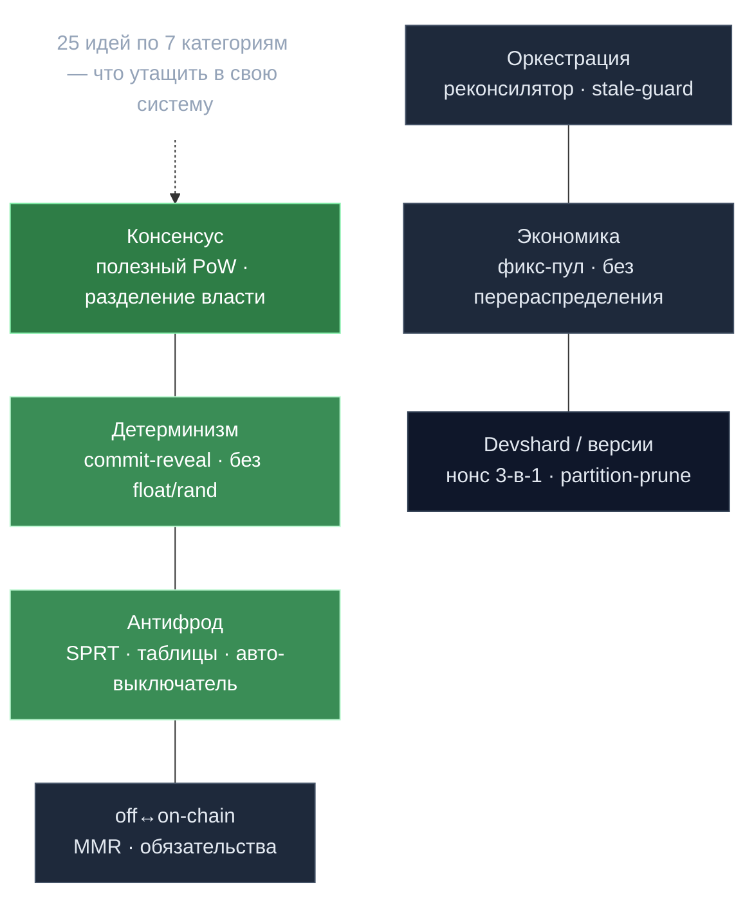

# 25 переносимых идей gonka

> **Суть:** что утащить из gonka в свою систему — независимо от того, строишь ли ты
> блокчейн. Каждая идея: формулировка → где в коде. Полный разбор —
> `/Volumes/Kingston/Agent/gonka/architecture/06-ideas-catalog.md`.

## 🗺️ Обзор

## 🧭 Консенсус и распределённость
1. **Полезный PoW** — если у сети уже есть дорогая полезная работа, сделай её самим
   механизмом Сивилл-устойчивости. → [[Proof of Compute 2.0 — власть есть вычисление]]
2. **Раздели «кто решает» и «кто рискует деньгами»** на два модуля, связанных хуком —
   меняются независимо. → `docs/cosmos_changes.md`
3. **Один часовой + пассивные исполнители** — централизуй тайминг, децентрализуй
   исполнение, делай межмодульные вызовы fault-tolerant. → [[Эпоха — главные часы сети]]
4. **Буфер активации** — закладывай явный лаг между «решено» и «вступило в силу», если
   исполнителям нужен прогрев. → `module.go (H+2)`

## 🎲 Детерминизм и верифицируемая случайность
5. **Никаких float/rand на пути консенсуса** — `decimal` + ряды Тейлора +
   `DeterministicFloat`. → [[Детерминизм — дисциплина консенсуса]]
6. **commit-secret-seed → act → reveal → re-verify** — непредсказуемость + аудируемость
   без доверенного рандома. → [[Сид — подпись как источник нонсов]]
7. **Свежий challenge-хеш** отдельно от сида работы — чтобы исполнитель не оптимизировал
   проверяемые куски. → `poc/proof_client.go`
8. **Детерминированный джиттер из идентификатора** заменяет центральное расписание
   (анти-thundering-herd). → `new_block_dispatcher.go:424`

## 📊 Статистика для антифрода
9. **SPRT вместо порога** — решение по серии событий с контролем ошибок и минимумом
   наблюдений. → [[SPRT — последовательный детектор мошенника]]
10. **Предвычисленные таблицы критических значений** для статтеста в hot-loop (×10⁴–10⁵).
    → `calculations/stats_table.go`
11. **Авто-выключатель наказания** при системном сбое (baseline-relative порог + кэп).
    → `CheckAndPunishForDowntime`
12. **Риск-ориентированный сэмплинг** — доверенных проверяй реже (вес ∝ 1/репутация).
    → `should_validate.go`

## 🔗 Граница off-chain ↔ on-chain
13. **В цепь — обязательства, данные — off-chain**, верифицируемые по корню. →
    [[Off-chain данные — on-chain обязательства]]
14. **MMR** для «элемент был в наборе на момент N» при постоянном добавлении. →
    `poc/artifacts/mmr.go`
15. **Ленивый Fisher-Yates** — выборка k из миллионов за O(k) без материализации. →
    `poc/proof_client.go`
16. **Структурные инварианты ловят грубый фрод** до дорогой проверки (дубль-нонсы,
    порозность). → `poc/proof_client.go`

## ⚙️ Оркестрация (Go-сервис)
17. **Декларативный реконсилятор** (intended vs current) вместо императивных команд. →
    [[Broker — декларативный реконсилятор узлов]]
18. **Stale-result guard** — финализируй результат, только если его цель ещё актуальна.
    → `broker/commands.go`
19. **Воркеры без общего состояния** — «одна горутина владеет состоянием, остальные шлют
    ей сообщения». → `broker/node_worker.go`
20. **Long-poll вместо поллинга** — near-real-time распространение без push-инфры. →
    `nodemanager/runtime_config_*.go`

## 💸 Транзакции и экономика
21. **Tx без account-sequence** (uniqueness через timestamp) → конкурентный broadcast.
    → `cosmosclient.go`
22. **Дефляция через фиксированный пул эмиссии** — рост не порождает инфляцию. →
    [[Bitcoin-награды — дефляция через фикс-пул]]
23. **Экономика без перераспределения** — потери виновных в gov, не соседям. →
    `accountsettle.go`

## 🧩 Devshard и версии
24. **Один счётчик — много ролей** (нонс = id + порядок + маршрут). →
    [[Нонс — тройной идентификатор]]
25. **State root + кворум = расчёт за одну tx**; **binary-версия ⊥ protocol-версия**;
    **партиция = единица прунинга**. → [[State root и кворум — расчёт за одну транзакцию]],
    [[Devshard — платёжный канал инференса]]

## Связи
- Точка входа: [[MOC — gonka]].
- Принципы-родители: [[Proof of Compute 2.0 — власть есть вычисление]],
  [[Детерминизм — дисциплина консенсуса]], [[Off-chain данные — on-chain обязательства]].
