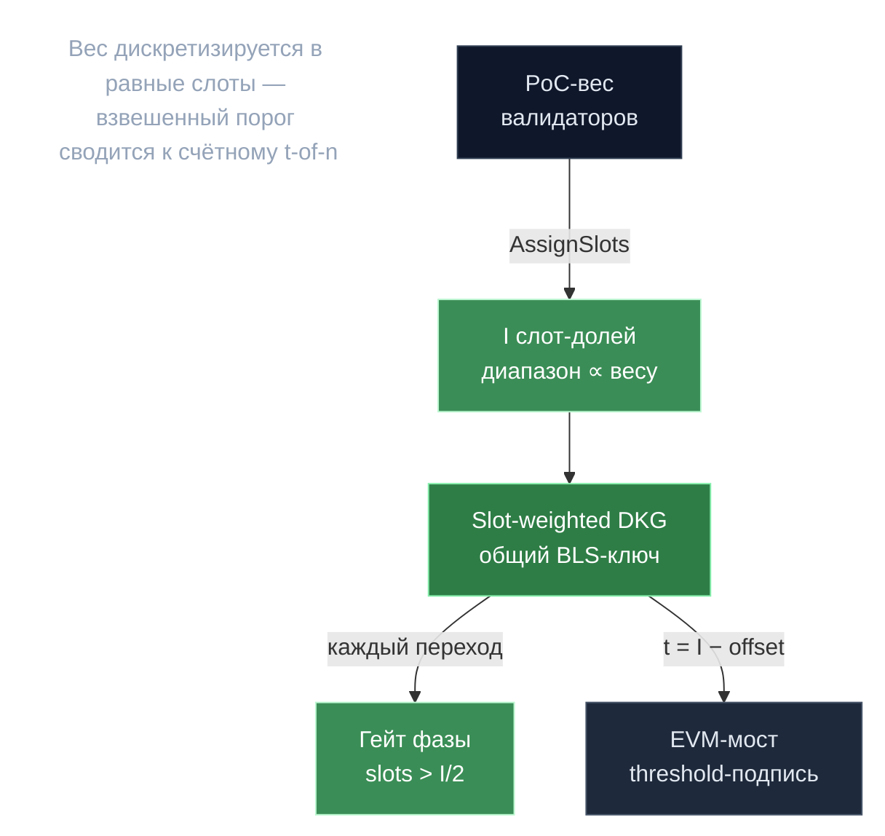

# BLS-порог — слот-взвешенный Shamir

> **Суть:** мосту в EVM нужна подпись, доказывающая согласие >50% веса валидаторов,
> но без единого приватного ключа (его кража = катастрофа). Решение: per-epoch DKG
> создаёт общий BLS-ключ, *секрета которого не держит никто*, и `t-of-n` пороговое
> подписание. Хитрость — **слот-взвешивание** сворачивает «взвешенный порог» в простой
> счётный.

## 🗺️ Обзор


## 💻 Код (`inference-chain/x/bls/keeper/phase_transitions.go:79`)
```go
// Check if we have sufficient participation (more than half the slots)
if slotsWithDealerParts > epochBLSData.ITotalSlots/2 {
    // Sufficient participation - transition to VERIFYING
    params, err := k.GetParams(ctx)
    // ...
    currentBlockHeight := ctx.BlockHeight()

    epochBLSData.DkgPhase = types.DKGPhase_DKG_PHASE_VERIFYING
    epochBLSData.VerifyingPhaseDeadlineBlock = currentBlockHeight + params.VerificationPhaseDurationBlocks
    // ...
}
```

## Слот-взвешенный VSS (главная идея)
Секрет шарится не «по валидаторам», а на `I` равных **слот-долей** (живой genesis:
`i_total_slots = 100`, offset `50`; в коде есть комментарий «прод 1000», но это
нереализованная цель — фактически 100). Валидатор владеет непрерывным диапазоном
слотов ∝ своему весу.
```
порог t = I − offset = 50  →  восстановление требует ≥51 слот-доли = >50% веса
```
> «t+1 слотов» автоматически означает «>50% веса» — **не нужен отдельный слой весов**.
> Дискретизируй вес в равные слоты, и взвешенные пороговые схемы становятся простыми.

## Для чего подпись (не beacon случайности)
1. **Межэпоховая цепочка доверия** — валидаторы *прошлой* эпохи заверяют групповой
   pubkey *новой* (→ `DKG_PHASE_SIGNED`).
2. **Мост** — `RequestThresholdSignature` подписывает Ethereum-совместимый payload
   (`abi.encodePacked → keccak256 → hashToG1`), релеер отправляет в EVM-контракт.

## Стейт-машина DKG (по высоте блока)
`DEALING → VERIFYING → DISPUTING → COMPLETED → SIGNED` (или `FAILED`). Каждый гейт
требует `slots > I/2`. Агрегат — `EpochBLSData` по эпохе.

## Три неочевидных решения
- **Анти-O(N²) газ:** dealer-части лежат под суб-ключами по отправителю → N-й дилер
  платит константный газ (чинит баг, где поздние дилеры «дорожали»).
- **Exclusion вместо slashing:** единственная санкция за нечестность — исключение из
  набора валидных дилеров, а не штраф. Дешевле, когда «плохой» просто не нужен.
- **Детерминированная адъюдикация спора on-chain:** обвинённый дилер публикует
  открытую долю + ECIES-seed; цепь *повторно шифрует* и побайтово сравнивает.
  Воспроизводимый арбитраж без доверенной стороны.

## Связи
- Откуда вес для слотов: [[Proof of Compute 2.0 — власть есть вычисление]].
- Кто инициирует DKG: [[Эпоха — главные часы сети]].
- Принцип воспроизводимости: [[Детерминизм — дисциплина консенсуса]].
