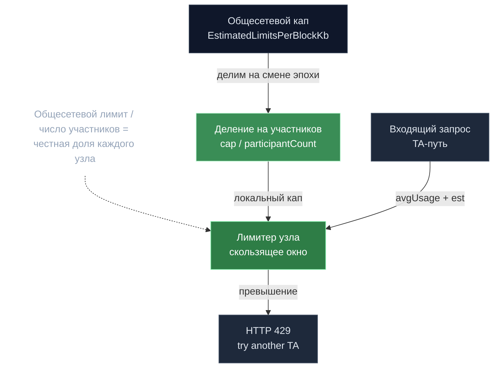

# Bandwidth limiter — честная доля узла

> **Суть:** Transfer-Agent узел не должен пере-подписать сеть запросами. Лимитер делит
> **общесетевой** лимит на число участников эпохи → каждый узел enforce'ит свою
> справедливую долю, и сумма локальных капов ≈ общему капу. Скользящее среднее, не
> token-bucket.

## 🗺️ Обзор


## 💻 Код (`decentralized-api/internal/bandwidth_limiter.go:202`)
```go
participantCount := uint64(len(epochGroupData.ValidationWeights))
if participantCount == 0 {
	return bl.defaultLimit, bl.defaultInferenceLimit
}

kbLimit := bl.defaultLimit / participantCount
inferenceLimit := bl.defaultInferenceLimit / participantCount
if inferenceLimit == 0 && bl.defaultInferenceLimit > 0 {
	inferenceLimit = 1 // Minimum of 1 inference per block per node
}
```

## ⚠️ Два РАЗНЫХ механизма под одним proto-struct
`BandwidthLimitsParams` обслуживает сразу:
1. **dapi-локальный лимитер** (эта заметка) — допуск входящих запросов на TA-пути.
2. **Чейн-сайд лимитер инвалидаций** (`ModelInferenceCountRollingWindowMap`) — сколько
   одновременных инвалидаций может держать валидатор. Совсем другое, on-chain.

## Алгоритм (per-node, in-memory)
```
windowSize = ExpirationBlocks + 1
avgUsage   = sum(usagePerBlock по окну) / windowSize
reject if avgUsage + estimatedKB/windowSize > limitsPerBlockKB
```
Два капа: KB (`estimatedKB = prompt·kbIn + maxTokens·kbOut`) и число in-flight. Учёт
размазан на блок завершения (`Record` при допуске, `defer Release` после) → фактически
лимитер concurrency на окне жизни запроса.

## Ключевая механика — деление на участников
```
limitsPerBlockKB      = EstimatedLimitsPerBlockKb / participantCount
maxInferencesPerBlock = MaxInferencesPerBlock     / participantCount   # min 1
```
Пересчёт на смене эпохи. TA не может локально открыть больше своей доли.

## Поведение
- Превышение → **HTTP 429** + «try another TA» (клиентский load-shedding, без авто-ретрая).
  Исполнительский путь лимитер **не** зовёт — только Transfer-Agent.
- ⚠️ **Оценка промпта = `len(text)`** (символы как прокси токенов!) — настоящий токенайзер
  есть, но в лимитер не подключён (он для эскроу позже).
- Дефолты: `estimated_limits_per_block_kb=10752`, `max_inferences_per_block=1000`, окно
  `ExpirationBlocks=20`. Тянутся в `ConfigManager` каждый блок.

> ⚠️ Расхождение: `max_inferences_per_block` в proto назван «chain-wide», но enforce'ится
> **per-node после деления** — чейн-сайд enforcement этого поля нет.

## Связи
- Где вызывается (TA-путь): [[Broker — декларативный реконсилятор узлов]] (общий dapi-контекст).
- Не путать с capacity ценообразования: [[Динамическое ценообразование — EIP-1559 по моделям]].
- Разбор: `architecture/11-advanced-subsystems.md` §C.
