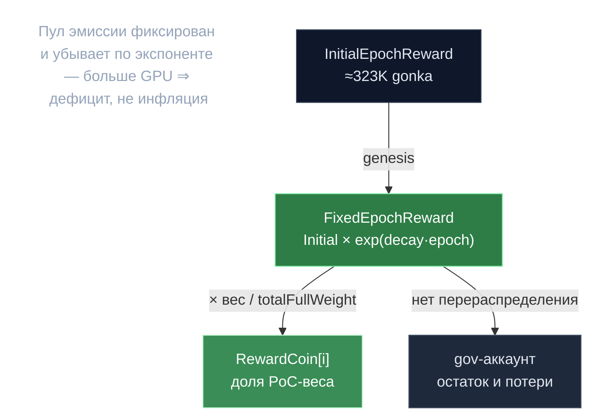

# Bitcoin-награды — дефляция через фикс-пул

> **Суть:** старая модель минтила субсидию ∝ объёму работы — рост сети раздувал
> инфляцию. V2 фиксирует **пул эмиссии на эпоху** (убывающий по экспоненте) и делит
> его по доле PoC-веса. Больше GPU ⇒ тот же пул на больше участников ⇒ дефицит
> вместо инфляции. Это «биткоин»-логика: фиксированный график, мягкий потолок.

## 🗺️ Обзор


## 💻 Код (`inference-chain/x/inference/keeper/bitcoin_rewards.go:131`)
```go
func CalculateFixedEpochReward(epochsSinceGenesis uint64, initialReward uint64, decayRate *types.Decimal) (uint64, error) {
    // ...
    initialRewardDecimal := decimal.NewFromUint64(initialReward)
    // Calculate decay exponent: decay_rate × epochs_elapsed
    decayRateDecimal := decayRate.ToDecimal()
    exponent, err := types.GetExponent(decayRateDecimal)
    // ...
    // Actual decay is exp(decay_rate)^epochsSinceGenesis
    expValue, err := exponent.PowInt32(int32(epochsSinceGenesis))
    // ...
    currentReward := initialRewardDecimal.Mul(expValue)
    return uint64(currentReward.IntPart()), nil
}
```

## Две монеты
| Монета | Источник | Распределение |
|---|---|---|
| **WorkCoins** | плата пользователя за инференс | 1:1, кто заработал |
| **RewardCoins** | свежий минт субсидии | по доле PoC-веса |

```
WorkFee     = (PromptTokens + ActualTokens) × UnitsOfComputePerToken × UnitOfComputePrice
RewardCoin[i] = (effectiveWeight_i / totalFullWeight) × FixedEpochReward
FixedEpochReward = InitialEpochReward × exp(DecayRate × epochsSinceGenesis)
```
- `InitialEpochReward` = **323 000 gonka/эпоха** (genesis; код 285K).
- `DecayRate` = **−0.000475** → халвинг ≈ каждые 4 года.
- Сходится к **680M gonka** (genesis; код 600M) — мягкий потолок со scale-down у предела.

## Критический инвариант — нет перераспределения
Знаменатель `totalFullWeight` **не** перенормируется после капа/инвалидации/простоя.
Любая «потерянная» доля (и остаток целочисленного деления) уходит в **gov-аккаунт**,
не соседям.

> Урок: не отдавай потери виновных честным — иначе доля награды непредсказуема и
> появляется стимул топить соседей. Один из [[25 переносимых идей gonka]].

## Два множителя против централизации
- **Бонус утилизации:** `1 + util × 0.5`.
- **Покрытие моделей:** полное ×1.2, частичное `1 + ratio × 0.1` — платят за
  обслуживание непопулярных governance-моделей.

## Гейты и графики
- **Downtime-гейт:** биномиальный тест miss-rate; провал обнуляет RewardCoins эпохи.
- **Кап власти** `MaxIndividualPowerPercentage=0.25` (послаблено для малых сетей).
- **Вестинг:** Work/Reward/Top-miner награды текут через `x/streamvesting` (180 эпох
  в проде), релиз по одной эпохе за раз — против dump-and-leave.

## Связи
- Откуда вес: [[Proof of Compute 2.0 — власть есть вычисление]].
- Финансовые штрафы: [[Гибридный вес — база плюс залог]].
- Когда происходит settlement: [[Эпоха — главные часы сети]].
