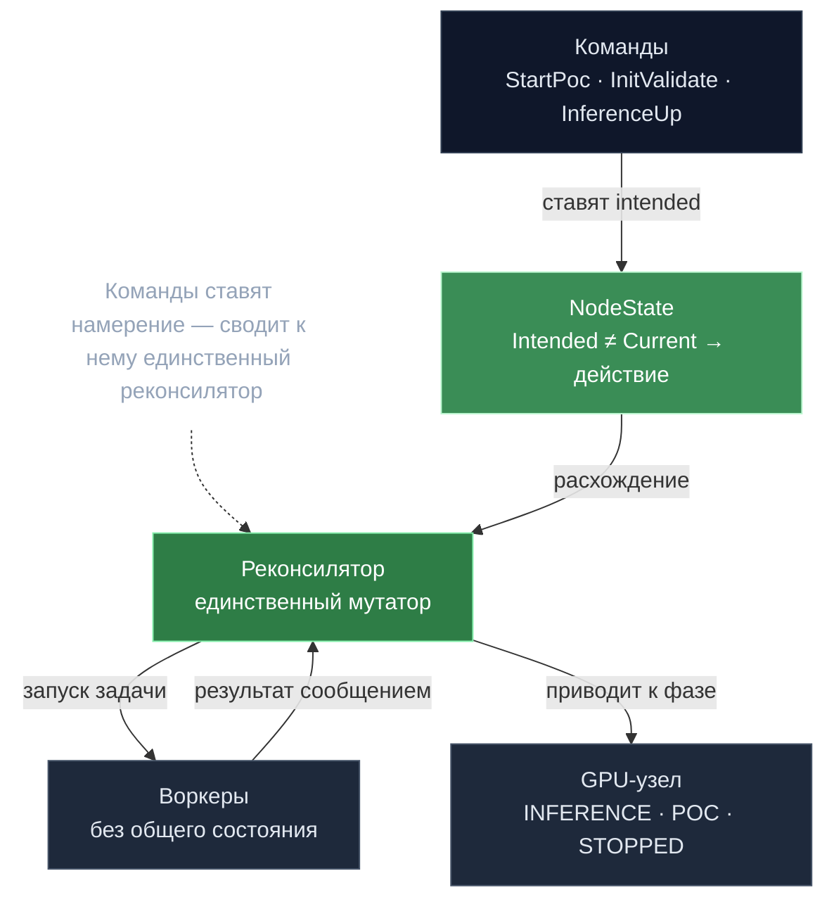

# Broker — декларативный реконсилятор узлов

> **Суть:** dapi не командует GPU-узлами императивно («сделай X сейчас») — это плодит
> гонки. Вместо этого внешние команды лишь **ставят намерение**, а единственный
> реконсилятор сводит фактическое состояние к желаемому. Паттерн k8s-controller для
> ML-узлов.

## 🗺️ Обзор


## 💻 Код (`decentralized-api/broker/broker.go:206`)
```go
type NodeState struct {
	IntendedStatus     types.HardwareNodeStatus `json:"intended_status"`
	CurrentStatus      types.HardwareNodeStatus `json:"current_status"`
	ReconcileInfo      *ReconcileInfo           `json:"reconcile_info,omitempty"`
	cancelInFlightTask func()

	PocIntendedStatus PocStatus `json:"poc_intended_status"`
	PocCurrentStatus  PocStatus `json:"poc_current_status"`
	// ...
}
```

## Intended vs Current
У каждого узла две пары статусов:
```
IntendedStatus / CurrentStatus       ∈ INFERENCE | POC | STOPPED | FAILED
PocIntendedStatus / PocCurrentStatus ∈ IDLE | GENERATING | VALIDATING
```
Команды (`StartPoc`, `InitValidate`, `InferenceUpAll`) меняют только *intended* и
триггерят реконсиляцию. Узлы приводятся к фазе сети ([[gonka — Жизненный цикл эпохи]]).

## Три приёма надёжности
1. **Реконсилятор — единственный мутатор.** Только он инициирует изменяющие действия:
   (а) отменяет устаревшие in-flight задачи, чьё намерение поменялось, (б) запускает
   новые там, где `current ≠ intended`.
2. **Воркеры без общего состояния.** Воркер исполняет команду и **возвращает результат
   сообщением** в единый процессор, а не пишет в общую память. «Одна горутина владеет
   состоянием» → нет блокировок (`node_worker.go`).
3. **Stale-result guard.** Результат финализируется, только если его `OriginalTarget`
   всё ещё совпадает с текущим намерением узла; иначе игнор — отменённые задачи не
   портят состояние (`commands.go`).

## Идемпотентные команды с шорткатом
`InferenceUp`/`StartPoC` сперва проверяют фактический статус ML-узла (вплоть до «нужная
модель загружена») и делают **no-op**, если цель достигнута — экономят редеплои.

## Две приоритетные очереди
`highPriority` (фазовые команды, cap 100) всегда предпочтительнее `lowPriority`
(локи инференса, cap 10000). Все ответы — через **буферизованные** каналы, чтобы
broker никогда не блокировался.

## Балансировка
`LockAvailableNode` берёт наименее загруженный (`LockCount`) узел, обслуживающий нужную
модель; `SkipNodeIDs` даёт ретрай на другом узле при сбое.

## Связи
- Что диктует фазу: [[gonka — Жизненный цикл эпохи]].
- Куда уходят результаты PoC: [[Off-chain данные — on-chain обязательства]].
- Сводка переносимых приёмов: [[25 переносимых идей gonka]].
