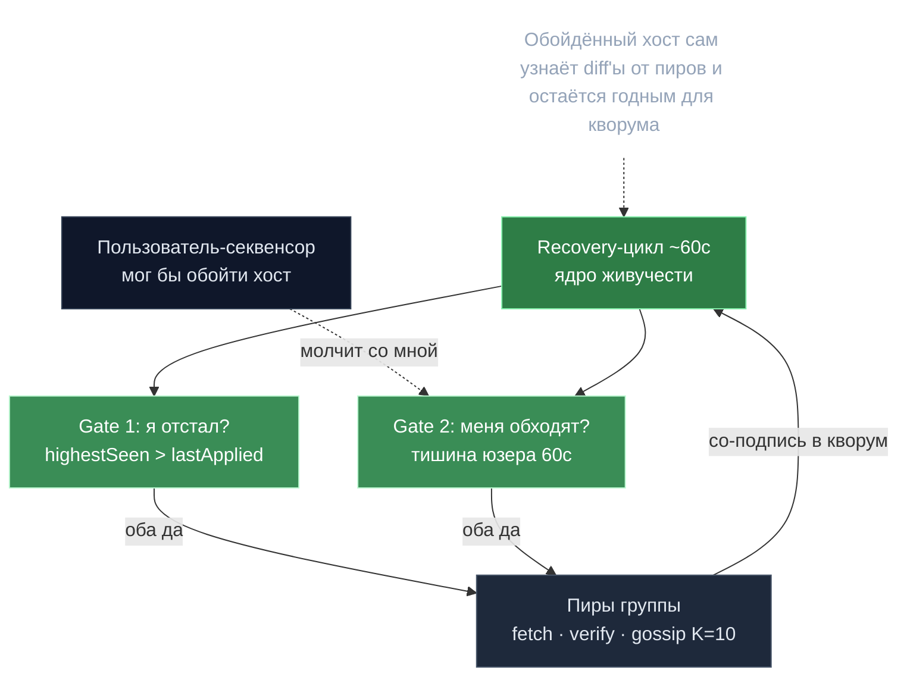

# Devshard gossip — живучесть при обходе

> **Суть:** пользователь — единственный секвенсор канала, и он мог бы «обойти» хост,
> чтобы лишить его доли. Gossip + recovery между хостами этого не дают: обойдённый хост
> сам узнаёт diff'ы от пиров, проверяет авторизацию юзера, подписывает и распространяет
> подпись — оставаясь годным для кворума 2/3+1.

## 🗺️ Обзор


## 💻 Код (`devshard/gossip/gossip.go:318`)
```go
if highestSeen <= lastAppliedNonce {
	return
}

// Only trigger recovery if we haven't received a user request recently.
if !lastReq.IsZero() && time.Since(lastReq) < recoveryDelay {
	return
}
// ...
diffs, err := fetcher.GetDiffs(ctx, lastAppliedNonce+1, highestSeen)
```

## Два канала
- **nonce-gossip** → `K=10` случайным пирам: `{Nonce, StateHash, StateSig, SlotID}`.
- **tx-broadcast** → всем (с дедупом): «устаревшие tx редки и критичны».

## Recovery-цикл (~60с) — ядро живучести
```
Gate 1: я отстал?    highestSeen > lastApplied ?
Gate 2: меня обходят? юзер НЕ говорил со мной последние 60с ?
если оба да:
  fetch  GetDiffs(lastApplied+1 .. highestSeen) у пира
  apply  ПРОВЕРИВ user-подпись над каждым diff (плохая → abort)
  sign   подписать state root своими слотами
  gossip разослать СВОИ подписи K пирам
```
> «Молчащий обойдённый хост» → «вносящий со-подписант» за ~60с. Пользователь **не может
> подавить улику** (она уходит к пирам) и **не может рассчитаться без 2/3+1**.

## Безопасность (две защиты + одна дыра)
- **Только члены группы** госсипят (юзер исключён) → 403 иначе.
- **stateSig обязан восстанавливаться в заявленный слот** до попадания в `seen` —
  защита от **отравления seen-map** (иначе вброс `(nonce, fakeHash)` спровоцировал бы
  ложную эквивокацию — детект «один нонс, разный хеш» → HTTP 409).
- ⚠️ **Открыто:** mempool gossip DoS (`ProposedAt=0`) — злой член вбрасывает невалидную
  tx → она мгновенно «устаревает» → все придерживают подписи → стоп сессии.

## Здоровье хоста — почему gossip-сбои не карают
- **Карантин** (`ParticipantRequestLimiter`) бьёт только по **инференс-пути** (429/503→60мин,
  прочее→30мин). Сбои **gossip/verify RPC игнорируются** — здоровый хост остаётся в
  ротации. Карантинному шлют **ghost-пробу** (нонс сжигается локально), чтобы
  маршрутизация `nonce % size` не разъехалась.
- Расчёт достигает даже карантинных хостов через `WithoutAdmission()`-клиент.

## Связи
- Что подписывают: [[State root и кворум — расчёт за одну транзакцию]].
- Зачем нонс маршрутизирует: [[Нонс — тройной идентификатор]].
- Контекст: [[Devshard — платёжный канал инференса]]. Разбор: `architecture/10-deep-mechanisms.md` §B.
