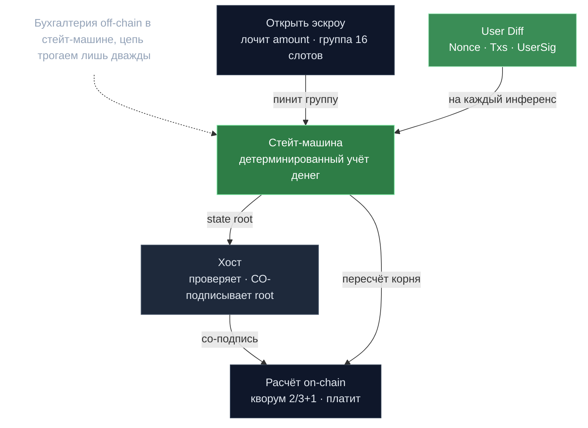

# Devshard — платёжный канал инференса

> **Суть:** прогонять каждый стриминговый инференс (секунды-минуты) через консенсус
> невозможно дорого. Devshard переносит **всю бухгалтерию off-chain** в детерминированную
> стейт-машину, а цепь трогает лишь дважды: открыть эскроу и рассчитаться. Это
> payment-channel, специализированный под метрируемый AI-compute. Заголовочная фича
> слоя `v0.2.13`.

## 🗺️ Обзор


## 💻 Код (`devshard/state/machine.go:697`)
```go
// Executor slot: group[inference_id % len(group)].SlotID
executorSlot := sm.state.Group[msg.InferenceId%uint64(len(sm.state.Group))].SlotID

// Reserve cost: (input_length + max_tokens) * token_price
reservedCost, err := tokenCost(msg.InputLength, msg.MaxTokens, sm.state.Config.TokenPrice)
if err != nil {
	return err
}
if sm.state.Balance < reservedCost {
	return types.ErrInsufficientBalance
}
sm.state.Balance -= reservedCost
```

## Учётный цикл
```
1. MsgCreateDevshardEscrow → лочит amount, пинит группу из 16 хост-слотов
2. Пользователь-секвенсор шлёт Diff{Nonce, Txs, UserSig, PostStateRoot} на каждый инференс
3. Локальная стейт-машина считает деньги (резерв → реальная стоимость → возврат излишка)
4. Хост проверяет, применяет, СО-ПОДПИСЫВАЕТ state root (или придерживает подпись)
5. MsgSettleDevshardEscrow → цепь пересчитывает корень, проверяет кворум 2/3+1, платит
```

## Три идеи, на которых держится
- **Пользователь — секвенсор**, а нонс — [[Нонс — тройной идентификатор]] (id инференса
  + порядок diff'а + ключ маршрутизации `group[nonce % 16]`).
- **Детерминированный state root + кворум подписей** = расчёт за одну tx вместо тысяч.
  См. [[State root и кворум — расчёт за одну транзакцию]].
- **Единственный рычаг хоста — придержать подпись.** Если пользователь хитрит, хост не
  подписывает → кворум не собрать → расчёт невозможен.

## Low-latency: спекулятивный прокси
Запрос — **растущий список попыток**. Т.к. нонс сам маршрутизирует на следующий хост,
fanout бесплатен: по таймауту/мгновенному fail стартует следующий хост; победитель —
первый, выдавший вывод. Так «host1 мёртв, host2 мёртв, host3 победил» работает само
(`cmd/devshardctl/speculative.go`).

## Хранилище и версии
- **Партиция = эпоха:** прунинг = DROP партиции / удаление файла, без VACUUM.
- **Два концепта версии:** binary-версия (кто может работать) ⊥ protocol-версия (что
  означает state root). Багфикс бампит первую, не вторую — несколько бинарей работают
  на общем хранилище.
- **Schema forward-only**, охраняется CI — старые бинари делят те же таблицы.

## Модель атак (кратко, `docs/attacks.md`)
| Атака | Защита |
|---|---|
| Исполнитель не работает | `ChallengeReceipt` после таймаута → возврат + `Missed++` |
| Пользователь не шлёт Finish | исполнитель придерживает state-подпись после `grace` нонсов |
| `StartedAt=0` манипуляция | дедлайн считается от `confirmed_at` (подписан исполнителем) |
| Отравление gossip | gossip только членам группы + проверка восстановления слота |

## Связи
- Ядро идеи маршрутизации: [[Нонс — тройной идентификатор]].
- Криптомеханика расчёта: [[State root и кворум — расчёт за одну транзакцию]].
- Параллель с PoC: [[Off-chain данные — on-chain обязательства]].
