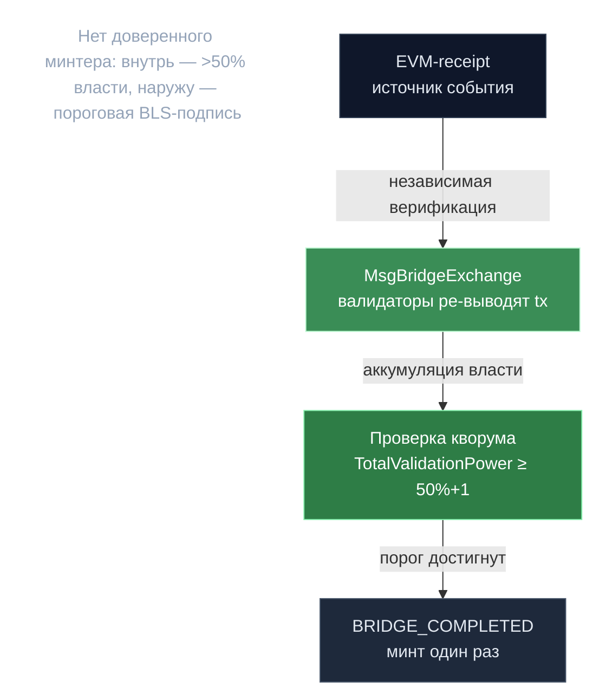

# EVM-мост — порог BLS авторизует

> **Суть:** мост между Gonka и EVM-цепями не имеет доверенного минтера. Операции
> наружу (Gonka→EVM) авторизует **пороговая BLS-подпись** живой эпохи валидаторов;
> операции внутрь (EVM→Gonka) требуют **>50% власти** валидаторов, каждый из которых
> независимо ре-выводит транзакцию из EVM-receipt. Та же DKG-группа, что и в консенсусе.

## 🗺️ Обзор


## 💻 Код (`inference-chain/x/inference/keeper/msg_server_bridge_exchange.go:172`)
```go
// Check if we have majority (50+% of total power)
requiredPower := (totalEpochPower / 2) + 1

if existingTx.TotalValidationPower >= requiredPower {
    // Only process completion once to avoid duplicate mints
    if existingTx.Status == types.BridgeTransactionStatus_BRIDGE_PENDING {
        existingTx.Status = types.BridgeTransactionStatus_BRIDGE_COMPLETED
        k.SetBridgeTransaction(ctx, existingTx)
        // Handle token minting for completed transaction
        if err := k.handleCompletedBridgeTransaction(ctx, existingTx); err != nil {
            // ...
        }
    }
}
```

## Две оси активов
- Нативный Gonka ↔ **WGNK** (ERC-20 от того же контракта, 9 знаков).
- EVM ERC-20/ETH ↔ обёрнутый **CW20** на Gonka.

## Контракт `BridgeContract` (он же WGNK)
- Стейт: `ADMIN_CONTROL` → `NORMAL_OPERATION` (владелец — мультисиг).
- Ключ BLS-группы на эпоху; **переходы последовательны** (`epochId==latest+1`), новый ключ
  подписан *прошлым* — криптографическая цепочка доверия.
- Проверка подписи — нативные прекомпайлы **BLS12-381 (EIP-2537)**.
- **Авто-burn:** перевод WGNK на адрес контракта сжигает токены — UX «увести обратно».

## Анти-подделка (две стороны)
| Сторона | Защита |
|---|---|
| **EVM→Gonka** | >50% власти; дедуп по содержимому `originChain_block_receiptIdx`; привязка к `receiptsRoot`; «content mismatch — potential attack» |
| **Gonka→EVM** | BLS-порог живой эпохи; per-epoch `processedRequests[epoch][reqId]` (анти-replay); двойная привязка chain-id + домен операции (`MINT/WITHDRAW_OPERATION`); таймаут 30 дней → `ADMIN_CONTROL` |

## Эскроу + авто-возврат
Нативные токены при mint-запросе **атомарно** уходят в модуль `bridge_escrow`; любой сбой
сборки подписи **откатывает** перевод. Если пороговая подпись провалилась
(`AfterThresholdSigningFailed` хук) — `ProcessAutoRefundForFailedBridgeOperation` вернёт
эскроу (mint) или **ре-минтит** обёрнутые токены (withdrawal).

## Релеер
Не отдельный процесс, а **форк Geth + Prysm** (`bridge/script.sh`): Geth с флагами
`--bridge.postblock` (POST'ит данные блока/депозита на цепь) и `--bridge.getaddresses`
(список адресов мостов для слежения).

> ⚠️ Доки контракта противоречат себе по размерам BLS-подписи/ключа — сверяться с
> реальным `BridgeContract.sol`, не с markdown.

## Связи
- Механика порога: [[BLS-порог — слот-взвешенный Shamir]].
- Кто запрашивает подпись (хуки): [[Эпоха — главные часы сети]].
- Полный разбор: `architecture/08-bridge-and-protocol.md`.
