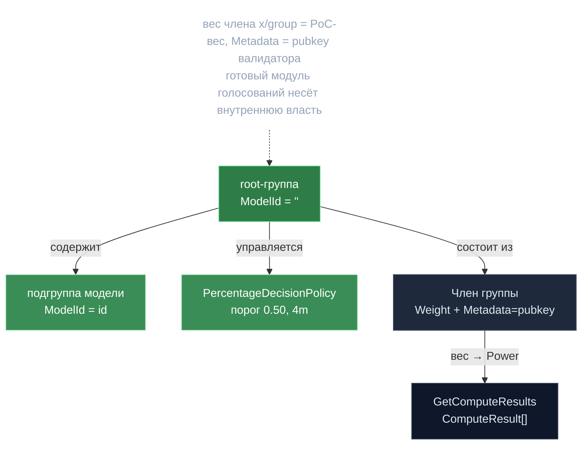

# EpochGroup — переиспользование x-group

> **Суть:** вместо собственной структуры «кто в эпохе и с каким весом» gonka
> переиспользует стандартный Cosmos-модуль `x/group`. Вес члена группы = его PoC-вес,
> а `Metadata` члена несёт ed25519-pubkey валидатора. Так готовый модуль голосований
> становится носителем «внутренней» власти сети.

## 🗺️ Обзор


## 💻 Код (`inference-chain/x/inference/epochgroup/epoch_group.go:398`)
```go
for _, member := range members {
    pubKeyBytes, err := base64.StdEncoding.DecodeString(member.Member.Metadata)
    // ...
    // The VALIDATOR key (ed25519), never to be confused with the account key
    pubKey := ed25519.PubKey{Key: pubKeyBytes}
    accAddr, err := sdk.AccAddressFromBech32(member.Member.Address)
    // ...
    valOperatorAddr := sdk.ValAddress(accAddr).String()
    computeResults = append(computeResults, keeper.ComputeResult{
        Power:           getWeight(member),
        ValidatorPubKey: &pubKey,
        OperatorAddress: valOperatorAddr,
    })
}
```

## Два уровня групп
| Группа | `ModelId` | Состав | Роль |
|---|---|---|---|
| **root** | `""` | все участники | источник набора валидаторов |
| **подгруппа модели** | id модели | кто поддерживает модель | распределение работы по модели |

Политика группы — фиксированный `PercentageDecisionPolicy("0.50", 4m)`: порог >50% по
весу для on-chain голосований об инвалидации/ревалидации инференса.

## Агрегат `EpochGroupData` (ключ `EpochIndex, ModelId`)
Сериализованное состояние эпохи-модели: `ValidationWeights[]`, `TotalWeight`,
`TotalThroughput`, `UnitOfComputePrice`, `ModelSnapshot`, `MemberSeedSignatures`.

**Инвариант:** сумма `ValidationWeights` = `TotalWeight`; членство синхронно
дублируется в `x/group` и в `ValidationWeights`.

## Два хака на стандартном модуле
1. **`Metadata` члена** = pubkey валидатора (поле «описание» используется как канал
   данных).
2. **`Metadata` группы** = dirty-флаг `"changed"/"unchanged"` — триггерит
   ре-бондинг через `SetComputeValidators` на блок позже наполнения.

> Это «внутренняя» (epoch-group) власть, не путать с «консенсусной» — см.
> [[Две системы власти — consensus и epoch-group]].

## Связи
- Кто наполняет группу: [[Эпоха — главные часы сети]].
- Куда уходит вес дальше: [[Proof of Compute 2.0 — власть есть вычисление]].
- Разница двух властей: [[Две системы власти — consensus и epoch-group]].
