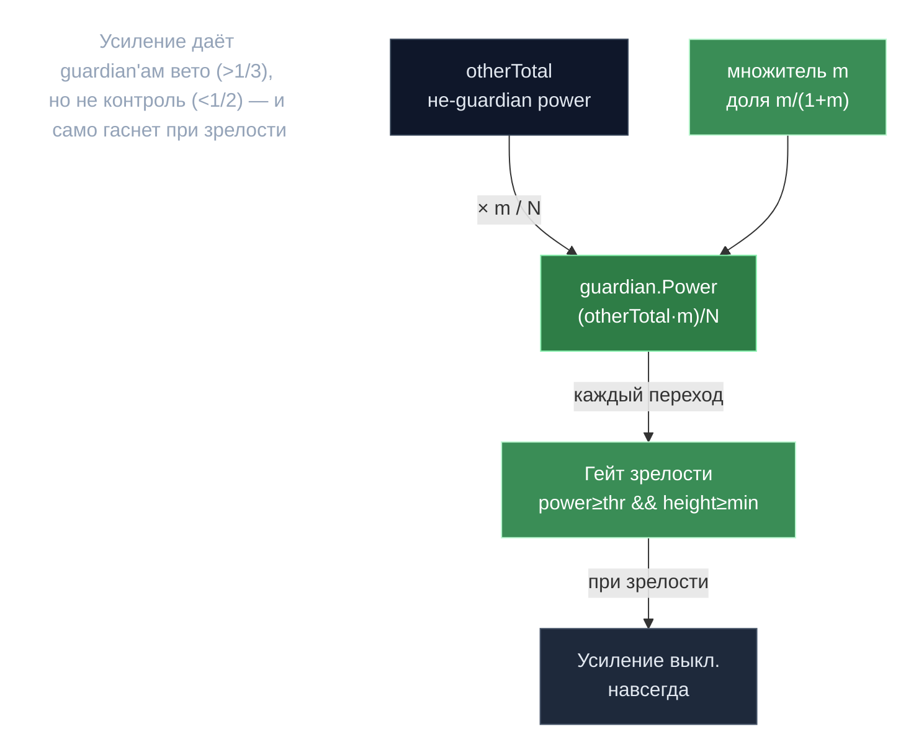

# Genesis Guardian — вето без контроля

> **Суть:** у молодой сети мало совокупной power, и кит мог бы быстро набрать >2/3
> и захватить цепь. Пока сеть «незрелая», 3 назначенных bootstrap-валидатора
> усиливаются ровно настолько, чтобы держать **>1/3** (право вето по BFT), но **<1/2 и
> <2/3** (не контроль). При зрелости усиление **само выключается** — без постоянной
> централизации.

## 🗺️ Обзор


## 💻 Код (`inference-chain/x/inference/module/genesis_guardian_enhancement.go:142`)
```go
// Calculate other participants' total power (excluding all guardians)
otherParticipantsTotal := totalNetworkPower - totalGuardianPower

// total_enhancement = other_participants_total * genesis_guardian_multiplier
multiplierDecimal := genesisGuardianMultiplier.ToDecimal()
otherParticipantsTotalDecimal := decimal.NewFromInt(otherParticipantsTotal)
totalEnhancementDecimal := otherParticipantsTotalDecimal.Mul(multiplierDecimal)

// per-guardian enhancement: total_enhancement / number_of_guardians
guardianCount := len(guardianIndices)
perGuardianEnhancementDecimal := totalEnhancementDecimal.Div(decimal.NewFromInt(int64(guardianCount)))
perGuardianEnhancement := perGuardianEnhancementDecimal.IntPart()
```

## Математика (выбор множителя `m`)
```
otherTotal = totalNetworkPower − totalGuardianPower          # только не-guardian power
guardian.Power = (otherTotal × m) / numGuardians            # поровну, ПЕРЕЗАПИСЬ
доля guardian'ов от нового тотала = m/(1+m)
```
Чтобы получить **вето** (>1/3): `m/(1+m) > 1/3` ⇒ `m > 0.5`. Поэтому genesis-`m=0.52`
≈ минимальный множитель, дающий вето без контроля (доля 34.2%, в коридоре BFT
`1/3 < 0.342 < 1/2 < 2/3`).

## ⚠️ Параметры эволюционировали (genesis ≠ слой v0.2.13)
| | Genesis | Действует на v0.2.13 |
|---|---|---|
| `m` | 0.52 | **0.33334** |
| доля guardian'ов | ~34.2% (вето) | **~25%** (уже не единоличное вето) |
| порог зрелости | 2M | **15M** |
| min-height | 0 | **3M** |

v0.2.13 снизил `m` до 25% и **одновременно** перенастроил кворум governance на 0.25/0.75
— guardian-VP теперь выровнен с консенсусным капом 0.25.

## Гейт зрелости (авто-выключение)
`InNetworkMature = power ≥ threshold && height ≥ minHeight`, проверяется **каждый переход
эпохи**. Height монотонен → при достижении зрелости усиление выключается **навсегда**.

## Второй механизм — слоты BLS DKG
Guardian'ам резервируется доля `m/(1+m)` слотов DKG. Порог реконструкции ключа
`t = ITotalSlots − offset` ⇒ **групповой BLS-ключ нельзя сформировать без guardian'ов** —
захваченное большинство не прогонит DKG в одиночку. (Третий, не про power: guardian'ы —
тай-брейкер валидации PoC.)

## Кто меняет
3 адреса `gonkavaloper...`. v0.2.7 перенёс адреса+порог+min-height в governance-`Params`
(меняются `MsgUpdateParams`), но `m` и флаг enabled остались в неизменяемых
`GenesisOnlyParams` — `m` меняется только апгрейдом (как сделал v0.2.13).

## Связи
- Куда идёт усиленная power: [[Две системы власти — consensus и epoch-group]].
- Механика слотов: [[BLS-порог — слот-взвешенный Shamir]].
- Капы власти: [[Гибридный вес — база плюс залог]]. Разбор: `architecture/10-deep-mechanisms.md` §C.
