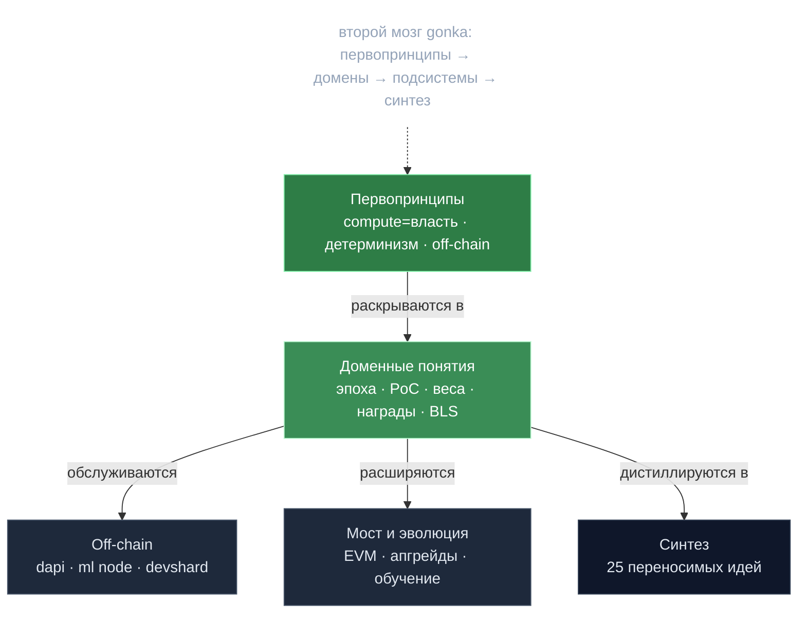

# 🗺️ MOC — gonka

> **Map of Content** — точка входа во «Второй мозг» по архитектуре `gonka`.
> Каждая заметка атомарна (одна идея) и связана `[[вики-ссылками]]`.
> Стиль: distill-from-first-principles (А. Карпати) — сначала *суть*, потом детали.

## 🎯 Одно предложение
`gonka` — децентрализованная AI-инфраструктура на форке Cosmos SDK, где
**право голоса валидатора равно доказанной вычислительной мощности GPU**, а не
застейканным токенам: «бесполезный» PoW заменён работой на трансформерах,
релевантной реальной нагрузке сети.

## 🗺️ Обзор

## 🧭 Навигация

### Головные заметки (архитектура)
- [[gonka — Контекстная карта]] — визуальная карта контекстов (mermaid) ⭐
- [[gonka — Жизненный цикл эпохи]] — таймлайн стадий эпохи (mermaid)

### Первопринципы (на чём держится всё)
- [[Proof of Compute 2.0 — власть есть вычисление]] ⭐
- [[Детерминизм — дисциплина консенсуса]]
- [[Off-chain данные — on-chain обязательства]]

### Доменные понятия (единый язык)
- [[Эпоха — главные часы сети]]
- [[EpochGroup — переиспользование x-group]]
- [[Две системы власти — consensus и epoch-group]]
- [[SPRT — последовательный детектор мошенника]]
- [[Гибридный вес — база плюс залог]]
- [[Bitcoin-награды — дефляция через фикс-пул]]
- [[BLS-порог — слот-взвешенный Shamir]]

### Off-chain оркестрация (dapi)
- [[Broker — декларативный реконсилятор узлов]]

### ML-узел (где реально считается compute) 🆕
- [[PoC-движок — расстояние на сфере]] ⭐
- [[Хеш в случайную модель — pool-трюк]]
- [[Две реализации PoC — v1 и v2]]

### Devshard (платёжный канал)
- [[Devshard — платёжный канал инференса]] ⭐
- [[Нонс — тройной идентификатор]]
- [[State root и кворум — расчёт за одну транзакцию]]

### Мост и эволюция 🆕
- [[EVM-мост — порог BLS авторизует]]
- [[Testermint — спецификация инвариантов]]
- [[Обучение — построено и удалено]] ⚠️

### Глубокие механизмы 🆕
- [[Динамическое ценообразование — EIP-1559 по моделям]]
- [[Devshard gossip — живучесть при обходе]]
- [[Genesis Guardian — вето без контроля]]

### Продвинутые подсистемы 🆕
- [[PoC-делегирование — N к 1 передача веса]]
- [[Анатомия апгрейда — миграция в хендлере]]
- [[Bandwidth limiter — честная доля узла]]

### Синтез
- [[25 переносимых идей gonka]] — что утащить в свою систему

> 🔍 **Review точности** (доки↔код, 4 исправленные ошибки): `/Volumes/Kingston/Agent/gonka/REVIEW.md`

## 🧩 Три первопринципа (TL;DR)
1. **Compute = stake.** PoC-вес → вес в Cosmos `x/group` → voting power CometBFT
   через форкнутый `SetComputeValidators`. См. [[Proof of Compute 2.0 — власть есть вычисление]].
2. **Один часовой — много исполнителей.** Вся синхронизация эпох в одной
   стейт-машине `EndBlock`; соседние модули — пассивные исполнители. Сбой соседа
   не валит цепь. См. [[Эпоха — главные часы сети]].
3. **Цепь хранит обязательства, не данные.** On-chain — хеши/корни/счётчики;
   промпты/артефакты off-chain, верифицируемы по корню. См.
   [[Off-chain данные — on-chain обязательства]].

## 📍 Источники
- Код: `/Volumes/Kingston/Agent/gonka/repo/**`
- Полный разбор (длинные доки): `/Volumes/Kingston/Agent/gonka/ARCHITECTURE.md` + `architecture/01..06`
- Узлы сети: `chain` (`inference-chain/`), `dapi` (`decentralized-api/`), `ml node` (Python/vLLM, внешний репо)
