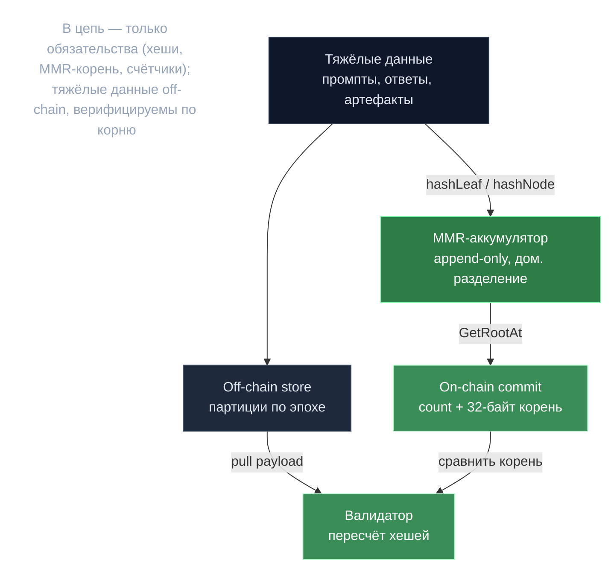

# Off-chain данные — on-chain обязательства

> **Суть:** прогонять промпты, ответы и артефакты PoC через консенсус — невозможно
> дорого. Поэтому в цепь идут только **криптографические обязательства** (хеши,
> корни MMR, счётчики), а тяжёлые данные живут off-chain с прунингом, оставаясь
> верифицируемыми по корню. Принцип «доверяй, но проверяй по корню».

## 🗺️ Обзор


## 💻 Код (`decentralized-api/poc/artifacts/mmr.go:14`)
```go
func hashLeaf(data []byte) []byte {
    h := sha256.New()
    h.Write([]byte{leafPrefix}) // 0x00 domain separation
    h.Write(data)
    return h.Sum(nil)
}

func hashNode(left, right []byte) []byte {
    h := sha256.New()
    h.Write([]byte{internalPrefix}) // 0x01 domain separation
    h.Write(left)
    h.Write(right)
    return h.Sum(nil)
}
```

## Что где живёт
| Данные | On-chain | Off-chain |
|---|---|---|
| PoC-артефакты | `count` + 32-байтный MMR-корень (`PoCV2StoreCommit`) | `poc/artifacts/store.go` |
| Промпт + ответ инференса | `PromptHash`, `ResponseHash` | `payloadstorage/` (по `inferenceId,epochId`) |
| Метрики инференса | — | `statsstorage/` (аналитика) |
| Сессия devshard | state root при расчёте | [[State root и кворум — расчёт за одну транзакцию]] |

## MMR — append-only аккумулятор (`poc/artifacts/mmr.go`)
- Доменное разделение: `hashLeaf=SHA256(0x00‖data)`, `hashNode=SHA256(0x01‖L‖R)`.
- `GetRootAt(count)` — корень для любого исторического среза.
- O(log n) доказательства; crash-recovery пересборкой из append-only файла.

> Когда нужно доказать «элемент X был в наборе на момент N» при постоянном
> добавлении — MMR лучше перестраиваемого Merkle-дерева.

## Как ловят лгущего исполнителя
Валидатор тянет payload из off-chain хранилища и **пересчитывает хеши** против
on-chain коммитмента. Не совпало ⇒ немедленная инвалидация
(`internal/validation/payload_retrieval.go`). Дешёвые структурные проверки до
дорогой статистики: дубль-нонсы и «порозность» (`maxNonce/count ≥ 100`) = фрод.

## Прунинг как удаление партиции
Off-chain хранилища партиционированы по эпохе: устаревание = DROP партиции (Postgres)
или удаление файла (SQLite per-epoch), без построчного DELETE. См. devshard
[[Devshard — платёжный канал инференса]].

## Связи
- Что коммитится во время PoC: [[gonka — Жизненный цикл эпохи]].
- Параллель в devshard: [[State root и кворум — расчёт за одну транзакцию]].
- Почему пересчёт детерминирован: [[Детерминизм — дисциплина консенсуса]].
