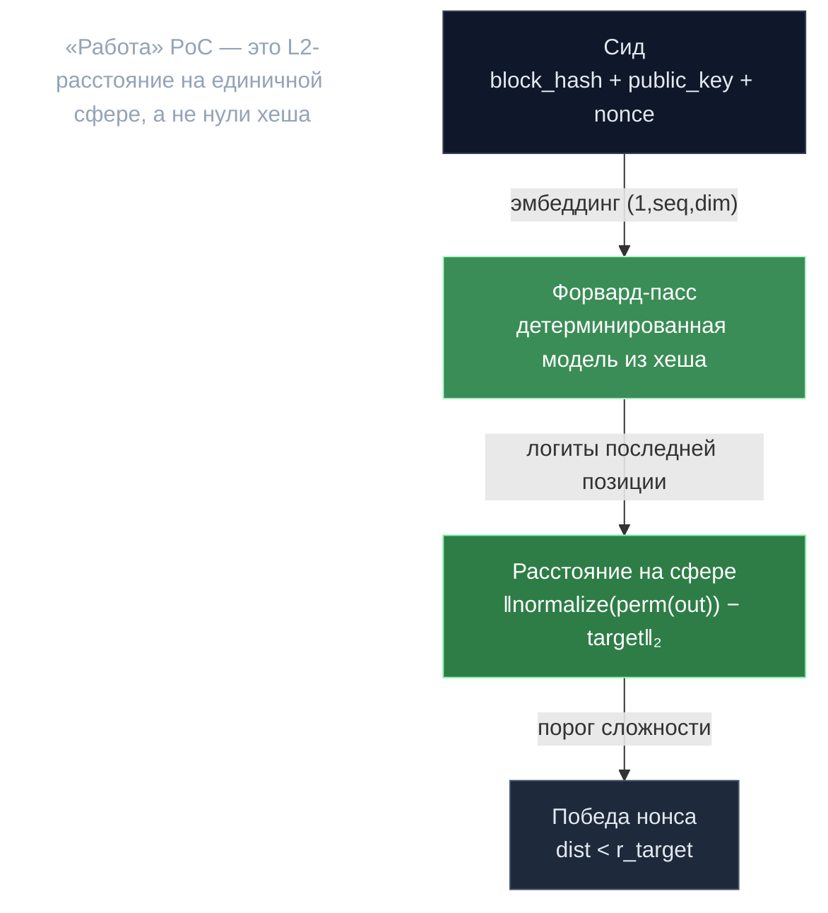

# PoC-движок — расстояние на сфере

> **Суть:** «работа» в Proof of Compute — это не поиск ведущих нулей хеша (устаревший
> эскиз в `description.md`), а **геометрия на единичной сфере**. Выход трансформера для
> нонса нормируется на сферу и сравнивается по евклидову расстоянию с target-вектором,
> выведенным из хеша блока. Сложность — непрерывный радиус, а не число нулей.

## 🗺️ Обзор


## 💻 Код (`mlnode/packages/pow/src/pow/compute/compute.py:172`)
```python
with self.stats.time_stats.time_process():
    outputs = outputs / np.linalg.norm(outputs, axis=1, keepdims=True)
    distances = np.linalg.norm(
        outputs - target,
        axis=1
    )
    batch = ProofBatch(
        public_key=public_key,
        block_hash=self.block_hash,
        # ...
        dist=distances,
        node_id=self.node_id,
    )
```

## Алгоритм (на один нонс)
```
1. нонс → сид f"{block_hash}_{public_key}_nonce{nonce}" → входной эмбеддинг (1,seq,dim) fp16
2. форвард-пасс модели → логиты последней позиции outputs[:,-1,:]
3. перестановка (сид f"..._nonce_{nonce}_permutations") + L2-нормировка на сферу
4. dist = ‖normalized − target‖₂            # target: сид f"{block_hash}_target"
5. нонс «победил», если dist < r_target      # r_target — ручка сложности
```
`ProofBatch = {public_key, block_hash, block_height, nonces[], dist[], node_id}`.

## Почему это честный PoW
- Чтобы узнать `dist` нонса — **обязателен форвард-пасс**; срезать нельзя.
- Результат **детерминирован** при данном железе (см. [[Детерминизм — дисциплина консенсуса]]).
- **Привязка к идентичности:** сид включает `public_key` → чужие артефакты под другим
  ключом дают полное несовпадение → фрод.

## Валидация — биномиальный тест, а не равенство
Модели недетерминированны на уровне fp16, поэтому сравнивать «точь-в-точь» нельзя.
Валидатор пересчитывает `dist` тех же нонсов и считает mismatch'и, затем:
```python
p = binomtest(k=mismatch, n=batch, p=5e-4, alternative='greater').pvalue
fraud = p < fraud_threshold
```
> «При базовом шуме железа (5e-4) — насколько вероятно столько mismatch'ей у честного
> узла?» Толерантно к fp16-шуму, ловит систематически-неверных. **Порозности/KS в живом
> пути нет.**

## Связи
- Как из хеша берётся модель: [[Хеш в случайную модель — pool-трюк]].
- Это v1; чем отличается v2: [[Две реализации PoC — v1 и v2]].
- Что доказывает вес: [[Proof of Compute 2.0 — власть есть вычисление]].
- Откуда сид: [[Сид — подпись как источник нонсов]].
