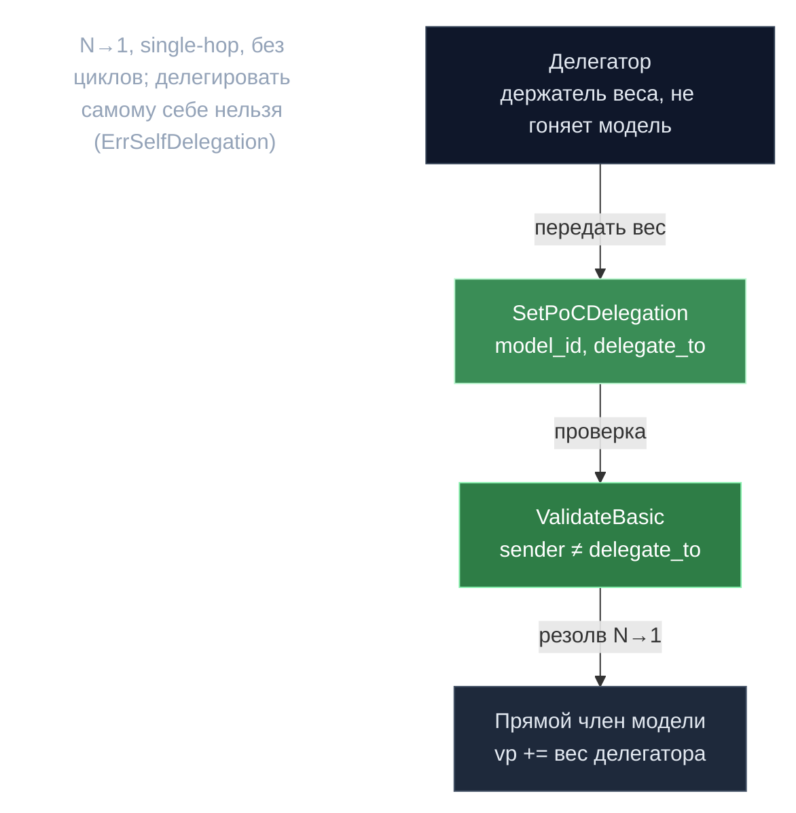

# PoC-делегирование — N к 1 передача веса

> **Суть:** в мульти-модельном PoC прямой член модельной группы — только тот, кто реально
> гоняет модель. Держатель веса прошлой эпохи, не запускающий модель, иначе считается
> **воздержавшимся** (против принятия по >2/3). Делегирование передаёт его consensus-вес
> прямому члену, чтобы модель добрала кворум.

## 🗺️ Обзор


## 💻 Код (`inference-chain/x/inference/types/message_poc_delegation.go:22`)
```go
if msg.DelegateTo != "" {
    if _, err := sdk.AccAddressFromBech32(msg.DelegateTo); err != nil {
        return errorsmod.Wrapf(sdkerrors.ErrInvalidAddress, "invalid delegate_to address (%s)", err)
    }
    if msg.Sender == msg.DelegateTo {
        return errorsmod.Wrap(ErrSelfDelegation, "sender cannot delegate to self")
    }
}
```

## Три взаимоисключающих сообщения (last-write-wins)
На `(model_id, participant)` в любой момент максимум одно из:
| Msg | Кто | Смысл |
|---|---|---|
| `SetPoCDelegation{model_id, delegate_to}` | делегатор | передать вес (пусто = очистить; самому себе нельзя) |
| `RefusePoCDelegation{model_id}` | принимающий | «не принимаю делегирование» |
| `DeclarePoCIntent{model_id}` | заявитель | «намерен делать PoC» (bootstrap-модель) |

Любое новое стирает два других.

## N→1, single-hop, без циклов
- **N→1:** многие делегируют одному; **один target на (model, делегатор)** (split нет).
- **Single-hop:** если target сам прямой член — **DIRECT приоритетнее**, его запись делегирования игнорируется. Если target не член — делегирование резолвится в **ModeNone** (штраф за неучастие). Циклы структурно невозможны.

## Потоки веса
- **Per-model voting power** стекается аддитивно: `vp[target] += финальныйВес[делегатор]`. Кап
  `max_model_voting_power_percentage`: превышение **сжигается, не перераспределяется**
  (иначе тихо переназначили бы доверие делегатора).
- **Consensus weight** напрямую не формируется делегированием — только через штраф-перенос.

## Штрафы (аддитивный аккумулятор, кап 1.0)
REFUSE → `+refusal_penalty`; NONE → `+no_participation_penalty`; DELEGATE → перенос
`delegation_share·вес` к target (клампится остатком — сохранение веса). Суммируются по
моделям, `min(1.0)`.

> ⚠️ **Слой АКТИВЕН с v0.2.12** (поправка после review): апгрейд ставит ненулевые
> `DelegationParams` (0.1 / 0.15 / 0.05 / CapFactor 0.75 / VP-cap 0.3). Откладываться может
> лишь применение штрафов до per-model `penalty_start_epoch`. См.
> [[Анатомия апгрейда — миграция в хендлере]].

## Жизненный цикл (ловушка)
Снимок на `poc_validation_start`. **Refusals/intents удаляются каждую эпоху** (одноразовые,
слать заново). **Делегирования СТОЯТ** до явной очистки. → стоящее делегирование к
выбывшему участнику превращается в **штраф**, а не no-op.

## Связи
- Куда стекается VP: [[EpochGroup — переиспользование x-group]].
- Зачем >2/3 по модели: [[Proof of Compute 2.0 — власть есть вычисление]].
- Две власти: [[Две системы власти — consensus и epoch-group]]. Разбор: `architecture/11-advanced-subsystems.md` §A.
