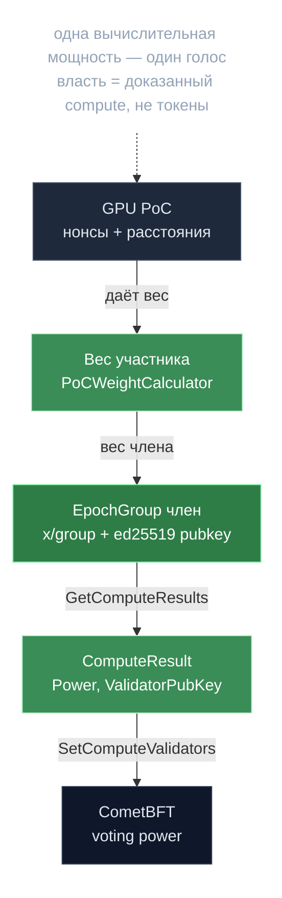

# Proof of Compute 2.0 — власть есть вычисление

> **Суть:** в классическом PoW узлы жгут энергию на бессмысленные хеши ради защиты
> цепи. Gonka заменяет это работой на **трансформер-моделях**, релевантной реальной
> нагрузке. Сколько полезных вычислений узел произвёл — столько у него и власти.
> Принцип «одна вычислительная мощность — один голос» вместо «один токен — один голос».

## 🗺️ Обзор


## 💻 Код (`inference-chain/x/inference/module/module.go:548`)
```go
// Intentionally operates on the previous epoch's group here; the new group
// triggers SetComputeValidators on the next block. See activation note above.
if currentEpochGroup.IsChanged(ctx) {
    computeResult, err := currentEpochGroup.GetComputeResults(ctx)
    if err != nil {
        am.LogError("Unable to get compute results", types.EpochGroup, "error", err.Error())
        return nil
    }
    // Apply early network protection if conditions are met
    finalComputeResult := am.applyEarlyNetworkProtection(ctx, computeResult)
    _, err = am.keeper.Staking.SetComputeValidators(ctx, finalComputeResult, testenv.IsTestNet())
    // ...
    currentEpochGroup.MarkUnchanged(ctx)
}
```

## Цепочка превращения compute → consensus power
```
GPU считает PoC (нонсы + расстояния от выходов модели)
   → PoCWeightCalculator.Calculate() → ActiveParticipant.Weight
      → вес члена в Cosmos x/group (Metadata = ed25519 pubkey валидатора)
         → ComputeResult{Power, ValidatorPubKey, OperatorAddress}
            → Staking.SetComputeValidators (форк) → voting power в CometBFT
```
Ключ: `voting power = PoC Power напрямую`, минуя `MaxValidators` и **бондинг токенов**
(`epoch_group.go:390-422`).

## Что пришлось перешить в Cosmos SDK (`docs/cosmos_changes.md`)
| Изменение | Зачем |
|---|---|
| `DefaultPowerReduction: 1_000_000 → 1` | любой ненулевой «вес» = ненулевая власть |
| `Delegate` пропускает движение токенов для PoC-валидаторов | бондинга нет вообще |
| `TotalBondedTokens` суммирует поля власти валидаторов | банк не источник власти |
| `Slash` не сжигает токены, а уменьшает абстрактную власть + **хук** | реальный штраф применяет [[Гибридный вес — база плюс залог\|x/collateral]] |

> Это и есть главная архитектурная идея: **разделить «кто решает» (консенсус) и «кто
> рискует деньгами» (collateral)** на два модуля, связанных хуком.

## Защита от накрутки
- **Нормализация по времени:** `claimedWeight = Count × timeNormalizationFactor` —
  ранний старт не даёт преимущества.
- **Confirmation PoC:** случайное среди-эпохи перепрувание ловит тех, кто выиграл
  вес и перестал обслуживать; может только *понизить* вес.
- **Супербольшинство 2/3** при приёме PoC + единогласие guardian'ов как тай-брейк.

## Связи
- Как это размечено во времени: [[gonka — Жизненный цикл эпохи]].
- Две разные «власти»: [[Две системы власти — consensus и epoch-group]].
- Откуда берётся непредсказуемость: [[Сид — подпись как источник нонсов]].
- Почему результат детерминирован: [[Детерминизм — дисциплина консенсуса]].
