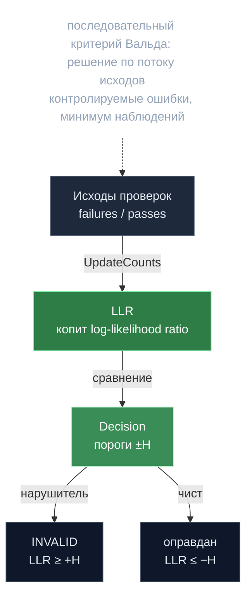

# SPRT — последовательный детектор мошенника

> **Суть:** корректность AI-выходов нельзя проверить «равенством» — модели
> недетерминированны. Поэтому каждый инференс выборочно переисполняется, а решение
> «честный / мошенник» по потоку исходов принимает **последовательный критерий
> Вальда (SPRT)** — с контролируемыми ошибками и минимумом наблюдений.

## 🗺️ Обзор


## 💻 Код (`inference-chain/x/inference/calculations/sprt.go:25`)
```go
// UpdateCounts applies a batch: `failures` and `passes` since last call.
// LLR += failures*logFail + passes*logPass
func (s SPRT) UpdateCounts(failures, passes int64) SPRT {
    if failures != 0 {
        s.LLR = s.LLR.Add(s.logFail.Mul(decimal.NewFromInt(failures)))
    }
    if passes != 0 {
        s.LLR = s.LLR.Add(s.logPass.Mul(decimal.NewFromInt(passes)))
    }
    return s
}

// Decision uses symmetric thresholds ±H
func (s SPRT) Decision() Decision {
    if s.LLR.GreaterThanOrEqual(s.H) {
        return Fail // favor H1 (reject H0)
    }
    if s.LLR.LessThanOrEqual(s.H.Neg()) {
        return Pass // favor H0
    }
    return Undetermined
}
```

## Как работает (`calculations/sprt.go`)
Копится log-likelihood ratio:
```
LLR += failures · ln(p1/p0) + passes · ln((1-p1)/(1-p0))
решение:  LLR ≥ +H → нарушитель ;  LLR ≤ −H → оправдан ;  иначе — ещё выборка
```
Два независимых SPRT на участника:
| SPRT | H0 (хороший) | H1 (плохой) | Вердикт |
|---|---|---|---|
| **Invalidation** | `FalsePositiveRate` | `BadParticipantInvalidationRate=0.20` | INVALID |
| **Inactivity** | низкий простой | высокий простой | INACTIVE |

Порог `H = 4`. Плюс «триппроволока»: подряд идущие отказы при
`FalsePositiveRate^N < 1e-6` → мгновенный INVALID.

## Две оптимизации горячего пути
1. **Биномиальный тест по таблицам.** Критические значения предрассчитаны (ключи ‰:
   50/100/200/300/400/500) → O(log n), zero-alloc вместо точного `decimal`
   (ускорение ~10⁴–10⁵×). `criticalK = floor(n·p0 + z·√(n·p0·(1−p0)))`, z=1.6448.
   `stats_table.go`, `docs/binom-stattest.md`.
2. **Детерминизм без float** — ряды Тейлора для `exp` (см.
   [[Детерминизм — дисциплина консенсуса]]).

## Авто-выключатель против ложных срабатываний
Порог простоя динамический: базовый сетевой miss-rate + маржа, с кэпом (500‰). При
сетевом outage наказание **само отключается** — не карает всех за общую беду.

## Что теряет пойманный
INVALID/INACTIVE «липкие» в эпохе → слэш залога 10–20% + обнуление наград + падение
веса. См. [[Гибридный вес — база плюс залог]].

## Связи
- Как выбираются инференсы на проверку: [[Сид — подпись как источник нонсов]].
- Финансовые последствия: [[Гибридный вес — база плюс залог]].
- Почему всё детерминировано: [[Детерминизм — дисциплина консенсуса]].
