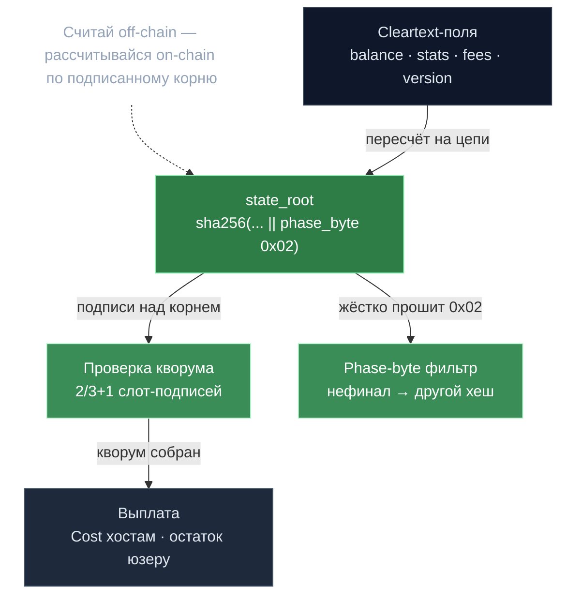

# State root и кворум — расчёт за одну транзакцию

> **Суть:** как доказать цепи итог тысяч off-chain инференсов одной транзакцией?
> Стороны со-подписывают **детерминированно вычисляемый корень состояния**; цепь
> сама пересчитывает корень и проверяет кворум подписей. Бухгалтерия off-chain —
> доверие on-chain.

## 🗺️ Обзор


## 💻 Код (`inference-chain/x/inference/keeper/devshard_settlement.go:169`)
```go
// Check quorum: derived from actual slot count in escrow.
requiredQuorum := DevshardQuorumFor(len(escrow.Slots))
if slotVotes < requiredQuorum {
	return fmt.Errorf("insufficient quorum: %d slot votes, need %d", slotVotes, requiredQuorum)
}
```

## Композиция корня (`state/hash.go`)
Фиксированной длины плоская конкатенация (без length-префиксов):
```
state_root = sha256(host_stats_hash || fees_be || rest_hash || version_hash || phase_byte)
rest_hash  = sha256(balance_be || inferences_hash_v2 || warm_keys_hash)
version_hash = sha256(protocol_version)        // [[Devshard — платёжный канал инференса]]
```

## Три приёма
1. **Phase-byte как структурный фильтр.** Цепь при пересчёте **жёстко прошивает**
   `phase_byte = 0x02 (Settlement)`. Любое нефинализированное состояние даёт другой
   хеш и **автоматически отвергается** — фильтрация бесплатно, через хеш.
2. **Sealed-accumulator.** Терминальные инференсы сворачиваются в одно 32-байтное
   значение (`FoldSealedAccumulator`), чтобы корень не материализовал всю историю.
   Живыми держатся только in-flight записи → состояние не растёт линейно.
3. **Версия в коммитменте.** `protocol_version` хешится в корень → смена правил
   расчёта меняет корень, несовместимые версии не смешиваются.

## Проверка на цепи (`devshard_settlement.go`)
```
1. пересчитать state_root из cleartext-полей MsgSettleDevshardEscrow
2. проверить кворум 2/3+1 слот-подписей над корнем
3. ограничить Cost/Missed/Invalid каждого слота через nonce % slotCount (анти-фабрикация)
4. assert totalCost + Fees ≤ escrow.Amount
5. заплатить HostStats[i].Cost каждому хосту, остаток вернуть пользователю
```

> Это переносимый шаблон любого payment-channel: считай off-chain, рассчитывайся
> on-chain по подписанному детерминированному коммитменту.

## Связи
- Контекст: [[Devshard — платёжный канал инференса]].
- Что нумерует записи: [[Нонс — тройной идентификатор]].
- Та же философия в PoC: [[Off-chain данные — on-chain обязательства]].
