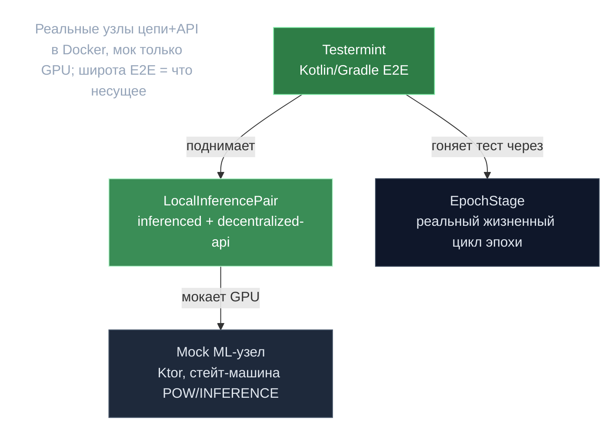

# Testermint — спецификация инвариантов

> **Суть:** Testermint — Kotlin/Gradle E2E-харнесс, который поднимает **реальные** узлы
> цепи и API в Docker и мокает только GPU-слой. Его ценность не только в тестах: **широта
> E2E-покрытия — самый честный сигнал того, что в системе несущее**. Что бьются проверять
> end-to-end — то и держит систему.

## 🗺️ Обзор


## 💻 Код (`testermint/src/main/kotlin/Epochs.kt:6`)
```kotlin
enum class EpochStage {
    START_OF_POC,
    END_OF_POC,
    POC_EXCHANGE_DEADLINE,
    START_OF_POC_VALIDATION,
    END_OF_POC_VALIDATION,
    SET_NEW_VALIDATORS,
    CLAIM_REWARDS
}
```

## Как устроен
- Поднимает реальные `inferenced` + `decentralized-api` через compose-файлы
  (`local-test-net/docker-compose-*.yml`); каждый участник = `LocalInferencePair`
  (узел + API + mock). Реальные P2P/RPC, genesis, join, опц. Postgres.
- Мокает ML-узел собственным **Ktor**-сервером (`testermint/mock_server/`), повторяющим
  API и стейт-машину (`STARTED/POW/INFERENCE/TRAIN/STOPPED`); ответы программируются.
- Модель `EpochStage` (`Epochs.kt`) проводит тест через реальный жизненный цикл эпохи —
  см. [[gonka — Жизненный цикл эпохи]].

## Что покрытие говорит о несущих инвариантах
| Инвариант | Тесты |
|---|---|
| **PoC = Sybil-защита** (жемчужина) | `ConfirmationPoC{Pass,Fail,MultiNode}`, `MultiModelPoC`, `PoCOffChain` |
| **Атомарность эскроу→валидация→расчёт + возврат** | `Inference{,Accounting,FailureAccounting,Retry}` |
| **Детерминизм границы эпохи** (смена валидаторов, награды) | через `EpochStage` |
| **BLS/DKG переживает рестарты/партиции** | `BLSDKGSuccess`, `BLSDisputeApiRestart`, `BLSNetworkRecovery` |
| **Devshard расчёт + Postgres + hot-config** | `Devshard{,Standalone,PostgresStorage}`, `DevsharddRuntimeConfig` |
| **Экономика/власть** | `Collateral`, `Delegation`/`ParticipantPower`, `StreamVesting`, `DynamicPricing` |

> **Заметного E2E-покрытия обучения НЕТ** — прямой сигнал, что оно не несущее. Согласуется
> с [[Обучение — построено и удалено]].

## Инструмент-помощник
`testermint/mcp_log_examiner/` — Kotlin **MCP-сервер** (SQLite/Exposed), грузит логи тестов
в SQLite и даёт MCP-тулы `load-log`/`log-query`, чтобы Claude SQL-запросами разбирал
падения.

> Переносимый приём: смотри на E2E-набор чужого проекта как на **исполняемую
> спецификацию** — он точнее доков говорит, какие инварианты команда считает критичными.

## Связи
- Жизненный цикл, который он гоняет: [[gonka — Жизненный цикл эпохи]].
- Что НЕ покрыто и почему: [[Обучение — построено и удалено]].
- Полный разбор: `architecture/09-testing-and-evolution.md`.
