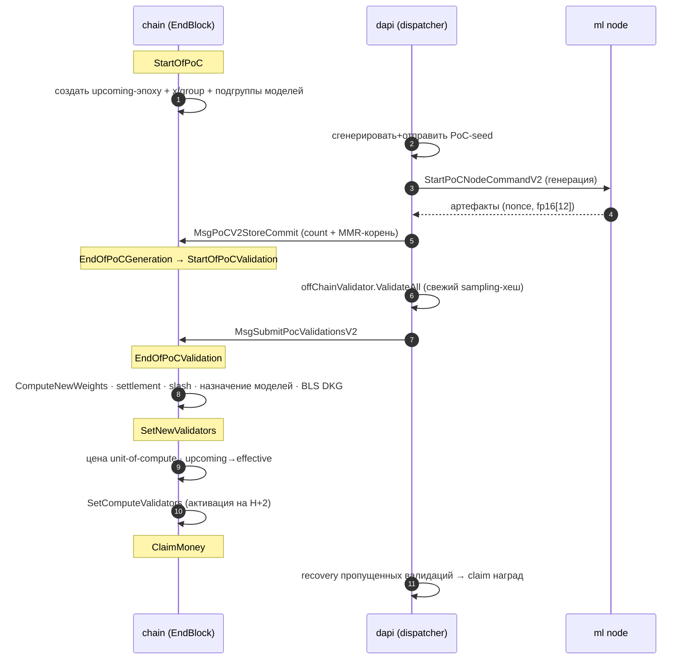

# gonka — Жизненный цикл эпохи

> **Суть:** эпоха — это период с зафиксированным набором валидаторов. Всё крутится
> вокруг одного якоря — `PocStartBlockHeight`. `EpochContext` превращает
> относительные смещения параметров в абсолютные высоты блоков для каждой стадии,
> а стейт-машина `EndBlock` исполняет переходы. См. [[Эпоха — главные часы сети]].

## Таймлайн стадий (mermaid)



## 💻 Код (`inference-chain/x/inference/types/epoch_context.go:220`)
```go
// Стадия эпохи = чистая функция от высоты блока (без побочных эффектов).
func (ec *EpochContext) IsStartOfPocStage(blockHeight int64) bool {
    return blockHeight == ec.StartOfPoC()
}
func (ec *EpochContext) IsEndOfPoCValidationStage(blockHeight int64) bool {
    if ec.EpochIndex == 0 { return false } // эпоха 0 — особая, без PoC
    return blockHeight == ec.EndOfPoCValidation()
}
func (ec *EpochContext) IsSetNewValidatorsStage(blockHeight int64) bool {
    if ec.EpochIndex == 0 { return false }
    return blockHeight == ec.SetNewValidators()
}
```

## Стадии (порядок проверки в `EndBlock`)

| Стадия | Что происходит | Заметка |
|---|---|---|
| `StartOfPoC` | новая upcoming-эпоха, группы, seed, старт генерации | [[Сид — подпись как источник нонсов]] |
| `EndOfPoCGeneration` | окончание генерации, переход к валидации | [[Off-chain данные — on-chain обязательства]] |
| `StartOfPoCValidation` | участники проверяют чужой PoC | [[Детерминизм — дисциплина консенсуса]] |
| `EndOfPoCValidation` | **формирование эпохи целиком**: веса, settlement, slash, DKG | [[Эпоха — главные часы сети]] |
| `SetNewValidators` | цена compute, активация валидаторов на **H+2** | [[Две системы власти — consensus и epoch-group]] |
| `ClaimMoney` | recovery валидаций → клейм наград | [[Bitcoin-награды — дефляция через фикс-пул]] |

## Три неочевидных решения
1. **Буфер H+2.** Новый набор валидаторов активируется через 2 блока после расчёта —
   чтобы dapi успел подгрузить модели под новую эпоху.
2. **Эпоха 0 особая** — без PoC, всегда `InferencePhase` (bootstrap).
3. **Три указателя эпох** — Effective/Current (активна), Upcoming (готовится через
   PoC), Previous. Чистые границы между подготовкой и переключением.

## Связи
- Механика стейт-машины: [[Эпоха — главные часы сети]].
- Что делает dapi на каждой стадии: [[Broker — декларативный реконсилятор узлов]].
- Карта целиком: [[gonka — Контекстная карта]].
