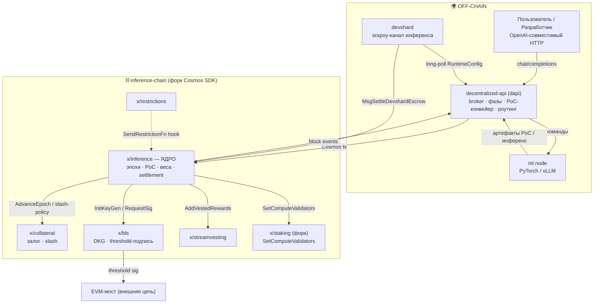

# gonka — Контекстная карта

> **Суть:** gonka — это три типа узлов (`chain` / `dapi` / `ml node`) и семь
> on-chain доменов. Ядро (`x/inference`) дирижирует всеми остальными модулями как
> исполнителями. Это карта *смысловых* границ, по которым язык не должен протекать.

## Диаграмма (mermaid)



## 💻 Код (`inference-chain/x/inference/types/expected_keepers.go:77`)
```go
// Ядро x/inference объявляет, ЧТО ему нужно от соседей (ACL).
// Интерфейсы реализуют сами модули — зависимость направлена К ядру.
type StakingKeeper interface {
    SetComputeValidators(ctx context.Context, computeResults []keeper.ComputeResult, isTestnet bool) ([]types.Validator, error)
}
type CollateralKeeper interface {
    AdvanceEpoch(ctx context.Context, completedEpoch uint64) error
}
type StreamVestingKeeper interface {
    AddVestedRewards(ctx context.Context, participantAddress, fundingModule string, amount sdk.Coins, vestingEpochs *uint64, memo string) error
    AdvanceEpoch(ctx context.Context, completedEpoch uint64) error
}
type BlsKeeper interface {
    InitiateKeyGenerationForEpoch(ctx sdk.Context, epochID uint64, finalizedParticipants []blstypes.ParticipantWithWeightAndKey) error
}
```

## Роли контекстов (кратко)

| Контекст | Тип DDD | Ответственность | Ключевая заметка |
|---|---|---|---|
| **x/inference** | Core | эпохи, PoC, веса, settlement, ценообразование | [[Proof of Compute 2.0 — власть есть вычисление]] |
| **decentralized-api** | Core | оркестрация GPU, роутинг, off-chain валидация | [[Broker — декларативный реконсилятор узлов]] |
| **devshard** | Core (растущий) | low-latency инференс без on-chain на запрос | [[Devshard — платёжный канал инференса]] |
| **x/collateral** | Supporting | кастодиан залога, исполнитель слэшинга | [[Гибридный вес — база плюс залог]] |
| **x/bls** | Supporting | пороговая подпись для cross-chain моста | [[BLS-порог — слот-взвешенный Shamir]] |
| **x/streamvesting** | Supporting | график выплат наград | [[Bitcoin-награды — дефляция через фикс-пул]] |
| **x/staking (форк)** | Generic⁺ | `voting power = PoC score` вместо токенов | [[Две системы власти — consensus и epoch-group]] |

## Отношения контекстов (язык DDD)
- **`x/inference` → спутники: Customer–Supplier с дирижированием.** Один часовой
  (`EndBlock`) дёргает кейперы соседей на границе эпохи; сбой соседа эмитит
  `epoch_error`, но **не валит цепь**. См. [[Эпоха — главные часы сети]].
- **dapi → chain: Conformist + ACL.** dapi каждый блок тянет `Params` цепи в кэши —
  цепь единственный источник истины.
- **devshard → chain: Open Host Service.** Минимальный публичный протокол: открыть
  эскроу, рассчитаться с кворумом. См. [[State root и кворум — расчёт за одну транзакцию]].
- **chain ↔ форк Cosmos SDK: Shared Kernel.** Правки изолированы (`docs/cosmos_changes.md`).
- **bls → EVM: Published Language** (`keccak256`/`hashToG1`).

## Связи
- Дальше во времени: [[gonka — Жизненный цикл эпохи]].
- Корневой принцип: [[Proof of Compute 2.0 — власть есть вычисление]].
