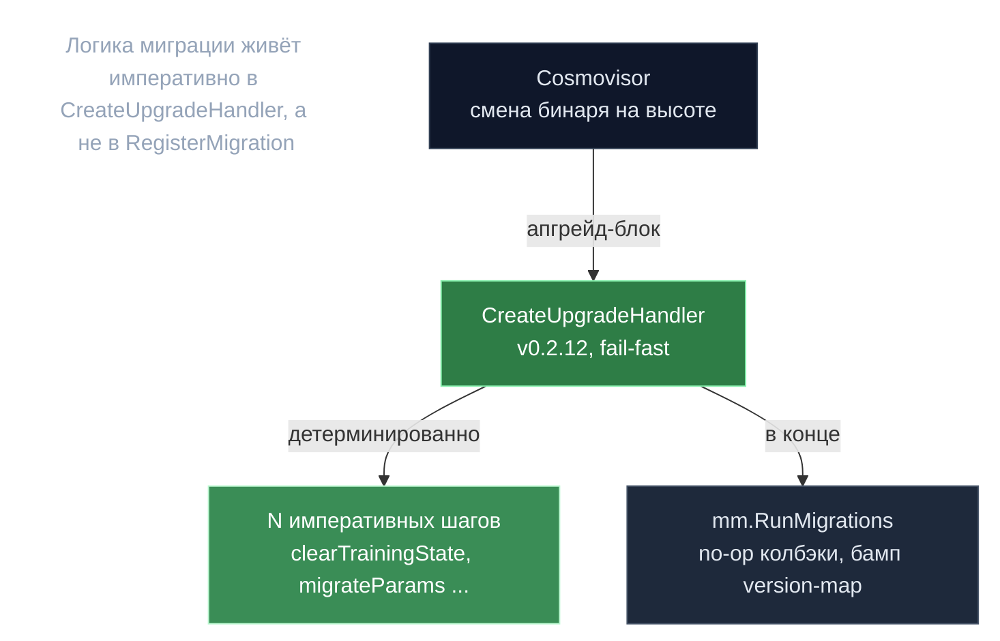

# Анатомия апгрейда — миграция в хендлере

> **Суть:** в gonka реальная логика миграции состояния живёт **императивно внутри
> `CreateUpgradeHandler`**, а не в стандартных колбэках `RegisterMigration` (для inference
> они **no-op'ы с версии 8**; v7 ещё делает реальную работу — `MigrateLegacyBridgeState` +
> `MigrateConfirmationWeights`). Бамп `ConsensusVersion` (inference=14) — лишь бухгалтерия
> version-map, чтобы `RunMigrations` был доволен.

## 🗺️ Обзор


## 💻 Код (`inference-chain/app/upgrades/v0_2_12/upgrades.go:117`)
```go
err := removeTopMiner(ctx, k)
if err != nil {
    return nil, err
}

err = clearTrainingState(ctx, k)
if err != nil {
    return nil, err
}

// Multi-model migration steps.
err = clearLegacyPoCv2Data(ctx, k)
if err != nil {
    return nil, err
}

err = migrateParams(ctx, k)
// ... backfillVotingPower, initNewPruningState, adjustBLSParameters, ...
```

## Скелет любого хендлера
```
лог → гард версии capability → N императивных шагов (fail-fast) → mm.RunMigrations → лог
```
Cosmovisor читает upgrade-info, меняет бинарь на плановой высоте, затем именованный
хендлер исполняется в апгрейд-блоке **на каждом валидаторе детерминированно**, до любой
пользовательской tx новой версии.

## v0.2.12 — самый тяжёлый (13 шагов)
Пивот **single→multi-model** + включение комиссий. Среди шагов:
- `clearTrainingState` — вайп обучения (см. [[Обучение — построено и удалено]]).
- `migrateParams` — singular PoC-поля → `Models[]`, добавлен Kimi-K2.
- `backfillVotingPower` / `initNewPruningState` — засеять новые поля, иначе первая эпоха/прунинг сломались бы на нулях.
- **Четыре BLS/bridge sub-key миграции** — фикс бага **O(N²) газа**: инлайн-аккумуляция в одной proto-записи ре-маршалила растущий слайс на каждой отправке; разнесли в per-entry sub-keys (константный газ). Переносится **до** первой tx новой версии.
- `setFeeParams` + `migrateFeegrantsForFees` — включили комиссии чейн-вайд → авто-`BasicAllowance` cold→warm, чтобы «тёплый» ключ dapi платил с «холодного».
- `distributeBountyRewards` — 13 баунти на $35 200 USDT через CosmWasm `withdraw_ibc` (не минт; нехватка баланса → пропуск).

## Идемпотентность (halt/повтор должен сходиться)
Гарды: empty-check, presence-loop, монотонный `<`, existence-check, «у мигрированной записи
нет инлайна → повтор no-op». Hard-error только для обязательного (tokenomics, genesis-only
params); soft-skip для опционального (нет эффективной эпохи → пропуск).

## Чему учит набор миграций
- **Реальный баг O(N²) газа** в DKG/bridge — шрамы инлайн-аккумуляции.
- **Включение экономики тянет сантехнику** (feegrant вслед за комиссиями).
- ⚠️ **v0.2.14 — почти целиком ремонт** за v0.2.13 (бэкфилл devshard-параметров/снимков,
  которые «mainnet выполнил до того, как бэкфиллы подъехали») — операционный промах,
  потребовавший доп-апгрейда. Урок: миграции легко выпустить неполными.

> Переносимый урок: при rolling-апгрейдах сложную миграцию проще держать **императивной и
> идемпотентной в одном месте**, чем размазывать по per-module колбэкам — но тогда сам
> следи за полнотой (v0.2.14 показывает цену пропуска).

## Связи
- Эволюция параметров (genesis ≠ действующее): [[Genesis Guardian — вето без контроля]].
- Что удалили: [[Обучение — построено и удалено]].
- Дремлющий слой делегирования: [[PoC-делегирование — N к 1 передача веса]]. Разбор: `architecture/11-advanced-subsystems.md` §B.
