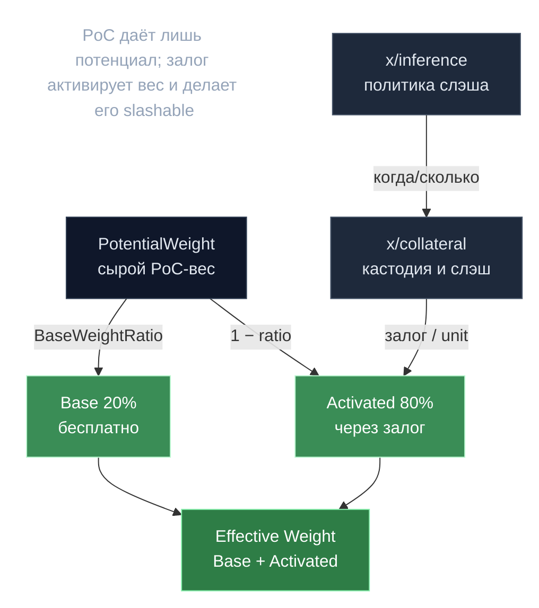

# Гибридный вес — база плюс залог

> **Суть:** один лишь GPU-compute уязвим к лени и Сивиллам. Поэтому PoC даёт лишь
> *потенциальный* вес: малую часть (20%) дают бесплатно, а большую нужно
> **активировать залогом**, который слэшится за плохое поведение. Залог *оценивает*
> влияние GPU и привязывает его к slashable-ставке.

## 🗺️ Обзор


## 💻 Код (`inference-chain/x/collateral/keeper/keeper.go:423`)
```go
// Determine the effective fraction to apply.
// If requiredCollateral is provided and smaller than totalActual, scale the
// fraction so that the total slash equals requiredCollateral × slashFraction.
effectiveFraction := slashFraction
if requiredCollateral.IsPositive() && totalActual.IsPositive() {
    // slashTarget = min(requiredCollateral, totalActual) × slashFraction
    base := math.MinInt(requiredCollateral, totalActual)
    slashTarget := math.LegacyNewDecFromInt(base).Mul(slashFraction)
    // effectiveFraction = slashTarget / totalActual
    effectiveFraction = slashTarget.Quo(math.LegacyNewDecFromInt(totalActual))
    if effectiveFraction.GT(math.LegacyOneDec()) {
        effectiveFraction = math.LegacyOneDec()
    }
}
```

## Формула (`x/collateral`)
```
Base Weight         = PotentialWeight × BaseWeightRatio        (genesis 0.2, бесплатно)
Collateral-Eligible = PotentialWeight × (1 − BaseWeightRatio)  (80%, нужен залог)
Activated Weight    = min(Collateral-Eligible, Collateral / CollateralPerWeightUnit)
Effective Weight    = Base Weight + Activated Weight
```
- `CollateralPerWeightUnit` = **4.2** gonka/единицу (genesis; дефолт кода 1).
- **Grace** до эпохи 180: `BaseWeightRatio = 1.0` (весь вес бесплатен) — низкий порог входа.

## Роль модуля — исполнитель, не политик
`x/collateral` владеет *кастодией и механикой*, но **не решает когда/сколько слэшить**
— политику задаёт `x/inference` ([[Эпоха — главные часы сети]]). Это прямое следствие
принципа «разделить консенсус и деньги» из
[[Proof of Compute 2.0 — власть есть вычисление]].

## Слэшинг
| Триггер | Доля | Кто инициирует |
|---|---|---|
| INVALID (вредная работа) | **20%** | [[SPRT — последовательный детектор мошенника]] |
| Downtime (miss% > 5%) | **10%** | проверка простоя |
| Консенсус-фолт (double-sign) | через staking-хук `BeforeValidatorSlashed` | форк staking |

Инварианты: слэш **идемпотентен** per `(epoch, participant, reason)`; ограничен
требуемым залогом (пере-депонировавших не штрафуют сверх нужного); слэшированное идёт
в **gov-аккаунт**, не соседям — принцип «экономика без перераспределения»
(см. [[Bitcoin-награды — дефляция через фикс-пул]], [[25 переносимых идей gonka]]).

## Вывод залога
Уходит из активного веса сразу (вес падает следующей эпохой), но токены остаются
слэшируемы до конца unbonding (`UnbondingPeriodEpochs`, дефолт 1).

## Связи
- Кто триггерит слэш: [[SPRT — последовательный детектор мошенника]].
- Кто дёргает `AdvanceEpoch`: [[Эпоха — главные часы сети]].
- Экономика наград: [[Bitcoin-награды — дефляция через фикс-пул]].
