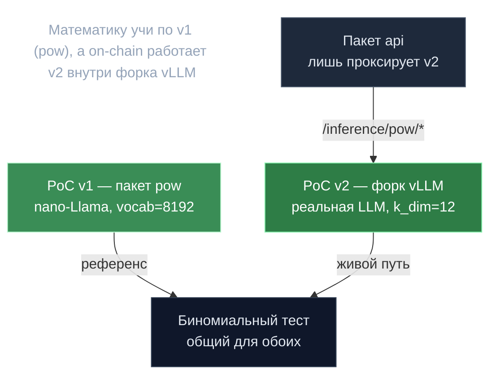

# Две реализации PoC — v1 и v2

> **Суть:** в репозитории сосуществуют **две разные реализации Proof of Compute**, и та,
> что цепь использует сегодня (v2), живёт **не** в пакете `pow`, а внутри форка vLLM,
> который пакет `api` лишь проксирует. Это легко упустить: математику учить по v1, а в
> бою работает v2.

## 🗺️ Обзор


## 💻 Код (`mlnode/packages/api/src/api/inference/pow_v2_routes.py:52`)
```python
class StatTestModel(BaseModel):
    dist_threshold: float = 0.02
    p_mismatch: float = 0.001
    fraud_threshold: float = 0.01

# ...

class PoCParamsModel(BaseModel):
    model_config = ConfigDict(extra="forbid")
    model: str
    seq_len: int
    k_dim: int = 12
```

## Сравнение
| | **PoC v1 (`pow`)** | **PoC v2 (форк vLLM + `api`)** |
|---|---|---|
| Где считается | отдельный PyTorch-движок | внутри процесса vLLM; mlnode проксирует |
| Модель | кастомная nano-Llama 3.1, веса random-init из хеша | **реальная обслуживаемая LLM** (напр. Qwen3-0.6B) |
| Артефакт | полный `vocab_size`(8192) вектор расстояний | **k_dim=12 fp16** вектор (`vector_b64`, 24 байта) |
| HTTP | `/api/v1/pow/*` | `/api/v1/inference/pow/*` |
| Ручка сложности | `r_target` | `dist_threshold` (0.02) |
| Статус | референс, полностью реализован | живой on-chain путь |

Общее — **статистический тест тот же** (биномиальный, см.
[[PoC-движок — расстояние на сфере]]); v2 лишь применяет его к продакшен-LLM и сжимает
артефакт до 24 байт.

## Почему v2 элегантнее
- **Та же GPU, что обслуживает инференс, делает и PoC** — нет отдельной «майнинговой»
  модели, ресурсы не дублируются.
- **k_dim=12 fp16** делает доказательство крошечным (цепь хранит/сравнивает векторы).
- **Подмена квантизации детектируется:** одинаковая точность → L2 < 0.002; fp8-vs-fp16
  → ~0.02+. Поэтому квантизацию требуется пиновать явно.
- Флаг `poc_stronger_rng` (Go-сторона `PocStrongerRng`) выбирает усиленный путь
  сид→работа; оба пути CI-тестируются на честную валидацию.

## Связи
- Математика обоих: [[PoC-движок — расстояние на сфере]].
- Детерминированная модель: [[Хеш в случайную модель — pool-трюк]].
- Что коммитится on-chain: [[Off-chain данные — on-chain обязательства]].
