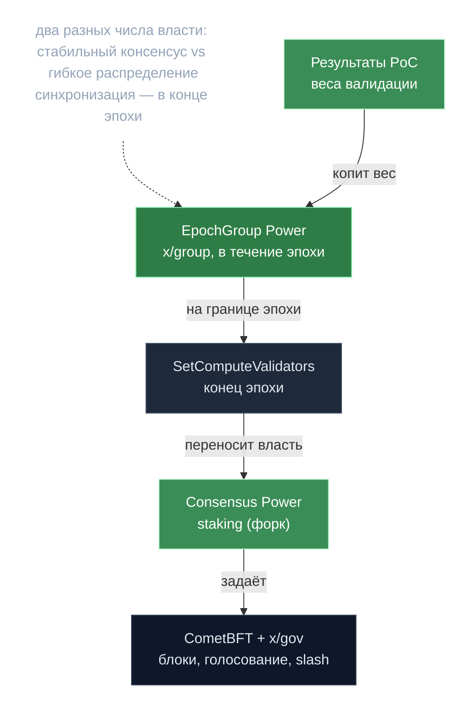

# Две системы власти — consensus и epoch-group

> **Суть:** в gonka «власть» — это два разных числа с разными ролями. Их легко
> спутать. **Consensus power** управляет блокчейном (CometBFT, gov, slash).
> **EpochGroup power** управляет внутренними операциями сети (валидация PoC,
> распределение работы). Они синхронизируются в конкретных точках цикла эпохи.

## 🗺️ Обзор


## 💻 Код (`inference-chain/x/inference/epochgroup/epoch_group.go:414`)
```go
// epoch-group вес члена → consensus Power (никакого бондинга токенов)
computeResults = append(computeResults, keeper.ComputeResult{
    Power:           getWeight(member),
    ValidatorPubKey: &pubKey,
    OperatorAddress: valOperatorAddr,
})
// ... затем в module.go: Staking.SetComputeValidators(ctx, finalComputeResult, ...)
```

## Сравнение
| | **Consensus Power** | **EpochGroup Power** |
|---|---|---|
| Где живёт | staking-модуль (форк) | [[EpochGroup — переиспользование x-group\|EpochGroupData]] |
| Кто ставит | `SetComputeValidators` в конце эпохи | результаты PoC в течение эпохи |
| Управляет | блоки CometBFT, голосование x/gov, магнитуда slash, набор валидаторов | вес голосов валидации PoC, распределение инференса, назначение моделей, отбор участников |
| Источник | вычисленный PoC-скор (PowerReduction=1) | историч. PoC + сохранённые веса + ёмкость MLNode |

## Поток синхронизации
1. **В течение эпохи** — EpochGroup power правит внутренними операциями.
2. **В конце эпохи** — результаты PoC считаются на весах EpochGroup.
3. **Обновление валидаторов** — власть успешных переносится в staking через
   `SetComputeValidators`. См. [[Proof of Compute 2.0 — власть есть вычисление]].
4. **Новая эпоха** — обновлённая consensus power активна, новая EpochGroup power
   формируется.

> Зачем два числа: blockchain-консенсус должен быть **стабильным и безопасным**,
> а распределение ресурсов — **гибким**. Разделение позволяет менять одно, не ломая
> другое.

## Экономическое следствие
Голос в governance считается по **consensus power = доказанный compute**, а не по
застейканным токенам. Кто больше полезно считает — у того больше право решать.

## Связи
- Откуда берётся PoC-вес: [[Proof of Compute 2.0 — власть есть вычисление]].
- Контейнер epoch-group власти: [[EpochGroup — переиспользование x-group]].
- Когда происходит синхронизация: [[gonka — Жизненный цикл эпохи]].
