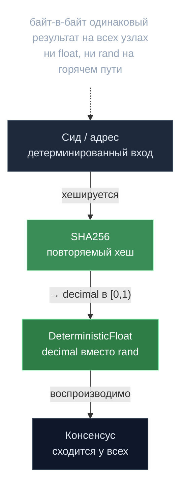

# Детерминизм — дисциплина консенсуса

> **Суть:** все узлы цепи обязаны прийти к **байт-в-байт** одинаковому результату,
> иначе консенсус расходится. Поэтому в gonka на горячем пути нет ни `math.*` float,
> ни `rand`. Всё «случайное» выводится детерминированно из сидов, вся арифметика —
> на целых/`decimal`/рядах Тейлора.

## 🗺️ Обзор


## 💻 Код (`inference-chain/x/inference/calculations/should_validate.go:57`)
```go
func DeterministicFloat(seed int64, identifier string) decimal.Decimal {
    // Build the exact same bytes as fmt.Sprintf("%d:%s", seed, identifier)
    // but without fmt. This must stay base-10 to preserve the legacy hash.
    b := make([]byte, 0, 21+1+len(identifier))
    b = strconv.AppendInt(b, seed, 10)
    b = append(b, ':')
    b = append(b, identifier...)

    sum := sha256.Sum256(b)
    hashInt := binary.BigEndian.Uint64(sum[:8])
    hashDecimal := decimal.NewFromUint64(hashInt)
    return hashDecimal.Div(maxUint64Decimal)
}
```

## Два врага консенсуса и чем их заменили
| Враг | Замена | Где |
|---|---|---|
| `float64` (`math.Exp`, `math.Tanh`) | ряды Тейлора + `shopspring/decimal` | `calculations/sprt.go` |
| `rand.Float64()` | `DeterministicFloat(SHA256(seed...))` | `should_validate.go`, `confirmation_poc.go` |

## Верифицируемая случайность (паттерн «commit → act → reveal → re-verify»)
1. Валидатор выбирает, что проверять, **приватным секретным сидом**.
2. Действует (валидирует выбранные инференсы).
3. На claim **раскрывает** сид.
4. Цепь **переисполняет** ту же функцию выборки и проверяет, что сделано ровно
   положенное. Пропуск обязательной валидации ⇒ `ErrValidationsMissed`, claim отклонён.

> Это даёт непредсказуемость *и* аудируемость без доверенного источника случайности.
> См. [[SPRT — последовательный детектор мошенника]].

## Свежий challenge-хеш против предсказания
Для выборки листьев на проверку берётся **отдельный** свежий sampling-хеш
(`SHA256(validatorPubKey:samplingBlockHash:height:modelId)`), отличный от хеша старта
работы — чтобы прувёр не мог заранее знать, какие куски проверят и оптимизировать
именно их (`decentralized-api/poc/proof_client.go`).

## Анти-thundering-herd
Каждый участник выводит задержку клейма в `[1,500]` блоков из `SHA256(своего адреса)` —
нагрузка размазывается по сети **без координатора**
(`new_block_dispatcher.go:424-439`).

## Связи
- Где это решает антифрод: [[SPRT — последовательный детектор мошенника]].
- Источник сидов: [[Сид — подпись как источник нонсов]].
- Один из переносимых уроков: [[25 переносимых идей gonka]].
