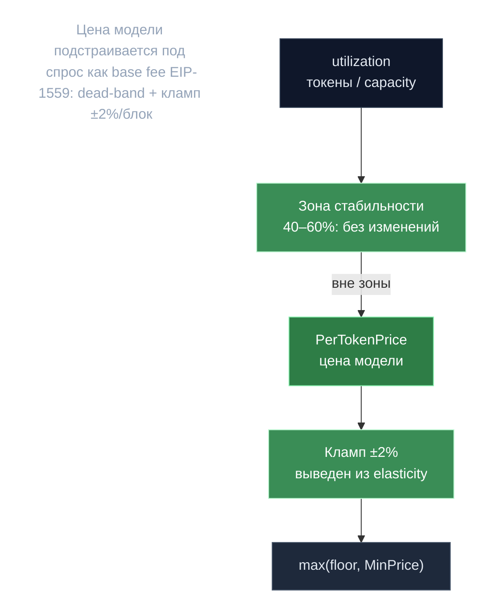

# Динамическое ценообразование — EIP-1559 по моделям

> **Суть:** цена за токен у каждой модели подстраивается под спрос как базовая
> комиссия EIP-1559 — каждый блок, независимо для каждой модели. Зона стабильности
> гасит дёрганье, кламп ±2%/блок не даёт манипулировать всплеском.

## 🗺️ Обзор


## 💻 Код (`inference-chain/x/inference/keeper/dynamic_pricing.go:169`)
```go
one := decimal.NewFromInt(1)
maxExcessDeviation := one.Sub(upperBound) // e.g., 1.0 - 0.60 = 0.40
maxDeficitDeviation := lowerBound         // e.g., 0.40 - 0.0 = 0.40

// Growth caps derived from elasticity and stability zone bounds
maxIncreasePerBlock := one.Add(maxExcessDeviation.Mul(elasticity))  // 1.0 + (0.40 × 0.05) = 1.02
maxDecreasePerBlock := one.Sub(maxDeficitDeviation.Mul(elasticity)) // 1.0 - (0.40 × 0.05) = 0.98

// Stability zone check (40%-60% by default)
if utilization.GreaterThanOrEqual(lowerBound) && utilization.LessThanOrEqual(upperBound) {
    newPrice = currentPrice // no price change
}
```

## Контур (раз в блок, `BeginBlocker`)
```
utilization = avgTokensPerBlock / (capacity_tok_s × 5с)     # 5с = блок
if 0.40 ≤ U ≤ 0.60:  цена не меняется          # зона стабильности (dead-band)
elif U < 0.40:       цена ×= 1 − (0.40−U)·0.05  # ≥ 0.98  → до −2%/блок
else U > 0.60:       цена ×= 1 + (U−0.60)·0.05  # ≤ 1.02  → до +2%/блок
цена = max(floor(цена), 1 ngonka)
```
Кламп **выведен**, не зашит: `1 ± 0.40·0.05 = 1.02/0.98`. Нагрузка считается скользящим
окном (12 блоков), **кормится в EndBlock** завершёнными инференсами → цена блока N
отражает спрос до N−1.

## Три неочевидных факта
1. **Capacity = `TotalWeight` модельной подгруппы** (сумма PoC-веса), а не реальный
   throughput — поля `total_throughput` в коде нет (TODO). Эвристика «~1000 нонсов ≈ 1000 ток/с».
2. **Grace-период:** до эпохи 90 цена = 0 (бесплатно, раскачка спроса); ровно на 90
   сидируется `BasePerTokenPrice=100`.
3. **`UnitOfComputePrice` (взвешенная медиана предложений) — рудимент:** считается
   каждую эпоху, но **не участвует в комиссии**. Реальная комиссия:
   `(prompt+completion токены) × PerTokenPrice`. Цена **фиксируется** при первом из
   Start/Finish, эскроу по ней → изменение в полёте не влияет на текущий инференс.

> Поправка: старая 3-факторная формула `Tokens × UnitsOfComputePerToken ×
> UnitOfComputePrice` **заменена** на однофакторную динамическую.

## Связи
- Куда идёт плата: [[Bitcoin-награды — дефляция через фикс-пул]].
- Откуда capacity (вес модели): [[EpochGroup — переиспользование x-group]].
- Полный разбор: `architecture/10-deep-mechanisms.md` §A.
