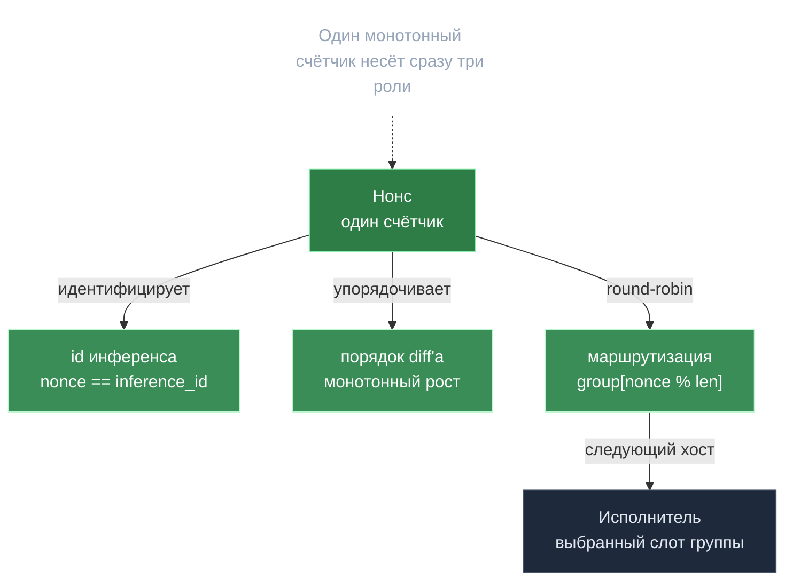

# Нонс — тройной идентификатор

> **Суть:** в devshard один монотонный счётчик — нонс — несёт сразу три роли. Один
> хорошо выбранный счётчик схлопывает сложность маршрутизации, упорядочивания и
> идентификации. Пример элегантности «меньше сущностей — меньше багов».

## 🗺️ Обзор


## 💻 Код (`devshard/state/machine.go:693`)
```go
// Duplicate inference ID guard.
if sm.isDuplicateInferenceID(msg.InferenceId) {
	return types.ErrDuplicateInferenceID
}

// Executor slot: group[inference_id % len(group)].SlotID
executorSlot := sm.state.Group[msg.InferenceId%uint64(len(sm.state.Group))].SlotID
```

## Три роли одного числа
| Роль | Как используется |
|---|---|
| **id инференса** | `nonce == inference_id` — уникально идентифицирует запрос |
| **порядковый номер diff'а** | монотонный рост от `latest+1` упорядочивает сессию |
| **ключ маршрутизации** | исполнитель = `group[nonce % len(group)]` (round-robin по группе) |

## Почему это красиво
- Спекулятивный прокси получает fanout **бесплатно**: каждый `PrepareInference()`
  двигает нонс → следующий хост в группе. Перебор хостов = просто инкремент.
- Карантинному хосту шлют **тихую ghost-пробу** (нонс сжигается локально, без HTTP),
  чтобы детерминированная схема `nonce % size` не разъехалась. См.
  [[Devshard — платёжный канал инференса]].

## Лимит нагрузки через нонс
Нет отдельного `max_inferences_per_devshard` — раз нонс *и есть* id инференса, кэп
нонсов кэпит инференсы. Governance-параметр `max_nonce`; хосты применяют его *с резервом*
под финализацию: `MaxActiveNonce = max_nonce − (groupSize + 1)`.

> Урок: прежде чем заводить новую сущность-идентификатор, спроси — не может ли
> существующий монотонный счётчик уже нести эту роль.

## Связи
- Где живёт: [[Devshard — платёжный канал инференса]].
- Что подписывают поверх нонса: [[State root и кворум — расчёт за одну транзакцию]].
- Сводка идей: [[25 переносимых идей gonka]].
