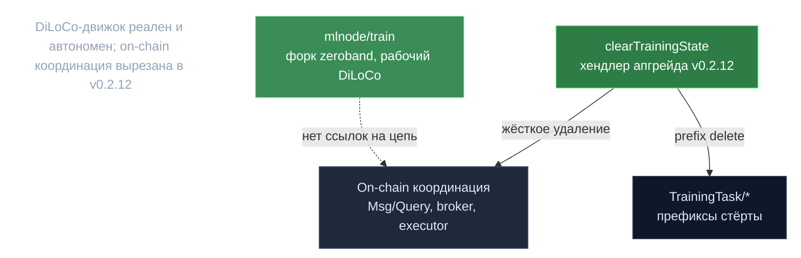

# Обучение — построено и удалено

> **Суть:** README репозитория рекламирует geo-distributed обучение (DiLoCo), но это
> **удалённая фича, а не roadmap и не live**. ML-движок DiLoCo реален и работает
> автономно; on-chain координация обучения была **жёстко вырезана в v0.2.12**. Важная
> поправка к официальному README.

## 🗺️ Обзор


## 💻 Код (`inference-chain/x/inference/keeper/training_state_cleanup.go:21`)
```go
store := runtime.KVStoreAdapter(k.storeService.OpenKVStore(ctx))
for _, keyPrefix := range [][]byte{
    []byte(inferencetypes.TrainingTaskKeyPrefix),
    []byte(inferencetypes.TrainingTaskSequenceKey),
    []byte(inferencetypes.QueuedTrainingTaskKeyPrefix),
    []byte(inferencetypes.InProgressTrainingTaskKeyPrefix),
    []byte("TrainingTask/sync/"),
} {
    prefixStore := prefix.NewStore(store, keyPrefix)
    iterator := prefixStore.Iterator(nil, nil)
    // ... collect keysToDelete, then:
    for _, key := range keysToDelete {
        prefixStore.Delete(key)
    }
}
```

## Что реально есть (ML-сторона)
`mlnode/packages/train` — форк `zeroband` (родословная OpenDiLoCo): рабочий DiLoCo
(внешний SGD lr 0.7 nesterov, псевдо-градиент, GLOO all-reduce, эластичный device-mesh
с heartbeat'ами и live-recovery, **TLS-транспорт + Ed25519-сертификаты**), сервис
`/api/v1/train/{start,stop,status}`.

> **Но:** ноль ссылок на цепь/cosmos/PoC. Нет on-chain координации задач и **нет
> валидации обучающей работы**. TLS даёт аутентичность узлов, не верифицируемость
> обучения. Это и есть пропасть до trustless-обучения.

## Что удалено (координационный слой)
- `proposals/training-removal-v0.2.12/` — **жёсткое удаление** (цель: «без заглушек, без
  флагов, без исторических запросов»): training `Msg`/`Query`, gRPC-координация ML-узлов,
  broker-команды, API-эндпоинты `/training/...`, executor/assigner.
- Хендлер v0.2.12 **активно стирает** состояние: `training_state_cleanup.go` чистит
  allow-list'ы и префикс-удаляет `TrainingTask/{value,sequence,queued,inProgress,sync}/`
  (последнее держало on-chain barrier/heartbeat координацию DiLoCo).

## Рудименты (доказательство, что было реально)
- `types/key_training_task.go` — оставлен *только* для детерминированного удаления.
- `hardware_node.proto:28` всё ещё перечисляет `TRAINING=3`, но не используется; в
  `broker/broker.go` enum выживает **только как комментарий**.
- mock-сервер Testermint хранит состояние `TRAIN` — ещё один рудимент.

> Урок: периодически сверяй README с реальным proto/кодом — маркетинговое описание
> переживает удалённую функциональность. См. [[Testermint — спецификация инвариантов]]
> (заметного E2E-покрытия обучения нет — сигнал, что оно не несущее).

## Связи
- ML-движок обучения: `architecture/07-mlnode-compute.md`.
- Где удаляют состояние при апгрейде: [[Testermint — спецификация инвариантов]].
- Полный разбор: `architecture/09-testing-and-evolution.md`.
