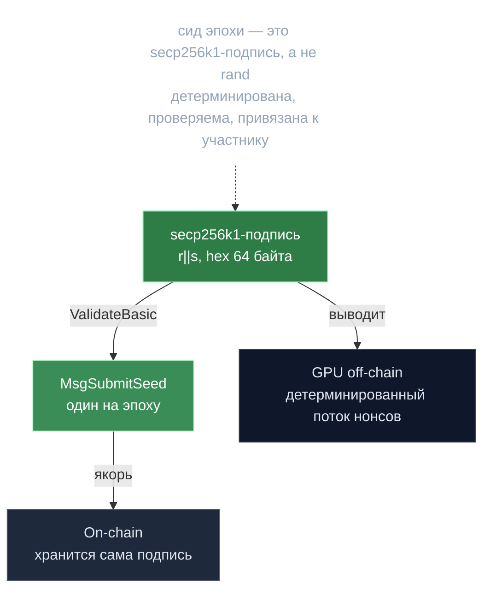

# Сид — подпись как источник нонсов

> **Суть:** «сид» эпохи — это не случайное число, а **secp256k1-подпись** участника.
> On-chain хранится сама подпись; GPU-узел off-chain детерминированно выводит из неё
> поток нонсов для PoC. Нет сида → нет веса.

## 🗺️ Обзор


## 💻 Код (`inference-chain/x/inference/types/message_submit_seed.go:20`)
```go
func (msg *MsgSubmitSeed) ValidateBasic() error {
    // signer
    if _, err := sdk.AccAddressFromBech32(msg.Creator); err != nil {
        return errorsmod.Wrapf(sdkerrors.ErrInvalidAddress, "invalid creator address (%s)", err)
    }
    // epoch_index must be > 0
    if msg.EpochIndex <= 0 {
        return errorsmod.Wrap(sdkerrors.ErrInvalidRequest, "epoch_index must be > 0")
    }
    // signature required and must be hex-encoded 64 bytes (r||s)
    if err := utils.ValidateHexRSig64("signature", msg.Signature); err != nil {
        return err
    }
    return nil
}
```

## Почему подпись, а не `rand`
- Подпись **детерминирована** и **проверяема**: любой может убедиться, что нонсы
  выведены именно из неё (см. [[Детерминизм — дисциплина консенсуса]]).
- Подпись **привязана к участнику** — нельзя присвоить чужой поток работы.
- Один `MsgSubmitSeed` на эпоху → дешёвый якорь всей PoC-генерации.

## Два сида с разными ролями (не путать)
| Сид | Источник | Для чего |
|---|---|---|
| **PoC-seed участника** | его secp256k1-подпись | детерминированный поток нонсов для генерации |
| **sampling-хеш** | свежий хеш блока (≠ хеш старта PoC) | выбор листьев на проверку, чтобы прувёр не предсказал |

> Разделение «сид работы» и «сид аудита» — чтобы исполнитель не оптимизировал именно
> проверяемые куски. См. [[Off-chain данные — on-chain обязательства]].

## Сетевой сид валидаций
Отдельно есть per-epoch **сетевой сид** (`configManager.GetCurrentSeed()`): все
валидаторы по нему детерминированно решают, какие инференсы проверять — сеть
*согласна* без координации, а исполнитель не предскажет своих проверяющих. На claim
сид раскрывается и проверяется повтором (`ShouldValidate`).

## Связи
- Зачем детерминизм: [[Детерминизм — дисциплина консенсуса]].
- Что доказывают нонсы: [[Proof of Compute 2.0 — власть есть вычисление]].
- Где это в цикле: [[gonka — Жизненный цикл эпохи]].
