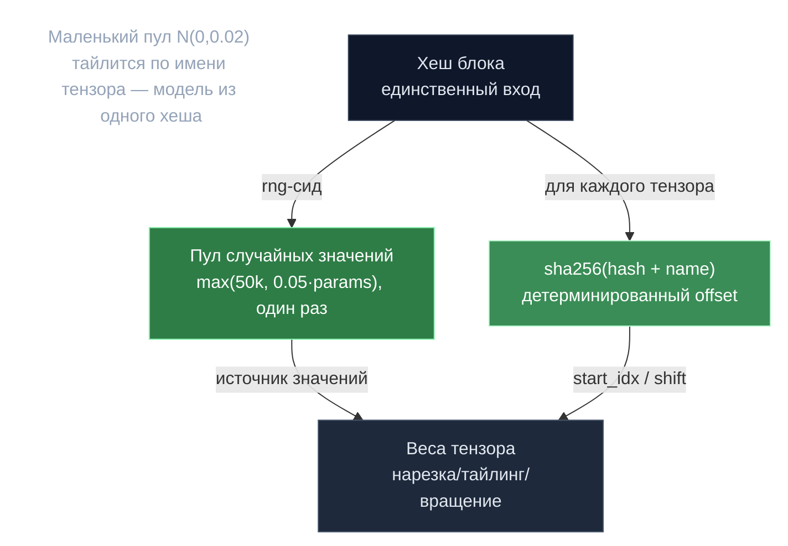

# Хеш в случайную модель — pool-трюк

> **Суть:** каждый узел должен пересобрать **байт-в-байт одну и ту же случайную модель**
> из одного лишь хеша блока — это якорь всего PoC. Наивно рисовать миллиарды весов
> через RNG слишком медленно. Трюк: нарисовать **маленький пул** случайных значений
> один раз, затем детерминированно нарезать его по имени каждого тензора.

## 🗺️ Обзор


## 💻 Код (`mlnode/packages/pow/src/pow/random_pool_optimized.py:34`)
```python
# Create a small pool of random values on the CPU.
pool_size = max(50000, int(total_params * pool_fraction))
pool_values = rng.normal(0.0, 0.02, size=pool_size).astype(np.float32)
pool_tensor = torch.from_numpy(pool_values).to(dtype=dtype)

with torch.no_grad():
    for name, param, param_size in tqdm(param_info, ...):
        combined_hash_input = f"{hash_}_{name}"
        name_hash = int(hashlib.sha256(combined_hash_input.encode('utf-8')).hexdigest()[:8], 16)
        if param_size <= pool_size:
            start_idx = name_hash % (pool_size - param_size + 1)
            values = pool_tensor[start_idx : start_idx + param_size]
        # ...
```

## Как
```
pool = N(0, 0.02), размер max(50_000, 0.05·total_params)   # один раз
для каждого тензора name:
    offset = sha256(f"{block_hash}_{name}")[:8]
    tensor = нарезка/тайлинг/вращение pool по offset
```
Цель: **<30с** инициализации модели на ~18B параметров (vs минуты при полном RNG).
Веса **никогда не обучаются** — это чистый детерминированный шум из хеша.

## Зачем это вообще
- Модель должна быть **общей и воспроизводимой** у всех, без раздачи весов по сети.
- Меняется хеш блока (новая эпоха) → меняется вся модель → нельзя предрасчитать наперёд.
- Это основа [[PoC-движок — расстояние на сфере|расстояния на сфере]]: target и веса
  выведены из того же хеша.

> Переносимый приём: когда нужна **большая детерминированная псевдослучайная структура**
> у многих узлов, дешевле сэмплировать малый пул и детерминированно тайлить его, чем
> гонять RNG по всему объёму.

## Связи
- Что делают с моделью: [[PoC-движок — расстояние на сфере]].
- Почему детерминизм критичен: [[Детерминизм — дисциплина консенсуса]].
- Где это в ML-узле: [[Две реализации PoC — v1 и v2]].
