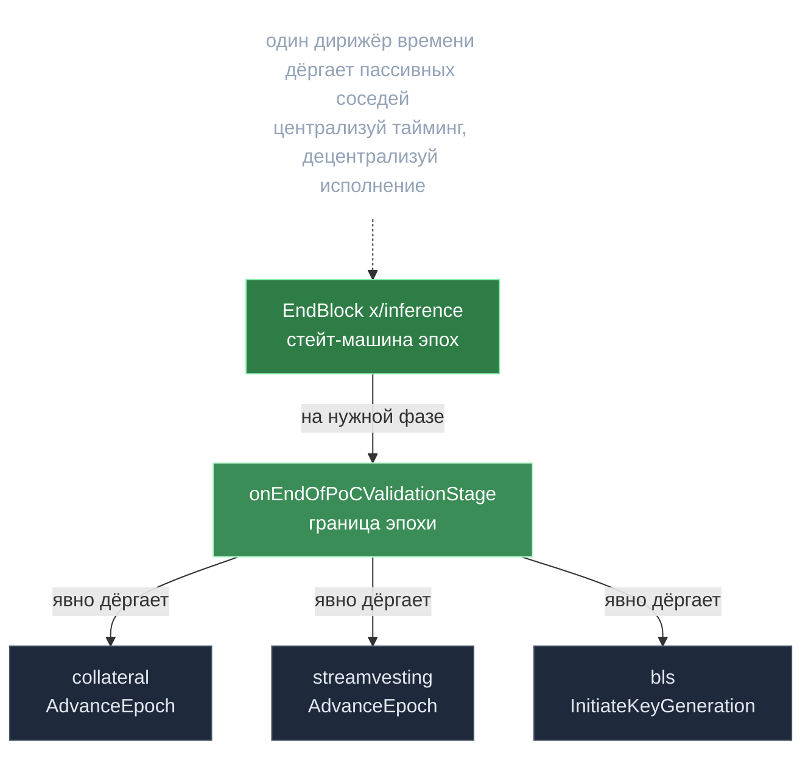

# Эпоха — главные часы сети

> **Суть:** во всей цепи один дирижёр времени — стейт-машина `EndBlock` модуля
> `x/inference`. Она задаёт такт эпох и на их границах **явно дёргает** кейперы
> соседних модулей. Соседи — пассивные исполнители; они не знают про время сами.

## 🗺️ Обзор


## 💻 Код (`inference-chain/x/inference/module/module.go:619`)
```go
func (am AppModule) onEndOfPoCValidationStage(ctx context.Context, blockHeight int64, blockTime int64) {
    effectiveEpoch, found := am.keeper.GetEffectiveEpoch(ctx)
    // ...
    // Signal to the collateral module that the epoch has advanced.
    if am.keeper.GetCollateralKeeper() != nil {
        if err := am.keeper.GetCollateralKeeper().AdvanceEpoch(ctx, effectiveEpoch.Index); err != nil {
            // ...сбой не валит цепь, а эмитит событие epoch_error
            sdkCtx.EventManager().EmitEvent(sdk.NewEvent("epoch_error",
                sdk.NewAttribute("stage", "advance_collateral_epoch"),
                sdk.NewAttribute("error_category", "cross_module"),
            ))
        }
    }
    // ... затем streamvesting.AdvanceEpoch, SettleAccounts, ComputeNewWeights ...
}
```

## EpochContext — чистое отображение высоты в стадию
`types/epoch_context.go` превращает относительные смещения `EpochParams` в абсолютные
высоты блоков. Это доменный сервис без побочных эффектов: `GetCurrentPhase(height)`
всегда даёт согласованный ответ. dapi переиспользует ту же функцию на чтении
(`chainphase/phase_tracker.go`) — единый источник правды о фазе.

## Один часовой дёргает исполнителей (на `EndOfPoCValidation`)
```
onEndOfPoCValidationStage():
    collateral.AdvanceEpoch()        // [[Гибридный вес — база плюс залог]]
    streamvesting.AdvanceEpoch()     // [[Bitcoin-награды — дефляция через фикс-пул]]
    settleAccounts(effectiveEpoch)   // минт + распределение по весу
    ComputeNewWeights(upcomingEpoch) // [[Proof of Compute 2.0 — власть есть вычисление]]
    assignModels() ; applySlash()
    bls.InitiateKeyGenerationForEpoch() // [[BLS-порог — слот-взвешенный Shamir]]
```

## Отказоустойчивость — ключевое решение
Вызовы соседних модулей обёрнуты так, что их сбой **эмитит событие `epoch_error`,
но не валит цепь**. Дирижёр продолжает формировать эпоху.

> Урок: централизуй *тайминг* в одном месте, децентрализуй *исполнение*, и делай
> межмодульные вызовы fault-tolerant.

## Три указателя эпох
- **Effective / Current** — активные валидаторы сейчас.
- **Upcoming** — готовится через PoC.
- **Previous** — прошлая (для settlement и recovery).

## Буфер активации H+2
Новый набор валидаторов вступает в силу через 2 блока после расчёта — чтобы dapi
успел подгрузить модели. Явный лаг между «решено» и «вступило в силу».

## Связи
- Визуальный таймлайн: [[gonka — Жизненный цикл эпохи]].
- Что считается в `ComputeNewWeights`: [[Proof of Compute 2.0 — власть есть вычисление]].
- Контейнер весов эпохи: [[EpochGroup — переиспользование x-group]].
