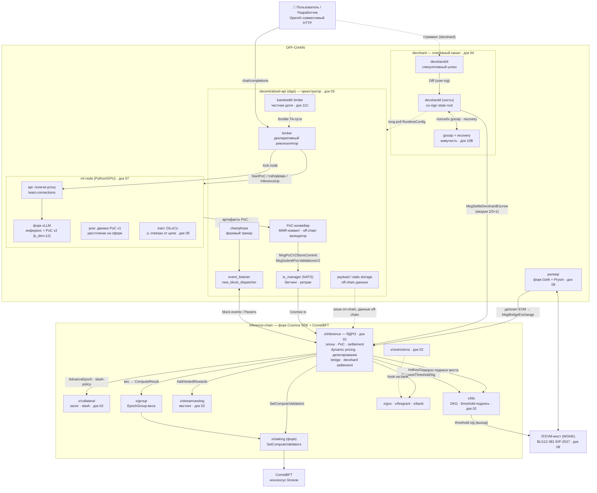
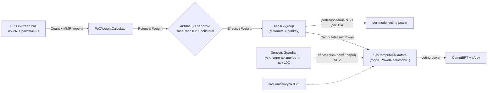
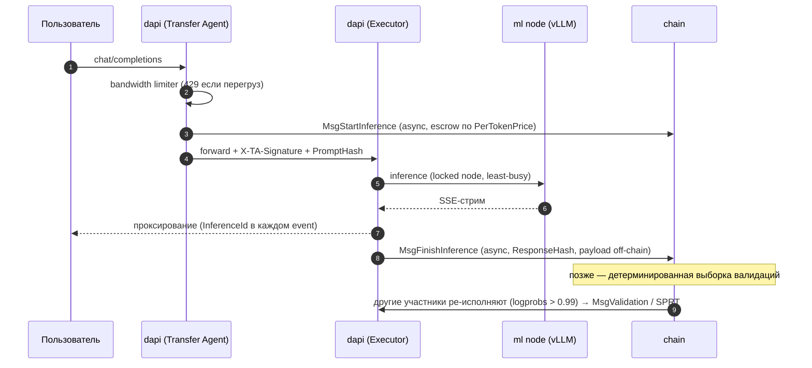
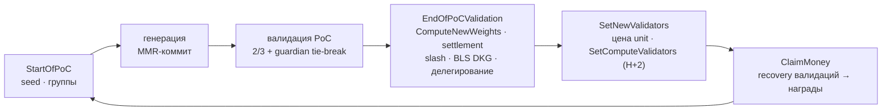
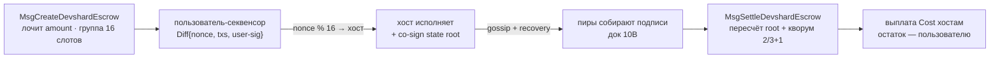
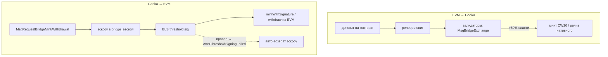

# 00 · Единая карта системы (все взаимосвязи)

> Одна мастер-диаграмма всех компонентов и потоков gonka + ключевые flow-схемы. Слой `v0.2.13`.
> Назад к [индексу](../ARCHITECTURE.md). Это визуальный «оглавитель» — каждый блок ссылается на свой документ.

---

## 1. Мастер-карта: компоненты и связи

**Как читать:** сплошная стрелка — основной поток (вызов/сообщение); пунктир — конфигурация/обязательства/побочный канал. Подписи на рёбрах — конкретные сообщения/действия. Номера доков ведут к разбору.

---

## 2. Поток власти: compute → consensus (суть PoC 2.0)

---

## 3. Поток инференса (transfer-agent → executor → валидация)

---

## 4. Жизненный цикл эпохи (PoC-цикл, сжато)

---

## 5. Devshard: жизненный цикл эскроу

---

## 6. Поток моста (обе стороны)

---

## 7. Навигатор: блок → документ

| Область | Документ |
|---|---|
| Ядро PoC, эпохи, settlement | [01](01-core-proof-of-compute.md) |
| collateral / bls / vesting / restrictions / genesistransfer / bookkeeper | [02](02-supporting-contexts.md) |
| dapi: broker, фазы, PoC-конвейер, инференс | [03](03-orchestration-dapi.md) |
| devshard: эскроу, спекулятивный прокси | [04](04-devshard-payment-channel.md) |
| Экономика V2 | [05](05-economics.md) |
| Каталог идей | [06](06-ideas-catalog.md) |
| ML-узел: математика PoC, vLLM, обучение | [07](07-mlnode-compute.md) |
| EVM-мост + proto-каталог | [08](08-bridge-and-protocol.md) |
| Testermint, апгрейды, судьба обучения | [09](09-testing-and-evolution.md) |
| Ценообразование, gossip/recovery, guardian | [10](10-deep-mechanisms.md) |
| Делегирование, анатомия апгрейда, лимитер | [11](11-advanced-subsystems.md) |
| Верификация точности | [REVIEW](../REVIEW.md) |
| Атомарные заметки | [Wiki/MOC — gonka](../Wiki/MOC%20—%20gonka.md) |
