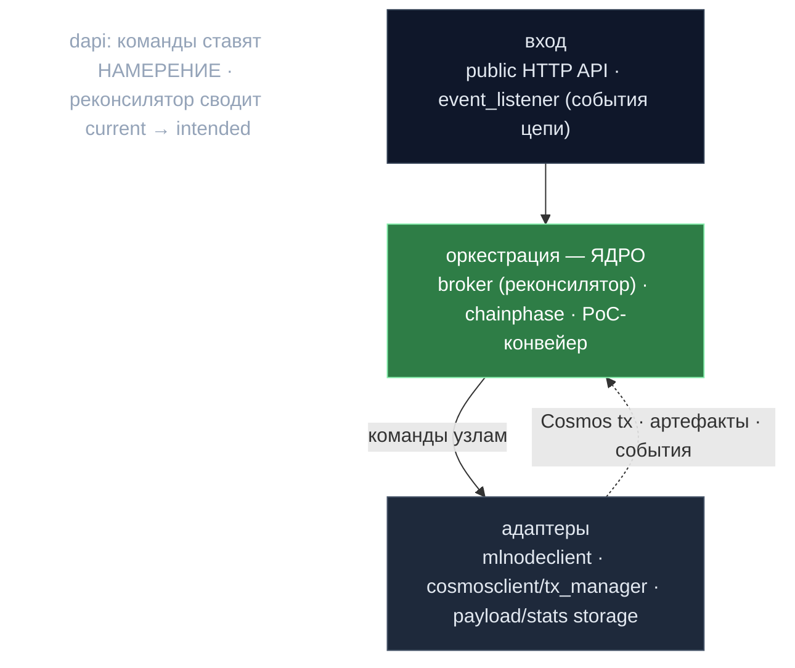

# 03 · Off-chain оркестрация — `decentralized-api` (dapi)

> Контекст: **`decentralized-api/`** (Go). Control-plane между цепью и GPU-узлами.
> Назад к [индексу](../ARCHITECTURE.md).

## Роль (один абзац)

dapi — per-participant **off-chain оркестратор** между Cosmos-цепью и парком GPU ML-узлов (Python/vLLM). Он: (a) следит за эпохами/фазами цепи по новым блокам; (b) ведёт каждый свой ML-узел через стейт-машину жизненного цикла (Inference ⇄ PoC-Generate ⇄ PoC-Validate ⇄ Stopped), приводя состояние узла к тому, что требует текущая фаза сети; (c) обслуживает публичный OpenAI-совместимый API — роутит/балансирует запросы на ML-узлы, фиксирует start/finish on-chain, проксирует ответы; (d) запускает генерацию PoC, on-chain MMR-коммит и off-chain валидацию *чужого* PoC; (e) делает рандомизированную выборку валидаций инференса; (f) управляет off-chain хранением payload/stats/артефактов (в цепь — только хеши/корни); (g) ведёт регистрацию участника, апгрейды ПО, BLS-подписание, gRPC NodeManager. Всё связывает `main.go` (встроенный NATS, cosmos-клиент с ретраями, фазовый трекер, broker, off-chain валидатор, commit-worker, три HTTP-сервера + NodeManager gRPC). Намеренный `os.Exit(1)` при shutdown — чтобы cosmovisor перезапустил процесс.

---

### Слои dapi

> Внешние команды лишь ставят **намерение**; единственный реконсилятор (broker) сводит состояние узлов к нему.

---

## 1. Отслеживание эпох/фаз и реакция на стадии PoC

- **`chainphase/phase_tracker.go`** — `ChainPhaseTracker`, потокобезопасный (`sync.RWMutex`) кэш *последней* эпохи, параметров, текущего блока, статуса синка. Хитрость: хранит сырые входы и **выводит** `CurrentPhase` на чтении через `types.NewEpochContext(...).GetCurrentPhase(height)` — каждый `GetCurrentEpochState()` возвращает согласованный снимок, вычисленный от высоты.
- **`internal/event_listener/event_listener.go`** — подписка на Tendermint-websocket события (`NewBlock`, `Tx`, BLS-события, `system/Barrier`). Тонкий: парсит высоту/хеш и делегирует диспетчеру.
- **`internal/event_listener/new_block_dispatcher.go`** — мозг оркестрации (`OnNewBlockDispatcher.ProcessNewBlock`). На блок: (1) запрашивает sync/epoch + `Params` цепи, заливая многое в кэши `ConfigManager` (валидация, лимиты bandwidth, allowlist transfer-агентов, PoC-параметры, версии devshard) — цепь источник истины, обновляется каждый блок; (2) обновляет фазовый трекер; (3) `handlePhaseTransitions`; (4) решает о реконсиляции по гибридной политике «интервал блоков + таймаут» (PoC каждый блок, Inference раз в 5 блоков, иначе 30с).

`handlePhaseTransitions` мапит предикаты стадий цепи на команды broker'а + действия PoC:
- `IsStartOfPocStage` → сгенерировать+отправить PoC-seed на будущую эпоху.
- `IsEndOfPocStage` → `NewInitValidateCommand()`.
- `IsStartOfPoCValidationStage` → взять хеш блока старта PoC, `offChainValidator.ValidateAll(...)` в горутине.
- `IsEndOfPoCValidationStage` → `NewInferenceUpAllCommand()`.
- `IsSetNewValidatorsStage` → `ChangeCurrentSeed()`.
- `IsClaimMoneyStage` → **сперва восстановление пропущенных валидаций прошлой эпохи, потом клейм наград** (порядок важен).
- **Confirmation PoC** (во время фазы инференса, только для активных): предикаты `ShouldStartGeneration/...ReturnToInference`.

> **Анти-thundering-herd:** каждый участник выводит детерминированную задержку клейма в `[1,500]` блоков из `SHA256(participantAddress)` — клейм-транзакции размазываются по сети (`new_block_dispatcher.go:424-439`).

---

## 2. Паттерн BROKER (ядро dapi)

`broker/` (+ `broker/README.md`) — **гибрид «команды + декларативный реконсилятор состояния»**:

- **Intended vs Current** (`broker/broker.go`, `NodeState`): у каждого узла `IntendedStatus`/`CurrentStatus` (INFERENCE/POC/STOPPED/FAILED) и `PocIntendedStatus`/`PocCurrentStatus` (IDLE/GENERATING/VALIDATING). Внешние команды лишь *ставят намерение*; реконсилятор сводит current→intended.
- **Процессор команд** (`processCommands`): одна горутина дренит **две приоритетные очереди** (`highPriorityCommands` cap 100, `lowPriorityCommands` cap 10000); high всегда предпочтителен. Все команды используют *буферизованные* response-каналы (валидируется в `QueueMessage`) — broker никогда не блокируется.
- **State-команды** (`broker/state_commands.go`): `StartPocCommand`, `InitValidateCommand`, `InferenceUpAllCommand` — каждая (a) ре-валидирует фазу перед мутацией (защита от устаревшей/переупорядоченной доставки), (b) ставит намерение всем узлам, (c) `TriggerReconciliation()`. Учитывают admin-disable и «POC_SLOT сохранён под инференс» (`ShouldContinueInference`) — preserved-узлы обслуживают инференс *во время* PoC.
- **Реконсилятор** (`reconcilerLoop`/`reconcile`): *единственный*, кто инициирует изменяющие действия. Две фазы: (1) **отменить устаревшие in-flight задачи**, чей `ReconcileInfo` не соответствует намерению (через сохранённый `cancelInFlightTask`), (2) **запустить новые** для узлов, где current≠intended и нет задачи в полёте. Условия перепроверяются под write-lock. Запуск по триггеру + таймер 30с.
- **NodeWorker** (`broker/node_worker.go`): одна горутина на узел, буферизованный канал. Воркеры **не мутируют общее состояние** — исполняют `NodeWorkerCommand`, затем кладут `UpdateNodeResultCommand` обратно в broker. `Submit` неблокирующий (дропает при полном канале).
- **Атомарная обработка результата** (`UpdateNodeResultCommand.Execute`): единственный источник истины финализации перехода. **Stale-result защита:** если `ReconcileInfo == nil` или `OriginalTarget`/`OriginalPocTarget` результата не совпадает с тем, к чему узел сейчас сводится, результат игнорируется — отменённые задачи не портят состояние.

**Команды (исполняют воркеры, `node_worker_commands.go`):** `StopNodeCommand`; `InferenceUpNodeCommand` (идемпотентна: если уже здоров и модель загружена — no-op); `StartPoCNodeCommandV2` (идемпотентна через `GetPowStatusV2`); `TransitionPoCToValidatingCommandV2` (**без сетевого вызова** — только флип состояния; саму V2-валидацию ведёт `OffChainValidator`); `NoOpNodeCommand`. *Команды обучения здесь не подключены.*

**Балансировка** (`LockAvailableNode`/`getLeastBusyNode`): наименее загруженный (`LockCount`) узел среди INFERENCE-intended *и* INFERENCE-current, не в реконсиляции, под `MaxConcurrent`, операбельный, обслуживающий нужную модель. Поддержка `SkipNodeIDs` (ретрай на другом узле). Generic-хелпер `LockNode[T]` оборачивает lock→action→release.

**Синк инвентаря узлов** (`nodeSyncWorker`, 60с): диффит локальную конфигурацию против on-chain `HardwareNodes` (`calculateNodesDiff`) и шлёт `MsgSubmitHardwareDiff` только при изменении.

---

## 3. Конвейер PoC (на стороне dapi): Generate → Commit → Validate → Report

1. **Seed:** на старте PoC dapi генерит и шлёт PoC-seed на будущую эпоху (`seed.RandomSeedManager`).
2. **Generate:** broker → POC/Generating; воркер шлёт `InitGenerateV2` на ML-узел. ML считает артефакты `(nonce, fp16 vector[kDim=12])` и POST'ит батчи в callback dapi (`/v2/poc-batches/{model}`).
3. **Accumulate + commit** (`poc/artifacts/` MMR + `poc/commit_worker.go`): артефакты идут в **Merkle Mountain Range** по `(pocStageHeight, modelId)`. `CommitWorker` периодически флашит, читает `GetFlushedRoot()` → `(count, rootHash)`, шлёт `MsgPoCV2StoreCommit` **только при изменении** (монотонно, с дедупом). Затем `MsgMLNodeWeightDistribution` — какой ML-узел сколько произвёл (∝ committed count) → кормит распределение веса/наград.
4. **Validate чужих** (`poc/validator.go` `OffChainValidator.ValidateAll`): запрашивает `AllPoCV2StoreCommitsForStage` и `PoCValidationSnapshot` для per-model взвешенной по власти **слот-выборки** (`ComputeSampledSlotCount`) — валидирует только назначенные пары участник-модель (fallback к O(N²) «всех», если снапшота нет). Воркер-пул (дефолт 10) над **буферизованным каналом, который ре-кьюит ретраябельные ошибки** с бэкоффом.
5. **Fetch + verify proof** (`poc/proof_client.go`): для каждой цели детерминированно выбирает индексы листьев через **ленивый Fisher-Yates**, сид `SHA256(validatorPubKey:samplingBlockHash:height:modelId)` — O(sampleSize) даже при огромном count; *свежий* sampling-хеш (≠ хеш старта PoC) мешает прувёру предсказать, какие листья проверят. POST подписанный запрос на `/v1/poc/proofs`; проверка MMR-доказательств против on-chain корня, точное покрытие листьев, валидность FP16 (отказ при NaN/Inf/неверной размерности), детект дубль-нонсов (фрод) и избыточной **порозности** (`maxNonce/count ≥ 100` ⇒ фрод).
6. **Stat-recheck + report:** проверенные артефакты шлются на локальный ML-узел через `GenerateV2` с `Validation.Artifacts` (хеш *генерации*, чтобы воспроизвести сид) для теста статистической эквивалентности. Permanent fail → `MsgSubmitPocValidationsV2` с `ValidatedWeight = -1` (невалидно).

---

## 4. Поток запроса инференса (end-to-end)

(`internal/server/public/post_chat_handler.go`, `completionapi/`, `mlnodeclient/`.)

- **Вход:** `/v1/chat/completions` и `/v1/completions`. Две роли: **Transfer agent** (нет id/seed) и **Executor** (id+seed). Тело до 10 MiB; allowlist transfer-агентов + гейт доступа разработчика.
- **Transfer agent:** проверяет наличие запрашивающего on-chain, оценивает токены промпта, проверяет **per-block bandwidth-limiter** (`internal/bandwidth_limiter.go`, параметры из цепи), выбирает исполнителя `GetRandomExecutor()`, форсит детерминированные настройки (`seed=rand`, `logprobs=true, top_logprobs=5, return_token_ids=true`), считает канонические `PromptHash`/`OriginalPromptHash`, подписывает `TransferSignature` и шлёт `MsgStartInference` **асинхронно**. Пересылает исполнителю по HTTP с заголовками `X-Inference-Id/X-Seed/X-Timestamp/X-Transfer-Address/X-TA-Signature/X-Prompt-Hash` (или вызывает локального исполнителя напрямую).
- **Executor:** проверяет подписи запрашивающего/трансфера и nonce-таймстемп; пересобирает тело и сверяет prompt-хеш с заголовком (детект подмены); берёт ML-узел через `broker.DoWithLockedNodeHTTPRetry` (least-busy, до 3 попыток, skip-failed, без ретрая на 4xx); зовёт версионированный inference-URL.
- **Streaming-прокси** (`internal/server/public/proxy.go`): SSE проксируется построчно (буфер 64KB→1MB) с flush на строку, инъекция `InferenceId` в каждое событие через `ResponseProcessor`. JSON-путь читает тело целиком и инъектит id. Обрабатывает обрыв клиента/сети посреди стрима.
- **Finish:** `sendInferenceTransaction` считает `ResponseHash` (SHA256), сверяет токены (из `usage` или fallback-токенизация), подписывает `ExecutorSignature`, **сохраняет промпт+ответ off-chain** (по `inferenceId`/`epochId`), шлёт `MsgFinishInference` асинхронно. На 400/422 от ML-узла всё равно создаётся синтетический ответ, чтобы цикл инференса корректно закрылся on-chain.

---

## 5. Рандомизированная выборка валидаций инференса

`internal/validation/inference_validation.go`. **Детерминированная, по сиду:** `calculations.ShouldValidate(globalSeed, inferenceDetails, validatorPower, executorPower, totalPower, params)` — все используют один per-epoch сетевой сид (`configManager.GetCurrentSeed()`), сеть *согласна*, какие инференсы кому проверять, без координации; исполнитель не может предсказать своих валидаторов. Выбор взвешен по власти (`ValidationRate` в bps), исключает себя-как-исполнителя и неподдерживаемые модели. Валидация переисполняет инференс на залоченном узле, тянет payload с ретраями (`payload_retrieval.go`, пересчитывает хеши против on-chain коммитмента — ловит лгущего исполнителя → немедленная инвалидация), сравнивает logprobs (`CompareLogits`, проход при similarity > 0.99) → `MsgValidation`. **Recovery:** на claim-стадии `DetectMissedValidations` повторяет сид прошлой эпохи по всем инференсам, находит пропущенные обязательные валидации и довыполняет до клейма.

---

## 6. Merkle proofs и MMR

- **`poc/artifacts/mmr.go`** — append-only Merkle Mountain Range артефактов PoC: `hashLeaf=SHA256(0x00‖data)`, `hashNode=SHA256(0x01‖L‖R)` (доменное разделение); поддерживает `GetRootAt(snapshotCount)` для любого исторического count; proof = сиблинги пути + прочие пики; O(log n). Корень коммитится on-chain per `(stage, model)`. `store.go` персистит append-only бинарь + per-node счётчики с crash-recovery; `managed_store.go` хранит per-stage/model сторы, прунит до 10 последних стадий.
- **`merkleproof/verify.go`** — *другое* назначение: Cosmos/CometBFT **state-inclusion** доказательства (`VerifyBlockSignatures`/`VerifyCommit`, `VerifyUsingMerkleProof` через IBC `VerifyMembership`). Позволяет off-chain компонентам доверять состоянию цепи без доверия full-узлу.

---

## 7. Off-chain хранилища payload / stats / артефактов

Объединяющая идея: **в цепи — только обязательства (хеши/корни/счётчики); полные данные — off-chain** с прунингом.
- **`payloadstorage/`**: промпт+ответ по `(inferenceId, epochId)`. Бэкенды: Postgres (партиционирование по эпохам, `PruneEpoch` = drop партиции), file (атомарный temp+rename), **hybrid** (Postgres-first + file fallback + rate-limited reconnect + dual-read). `ManagedStorage` добавляет TTL read-кэш + авто-прунинг (хранит current+2, lookback 10).
- **`statsstorage/`**: per-inference метрики (токены, стоимость, время, эпоха, модель, requester) — Postgres/file/disabled. Прунинг по retention (дефолт 30 дней). Off-chain, т.к. это аналитика высокого объёма, не критичная для консенсуса.

---

## 8. Прочие умные идеи

- **Async tx-менеджер на NATS JetStream** (`cosmosclient/tx_manager/`): durable очереди (`TxsToSend`/`TxsToObserve`), до 100 попыток с джиттером, классификация ошибок (транзиентные → ретрай, перманентные → drop). **Дедлайн по типу msg** (`tx_deadline_config.go`, напр. FinishInference 150 блоков) дропает зомби-tx. Детект halt/отставания узла ставит отправку на паузу.
- **Батчинг транзакций** (`batch_consumer.go`): три потока (StartInference, FinishInference, ValidationV2) флашатся по размеру *или* таймауту (~5с); ValidationV2 мержатся по стадии перед батчем — ~90% экономии комиссий/throughput.
- **Конкурентность без sequence:** Cosmos **unordered tx mode** с кэшированным `txFactory` (account number один раз, sequence опущен) и уникальным `TimeoutTimestamp` per-tx (`nowNanoUnique`) — устраняет contention по account-sequence, разрешает конкурентный broadcast.
- **Authz/feegrant warm-key:** «тёплый» ключ ML-ops оборачивает msg в `authz.MsgExec` с «холодным» аккаунтом как fee granter; диагностика парсит RawLog и советит запустить grant-команду.
- **Long-poll runtime-config** (`nodemanager/runtime_config_*`): gRPC NodeManager отдаёт снимок `RuntimeConfig` (approved versions+SHA256, режим logprobs, max nonce, validation rate, таймауты) с зажатым long-poll (≤60с) — ML-узлы ждут изменения конфигурации вместо поллинга.
- **Per-block синк конфигов:** почти все настройки тянутся из `Params` цепи каждый блок в `ConfigManager`.
- **Идемпотентные команды узлов:** InferenceUp/StartPoC проверяют текущий статус ML-узла (включая «модель загружена») и шорткатят, избегая лишних редеплоев.
- **Горячая смена версии:** клиенты строятся per-request из `GetCurrentNodeVersion()`; при смене версии реконсилятор сразу обновляет клиентов воркеров.
- **Координация апгрейда** (`upgrade/events.go`): следит за частичными/полными планами апгрейда, пишет cosmovisor `upgrade-info.json` на `height-1`, переключает версию ML-узла на плановой высоте.

---

## Главные файлы

| Концерн | Пути (от `repo/`) |
|---|---|
| Wiring | `decentralized-api/main.go` |
| Broker | `broker/{broker,state_commands,commands,node_worker,node_worker_commands,lock_helpers}.go`, `broker/README.md` |
| Фазы/события | `chainphase/phase_tracker.go`, `internal/event_listener/{event_listener,new_block_dispatcher}.go` |
| PoC | `poc/{validator,proof_client,commit_worker}.go`, `poc/artifacts/{mmr,store,managed_store}.go` |
| Инференс | `internal/server/public/{post_chat_handler,proxy}.go`, `completionapi/*`, `mlnodeclient/*`, `internal/bandwidth_limiter.go` |
| Выборка валидаций | `internal/validation/{inference_validation,payload_retrieval}.go` |
| Cosmos-клиент | `cosmosclient/tx_manager/{tx_manager,batch_consumer,errors,tx_deadline_config}.go` |
| Хранилища | `payloadstorage/*`, `statsstorage/*`, `merkleproof/verify.go` |
