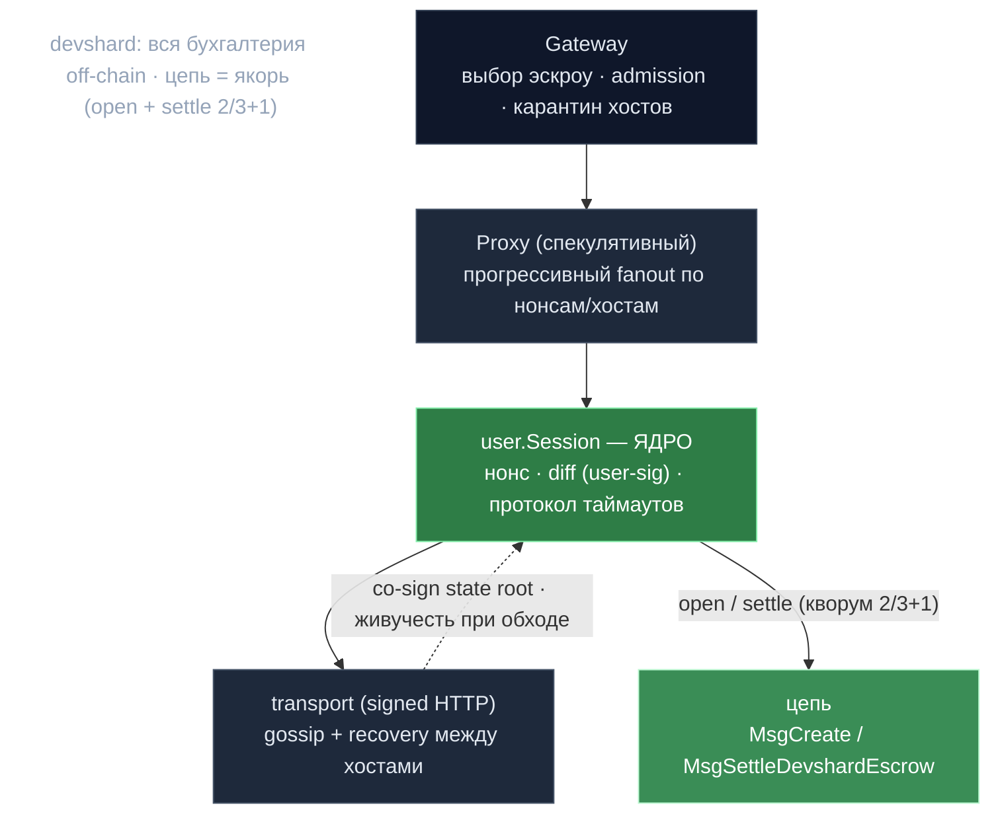

# 04 · Devshard — эскроу-канал стримингового инференса

> Контекст: **`devshard/`** (Go) + `inference-chain/x/inference/keeper/devshard_*`. Заголовочная фича слоя `v0.2.13-devshard-v2`.
> Назад к [индексу](../ARCHITECTURE.md).

## Что это и зачем (суть)

**Devshard — off-chain, эскроу-обеспеченный протокол оплаты и расчёта для стримингового LLM-инференса.** Пользователь оплачивает множество инференсов против *группы* хост-узлов, не трогая цепь на каждый запрос, затем рассчитывается за всю сессию одним подписанным state-коммитментом.

**Проблема:** прогонять каждый инференс (HTTP-стрим на секунды-минуты) через консенсус Cosmos — невозможно дорого и медленно. Devshard переносит *бухгалтерию* off-chain в детерминированную локальную стейт-машину, а цепь использует лишь как **якорь доверия для открытия (эскроу) и закрытия (расчёт)**. Концептуально — многосторонний платёжный канал, специализированный под метрируемый AI-compute, с OpenAI-совместимым HTTP-шлюзом.

Два бинаря:
- **`devshardd`** — хост-сайд процесс (`decentralized-api/cmd/devshardd/`), под `versiond`, держит слот в инференс-группе.
- **`devshardctl`** — юзер-сайд OpenAI-совместимый прокси/шлюз (`devshard/cmd/devshardctl/`).

---

### Слои devshard

> Пользователь — секвенсор; хосты co-sign state root; цепь трогается лишь дважды (open / settle).



---

## 1. Модель эскроу + расчёта (центральная идея)

### Учётный цикл
1. **Open:** `MsgCreateDevshardEscrow` (tx) лочит `amount`, пинит **группу из 16 хост-слотов** (`DevshardGroupSize = 16`), `token_price`, `epoch_index`, и снимает governance-дефолты комиссий *на строку эскроу*. Tx возвращает только `escrow_id`.
2. **Пользователь — секвенсор.** Каждый инференс — это **Diff** = `{Nonce, []Txs, UserSig, PostStateRoot}` (`types.Diff`). Diff'ы двигают монотонный нонс от `latest+1`. Пользователь подписывает каждый diff.
3. **`nonce == inference_id`, и нонс — это ключ маршрутизации.** Исполнитель = `group[inference_id % len(group)]` (`state/machine.go:698`). Рост нонса детерминированно обходит группу round-robin — это эксплуатирует спекулятивный прокси (каждый `PrepareInference` «естественно мапится на следующий хост»).
4. **Локальная детерминированная стейт-машина** (`state.StateMachine`) применяет txs и считает деньги:
   - `applyStartInference`: резервирует `(input_length + max_tokens) * token_price` из `Balance` (`ReservedCost`).
   - `applyFinishInference`: считает `actualCost` по реальным токенам, кап на резерве, **возврат излишка** в баланс, кредит `HostStats.Cost` исполнителя.
   - Каждый diff дебетует `FeePerNonce` в кумулятивный `Fees`; `CreateDevshardFee` — один раз при создании.
   - `applyTimeout`: возврат резерва (исполнитель не справился) + `HostStats.Missed++`.
5. **Хосты со-подписывают state-корни.** После diff'а хост проверяет подпись пользователя, применяет, подписывает **state root** (`StateSignatureContent{state_root, escrow_id, nonce}`). Пользователь собирает подписи. Хост может **придержать** подпись (единственный рычаг хостов) через `AcceptanceChecker`, если что-то не так (`host/host.go`, `host/staleness.go`).
6. **Settle:** `MsgSettleDevshardEscrow` несёт открытый текст `{Nonce, Fees, RestHash, HostStats[], StateRootAndProtocolVersion, Signatures[]}`. Цепь **пересчитывает state root** и проверяет **кворум 2/3+1** слот-подписей над ним, затем платит `HostStats[i].Cost` каждому хосту и возвращает остаток пользователю.

### State root (коммитмент) — `devshard/state/hash.go`
Фиксированной длины плоская конкатенация, без length-префиксов:
```
state_root = sha256(host_stats_hash || fees_be || rest_hash || version_hash || phase_byte)
rest_hash  = sha256(balance_be || inferences_hash_v2 || warm_keys_hash)
inferences_hash_v2 = sha256(sealed_acc || live_inferences_hash)   // v2
version_hash = sha256(state_root_and_protocol_version_utf8)
```
Кейпер цепи (`x/inference/keeper/devshard_settlement.go`) **жёстко прошивает `phase_byte = 0x02` (Settlement)** при пересчёте — любое нефинализированное состояние даёт другой хеш и структурно отвергается. Цепь также ограничивает `Missed`/`Invalid`/`Cost` каждого слота через `devshardAssignedUpperBoundForSlot` (по маршрутизации `nonce % slotCount`), чтобы хосты не фабриковали работу, и проверяет `totalCost + Fees ≤ escrow.Amount`.

### `max_nonce` как лимит нагрузки сессии
`DevshardEscrowParams.max_nonce` (governance) кэпит расчётный нонс. Хосты применяют его *до* diff'ов, но с **резервом** под финализацию: `MaxActiveNonce(maxNonce, groupSize) = maxNonce - (groupSize + 1)` (`types/max_nonce.go`). Это «session workload limit» из v0.2.13. **Нет** отдельного `max_inferences_per_devshard` — нонс *и есть* id инференса, поэтому кэп нонсов кэпит инференсы. Подаётся через `MaxNonceProvider` (`max_nonce_provider.go`, из dapi `ConfigManagerMaxNonce` и devshardd `RuntimeConfigMaxNonce` через long-poll).

---

## 2. Архитектура прокси и low-latency стриминг

Слоистая, строгое разделение (`devshard/docs/proxy-architecture.md`):
- **Gateway** — выбирает *какой эскроу* (multi-escrow роутинг, admission control, capacity-weighted).
- **Proxy** — HTTP in/out для одного эскроу (нарочно тонкий; не знает про нонсы/хосты).
- **Redundancy** — политика гонки по нескольким нонсам.
- **user.Session** — владеет протоколом, жизненным циклом нонса, протоколом таймаутов.
- **transport.HTTPClient** — реальная подписанная сетевая граница.

### Спекулятивный прокси (заголовочная latency-идея) — `cmd/devshardctl/speculative.go`
Каждый запрос — **растущий список попыток**, а не пара primary/secondary. Т.к. каждый `PrepareInference()` двигает нонс → следующий хост, прокси делает **прогрессивный fanout** по всей группе:
- **Стартовое решение** из `PerfTracker`: `primary_unresponsive` (responsive-rate < 0.5 → сразу второй хост), `secondary_faster` (следующий хост ≥50% быстрее → сразу), иначе `receipt_timeout` (старт primary, ждём).
- **Четыре триггера эскалации:** receipt-таймаут, first-token-таймаут (`max(cap, input_tokens × per_token_lag)`), non-stream таймаут, **мгновенный fail** (мёртвый хост → сразу следующий). Так работает «host1 мёртв, host2 мёртв, host3 победил».
- **Победитель = первая попытка, выдавшая вывод**; проигравшие подавляются, но корректно дренируются/таймаутятся, чтобы протокол рассчитался.

**Предложено (ещё не построено):** pairwise A/B-роутинг — low-rate сэмплинг двух хостов на *одном* промпте, скоринг по полной длительности попытки, агрегация Bradley-Terry/Elo для нетранзитивных циклов; gated за `redundancy.speed_policy = legacy|pairwise|hybrid`.

### Ротация шлюза (непрерывность между эпохами) — `docs/gateway-rotation-controls-pr.md`
Эскроу привязаны к эпохе, поэтому их надо заменять на переходах PoC/эпох. Две роли: **regular** (обычный трафик) и **temp** (мостовые эскроу, создаваемые за `pre_poc_blocks` до PoC для удержания ёмкости через переход). `escrow_rotation.enabled` — мастер-выключатель; `settlement_enabled` отдельно контролирует авто-расчёт. Состояние в `gateway.db`.

### Stream resume — `docs/stream-resume-pre-proposal.md`
Честное «чего ещё нет»: сегодня **нет mid-stream resume**; восстановление — полный replay (кэш завершённого ответа на хосте по id инференса) или новая попытка. Умная существующая деталь — **`metaDrainTimeout`**: при обрыве клиента прокси использует `context.Background()` для upstream-ноги и продолжает дренить host-SSE (10–30с), чтобы `MsgFinishInference` всё равно прошёл (аналог OpenAI `background=true`).

---

## 3. Хранилище — `docs/storage-design.md`, `devshard/storage/`

**Гибридный бэкенд, выбран один раз при старте** (`factory.go`): SQLite **или** Postgres — никогда per-request роутинг (ранний dual-backend терял таблицу маршрутов при рестарте и мог форкнуть append-лог). Ключевая идея — прунинг:

- **`epoch_id` (= `epoch_index` эскроу) — ключ партиции.** Один эскроу в двух эпохах = коррупция (hard error).
- **Postgres:** декларативный `PARTITION BY RANGE (epoch_id)`. Прунинг = **DROP партиции**. Партиции создаются лениво в `ensurePartition` — никакого DDL на горячем пути.
- **SQLite:** **один файл на эпоху** (`epoch_<N>.db`) + индекс маршрутов (`_meta.db`). Прунинг = **удаление файла**, без VACUUM. Eager-реконсиляция при старте чинит индекс после крэшей.
- **Хранение N=3 эпохи;** прунинг по **событиям смены эпохи** (из long-poll), не по тикеру — и только *после* recovery (прунинг до replay мог бы удалить ещё активные сессии). Курсор прунинга двигается только при полном успехе.
- **Стикинесс бэкенда:** маркер-файл `.pg-bound`; промоушн SQLite→Postgres только когда `escrow_epoch` пуст. (v0.2.13 явно отмечает: авто-миграция и строгая стикинесс — follow-up.)
- **Схема — forward-only, append-only** (`storage/migrate/`, CI `scripts/check-storage-ddl.sh`) — **потому что несколько версий бинаря `devshardd` делят одни файлы Postgres/SQLite одновременно**, и деструктивный DDL сломал бы старые ещё работающие бинари.

---

## 4. Два концепта версий — `docs/protocol-version.md`, `types/protocol_version.go`

Намеренно разделены (смешение «ломает recovery, host binding, миграцию»):

| Концепт | Источник | Назначение |
|---|---|---|
| **Runtime / binary version** | `DevshardEscrowParams.approved_versions` (name/URL/sha256), поллит versiond | *Какой бинарь может работать.* Биндится в storage (`sessions.version`) — в сессию входят только хосты того же runtime (`ErrSessionVersionConflict`). **НЕ** хешится в state root. |
| **State-root & protocol version** | `types.DevshardStateRootAndProtocolVersion` (`"v2"`) | *Как состояние хешится/рассчитывается.* **Хешится в каждый state root** (`version_hash`) и несётся на `MsgSettleDevshardEscrow`. Бампить только при смене композиции корня или правил расчёта. |
| (aux) **Legacy route tag** | `types.LegacyRouteSessionVersion` (`"v1"`) | storage-bind тег для `/v1/devshard` и встроенных dapi-хостов. |

**Почему два:** `versiond` гоняет **несколько версий бинаря одновременно** (каждая на `/devshard/<name>/*`), все делят Postgres. Binary-версия изолирует *кто участвует*; protocol-версия изолирует *что означает криптокоммитмент*. Багфикс-релиз бампит binary, но не protocol. Цепь проверяет `approved_versions` только при расчёте (точка принуждения — создание эскроу версионно-агностично). `sha256` — реальная идентичность бинаря; URL — подсказка; versiond перехеширует при старте (детект подмены).

---

## 5. Координация хостов: health, availability, gossip

### Две независимые системы health-хостов — `docs/host-health.md`
- **ParticipantRequestLimiter** (жёсткий карантин, process-wide, по gonka-адресу): time-based карантин на 429/503 (60 мин), 404/transport-fail/3×EOF/3×empty-stream/stalled-winner (30 мин). Карантинные хосты получают **тихие ghost-пробы** — нонс сжигается (MsgStartInference собирается локально, без HTTP), чтобы ротация осталась консистентной. Сбои не-инференс RPC (голоса/gossip) **не** карантинят. Персист в `gateway.db`.
- **PerfTracker** (мягкий, per-escrow, по слоту): скользящие сэмплы отзывчивости/времени, влияют только на спекулятивное *решение*, никогда не блокируют трафик. Само-исцеляется.

### Availability — `availability.go`
`AvailabilityTracker` держит process-local `{Enabled, Time, EpochID}`, кормится из long-poll (`devshard_requests_enabled` governance-флаг → 503 при выключении).

### Gossip — `gossip/doc.go`
Host-to-host (никогда не пользователь), два канала: **nonce gossip** (K случайным пирам: `(nonce, hash, sig, slot)`) и **tx broadcast** (всем, с дедупом). Детект **эквивокации** (один нонс, разный хеш → ошибка). Rebroadcast устаревших SEEN-нонсов каждые 30с; **recovery-цикл** каждые 60с: если хост видит нонс выше своего, а пользователь с ним не говорит, он тянет недостающие diff'ы, применяет (проверяя user-подписи), подписывает и госсипит свои подписи. Так хосты остаются живы, даже когда пользователь их обходит.

### Поток параметров — `docs/params-dataflow.md`
**dapi — единственный источник истины** для governance-параметров (он и так подписан на события цепи). `devshardd` не поллит цепь; он **long-poll'ит gRPC dapi `GetRuntimeConfig`** (cap 60с, мгновенно будится при смене параметра/эпохи). Адаптивный супервизор переключается на прямой поллинг цепи, если dapi упал (после 90с staleness), и возвращается после 2 здоровых проб — без рестарта. Параметры в **3 полосах**: A (per-escrow, заморожены в строке: комиссии, seal-grace), B (заморожены при bind: `validation_rate`, `vote_threshold`), C (живые: `max_nonce`, таймауты, `devshard_requests_enabled`, `approved_versions`).

---

## 6. Модель атак — `docs/attacks.md`

Противники: **пользователь** (хочет бесплатный инференс/возвраты), **исполнители** (оплата без работы), **злонамеренные члены группы** (хотят сорвать расчёт).

| Атака | Защита |
|---|---|
| **Исполнитель не работает** (не подписывает receipt) | После `RefusalTimeout` верификаторы `ChallengeReceipt`; недостижим → голос accept → полный возврат пользователю, `Missed++`. Challenge форвардит payload — «вычисляй или будешь помечен». |
| **Пользователь придерживает/портит промпт** | Верификаторы `VerifyPayload` (prompt_hash, model, длины, max_tokens, started_at) до форварда. Битый payload не доходит до порога голосов. |
| **Пользователь игнорит MsgFinishInference** (чтобы не платить) | Timeout требует >2/3 подписанных accept; хосты, опрошенные при верификации, отказывают, если finish в их mempool. После `grace` **нонсов** (не wall-clock — пользователь секвенсор и мог бы играть со временем) исполнитель **придерживает свою state-подпись**, и пользователь не соберёт кворум. |
| **StartedAt=0 манипуляция** | Дедлайн execution-таймаута считается от **`confirmed_at`** (ставит и подписывает исполнитель), не от user-`started_at`. |
| **Избыточные валидации стопорят devshard** | `applyValidation` — no-op для уже разрешённых состояний (вместо падающей tx, которая устареет → придержанная подпись). |
| **Отравление seen-map в gossip** | (1) gossip-эндпоинты только членам группы. (2) `handleGossipNonce` проверяет, что `stateSig` восстанавливается в заявленный слот. |
| **Seed-grinding через малеабельность подписи** | Принудительное переиспользование прежнего warm-ключа для `Sign(escrowID)`. |
| **Mempool gossip DoS** (TODO) | Плохой член госсипит невалидную tx с `ProposedAt=0` → мгновенно stale → все придерживают подписи. Частично смягчено ограничением членства; помечено как открытое. |

Криптобэкбон: **secp256k1 ecrecover** везде (`signing/secp256k1.go`), **кворум 2/3+1** над детерминированным state root, **warm-key делегирование** через authz-гранты (хост подписывает тёплым ключом, авторизованным холодным validator-ключом; проверяется off-chain `VerifyWarmKey` и on-chain `HasWarmKeyGrant`).

---

## 7. Оптимизация жизненного цикла инференса (v2) — `docs/inference-lifecycle.md`

V2 убрал фазу **commit-reveal (`MsgRevealSeed`)**: она стоила газ каждую сессию, но кормила лишь `RequiredValidations`/`CompletedValidations`, которые **не читает никакой код цепи** (слэшинг идёт от `MissedRequests`). Деривацию сида (каждый хост сам выбирает, что валидировать) оставили; убрали лишь on-chain reveal. Это дало:
- **Прунинг RAM/состояния:** `Mutable.Inferences` больше не держит каждую запись вечно — только живой набор (in-flight + in-grace). 32-байтный commit-hash-дискриминатор на каждый когда-либо выданный id кормит state root; **sealed-аккумулятор** (`FoldSealedAccumulator` в `hash.go`) сворачивает терминальные инференсы в одно 32-байтное значение.
- **Удаление payload:** `DeleteInference` на терминальном статусе / входе в расчёт / **двухгейтовом stale-finished grace** (нужны *и* `InferenceSealGraceNonces`, *и* `InferenceSealGraceSeconds`). Валидатор, попавший на 404 удалённого payload, **молча скипает**.

---

## Главные файлы

| Концерн | Путь |
|---|---|
| Стейт-машина / бухгалтерия | `devshard/state/machine.go` |
| State root / sealed accumulator | `devshard/state/hash.go` |
| Сборка/проверка расчёта (off-chain) | `devshard/state/settlement.go` |
| Проверка расчёта в цепи | `inference-chain/x/inference/keeper/devshard_settlement.go` |
| Типы (Diff, EscrowState, SessionConfig) | `devshard/types/domain.go` |
| max_nonce / active cap | `devshard/types/max_nonce.go`, `devshard/max_nonce_provider.go` |
| Protocol-версия | `devshard/types/protocol_version.go` |
| User session (секвенсор, таймауты) | `devshard/user/session.go` |
| Host (подпись/withhold, nonce-gate) | `devshard/host/host.go`, `host/staleness.go` |
| Спекулятивный прокси | `devshard/cmd/devshardctl/speculative.go` |
| Хранилище | `devshard/storage/` |
| Gossip / Transport | `devshard/gossip/`, `devshard/transport/` |

> **Суть одной строкой:** devshard — платёжный канал off-chain расчёта, где *пользователь — секвенсор*, *нонсы = id инференса и ключи маршрутизации*, *хосты со-подписывают детерминированный state root*, а цепь трогается лишь дважды (открытие эскроу, расчёт с кворумом 2/3+1) — обёрнутый в спекулятивный, capacity-aware OpenAI-совместимый стриминг-шлюз с epoch-партиционированным хранилищем и аккуратной dual-version моделью.
