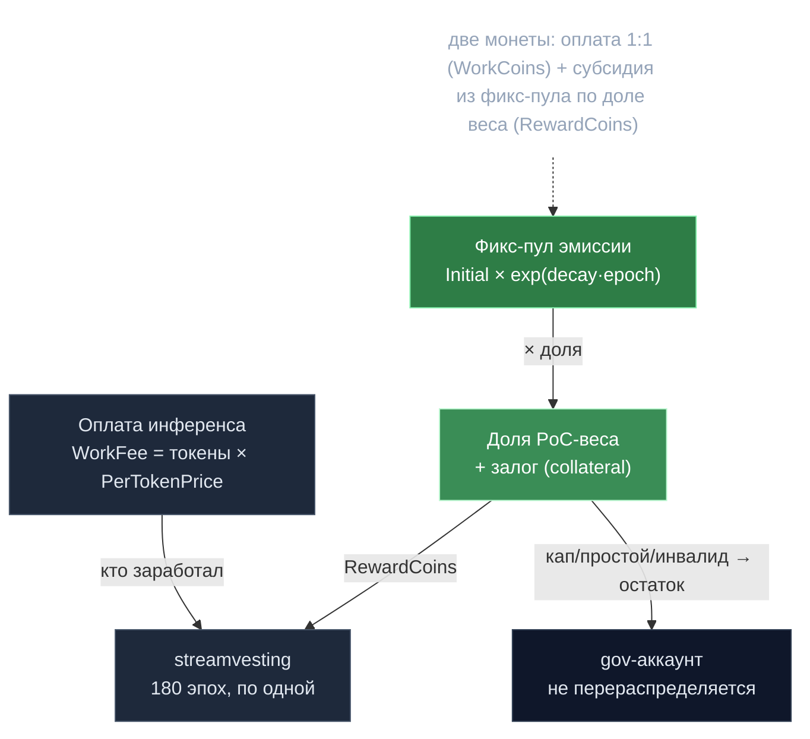

# 05 · Экономическая модель и токеномика (V2)

> Срез по `docs/tokenomics.md`, `voting.md`, `cosmos_changes.md`, `binom-stattest.md`, `proposals/tokenomics-v2/`, `genesis/genesis.json`.
> Назад к [индексу](../ARCHITECTURE.md).

## 🗺️ Обзор



---

## 1. Токен

**Нативный токен: Gonka.** `inference-chain/denom.json`:
- база `ngonka` (нанагонка), символ **GNK**, exp 0; `ugonka` (10³), `mgonka` (10⁶), `gonka` (10⁹).
- **1 gonka = 1 000 000 000 ngonka.**

**Genesis supply** (`genesis/genesis.json` → `inference.genesis_only_params`; отличается от дефолтов кода в `params.go`):

| Поле | Genesis (живой) | Дефолт кода |
|---|---|---|
| total_supply | 1 000 000 000 gonka | 1000M |
| originator_supply | 200 000 000 | 160M |
| pre_programmed_sale_amount | 120 000 000 | 120M |
| standard_reward_amount (кап субсидии) | 680 000 000 | 600M |
| top_reward_amount | 0 | — |

Итог supply = 1 млрд gonka. `standard_reward_amount` — жёсткий потолок кумулятивно минтированных RewardCoins.

**Газа нет.** Комиссии транзакций = 0 (`decentralized-api/cosmosclient/cosmosclient.go`); единственная экономическая плата — сервисная за инференс. Длина эпохи дефолт = 40 блоков, ~5с/блок, «1 эпоха ≈ 1 день» в проде.

---

## 2. Награды / расчёт (двухмонетная система)

Выплата участника за эпоху = **Work Coins + Reward Coins** (`msg_server_claim_rewards.go`).

### (a) Work Coins — плата пользователя, demand-driven
```
Final Fee = (PromptTokens + ActualCompletionTokens) × UnitsOfComputePerToken × UnitOfComputePrice
```
Эскроу держится наперёд по `MaxCompletionTokens` (`CalculateEscrow`), расчёт по реальным токенам (`CalculateCost`), остаток возвращается. Распределяются 1:1 — каждый получает ровно заработанные комиссии (`participant.CoinBalance`); при отрицательном балансе (долг) Work Coins = 0, долг неттится против Reward Coins.

### (b) Reward Coins — «биткоин»-субсидия (фиксированная)
Заменили старую инфляционную «переменную субсидию ∝ работе». Теперь **фиксированный минт на эпоху**, распределяемый по доле PoC-веса:
```
RewardCoin[i] = (effectiveWeight_i / totalFullWeight) × FixedEpochReward
```
**Кривая спада** (`CalculateFixedEpochReward`, `BitcoinRewardParams`):
```
current_reward = InitialEpochReward × exp(DecayRate × epochs_since_genesis)
```
- InitialEpochReward = **323 000 gonka/эпоха** (genesis; дефолт кода 285 000).
- DecayRate = **−0.000475 /эпоха** → халвинг ≈ каждые 1 460 эпох (~4 года).
- Сходящийся итог: 285 000 / 0.000475 = 600M gonka (целевая supply; genesis поднял до 323K/680M).

**Зачем фикс-минт:** делает сеть **дефляционной при росте** — больше GPU ⇒ тот же пул наград ⇒ меньше gonka/GPU ⇒ выше себестоимость майнинга/монету ⇒ ценность от дефицита (в противовес старой ловушке «рост → больше минта → инфляция»).

**Множители фазы-2** (`BitcoinRewardParams`):
- Бонус утилизации: `1 + (model_utilization × 0.5)`.
- Покрытие моделей: полное ×1.2; частичное `1 + coverage_ratio × 0.1`. Стимулирует обслуживать *все* governance-модели, мешая централизации на популярных.

**Гейт простоя:** `CheckAndPunishForDowntime` гоняет биномиальный тест miss-rate; провал обнуляет Reward Coins за эпоху. Динамический p0 (базовый сетевой miss-rate + 20‰ маржа, кап 500‰ — авто-выключатель наказания при сетевом outage).

**Два РАЗНЫХ капа власти (важно, доки часто путают):**
- **Кап консенсуса/голоса** = `MaxIndividualPowerPercentage` (genesis **0.25**) — применяется к voting power в `module/power_capping.go:40`.
- **Кап наград** = **жёстко зашитые 0.30** (`keeper/bitcoin_rewards.go:277` `DecimalFromFloat(0.30)` → `CalculateOptimalCap`), на reward-веса. Это *не* параметр 0.25.

Для малых сетей кап послаблен (1→100%, 2→50%, 3→40%). Незаклеймленное/обрезанное/закэпленное → в **gov, не перераспределяется**.

**Top-miner** (`top_miner.proto`): genesis-параметры активны — `top_rewards=3`, `top_miner_poc_qualification=10`, `top_reward_allowed_failure=0.1`, `top_reward_period=1 год`, `top_reward_payouts=12`, `top_reward_payouts_per_miner=4`, `top_reward_max_duration=4 года`. Надёжные топ-майнеры получают периодические доплаты; пул `top_reward_amount=0` в текущем genesis (механика жива, но «спит»).

---

## 3. Двойная модель власти (экономические следствия)

| | **Consensus Power** (staking) | **EpochGroup Power** (внутренняя) |
|---|---|---|
| Ставит | `SetComputeValidators` в конце эпохи | результаты PoC в течение эпохи |
| Управляет | блоки CometBFT, голосование x/gov, магнитуда слэша, набор валидаторов | вес голосов валидации PoC, распределение работы, назначение моделей, отбор участников |
| Источник | вычисленный PoC-скор (PowerReduction=1) | историч. PoC + сохранённые веса + ёмкость MLNode |

**Следствие:** власть = доказанный GPU-compute, не застейканные токены. Форк Cosmos SDK — `inference-chain/go.mod:7`: `github.com/cosmos/cosmos-sdk => github.com/gonka-ai/cosmos-sdk v0.53.3-ps17-observability` (⚠️ `docs/cosmos_changes.md` называет `product-science/...` — это устаревшее имя, реальная зависимость указывает на `gonka-ai/cosmos-sdk`). В форке: `DefaultPowerReduction` 1 000 000→1, бондинг обойдён, `TotalBondedTokens` суммируется из полей власти валидаторов, `Slash` уменьшает абстрактную власть вместо сжигания токенов — но безопасно триггерит хук `BeforeValidatorSlashed`, и реальный штраф применяет `x/collateral`. Это отвязывает безопасность консенсуса от спекуляции токеном, сохраняя финансовую ставку через залог.

> ⚠️ **Не верифицируемо в этом checkout.** Сам форк — внешний модуль, его исходников нет в `repo/`. Перечисленные правки staking/slashing подтверждаются только прозой `docs/cosmos_changes.md`, не кодом. В репозитории виден лишь *вызов* `SetComputeValidators` (`module.go:560`) и факт бондинга 101-го валидатора сверх `MaxValidators=100` (`app/tally_integration_test.go`).

---

## 4. Экономика залога (`x/collateral`)

**Гибридная модель веса** привязывает влияние выше базового уровня к депонированной ставке:
```
Base Weight        = PotentialWeight × BaseWeightRatio          (genesis 0.2 = 20%, бесплатно)
Collateral-Eligible = PotentialWeight × (1 − BaseWeightRatio)    (80%, нужен залог)
Activated Weight   = min(Collateral-Eligible, Collateral / CollateralPerWeightUnit)
Effective Weight   = Base Weight + Activated Weight
```
- `CollateralPerWeightUnit` = **4.2** gonka/единицу веса (genesis; дефолт кода 1). Пример: H100 (~1600 нонсов/эпоха), бэкуя 80% eligible-веса ⇒ ~0.0625 gonka/нонс.
- **Grace:** эпохи ≤ `GracePeriodEndEpoch` (=180) трактуют BaseWeightRatio как 1.0 (залог не нужен) — снижает порог входа.
- **Депозит/вывод:** `MsgDepositCollateral`/`MsgWithdrawCollateral`. Выводы в **очередь анбондинга** (`UnbondingPeriodEpochs` дефолт 1), остаются слэшируемы (слэшатся первыми, пропорционально).

**Слэшинг** (`CollateralParams`):
- INVALID (вредная/неверная работа): `SlashFractionInvalid` = **20%**.
- Downtime (miss% > `DowntimeMissedPercentageThreshold` = 5%): `SlashFractionDowntime` = **10%**.
- Консенсус-фолты (double-sign/liveness): зеркалятся из staking через `BeforeValidatorSlashed`. Маппинг gonkavaloper↔gonka доносит фолт до залога аккаунта.

---

## 5. Статистическая валидация и threat-модель мошенничества

**Биномиальный тест miss-rate** (`docs/binom-stattest.md`, `calculations/stats.go`, `stats_table.go`): односторонний биномиальный тест, превышает ли miss-rate исполнителя порог p0. Предвычисленные таблицы критических значений (ключи ‰: 50/100/200/300/400/500) дают O(log n), zero-alloc на пути консенсуса (ускорение 18 000–255 000× против точного decimal). `criticalK = floor(n·p0 + z·√(n·p0·(1−p0)))`, z=1.6448 (α=0.05). n>990 → консервативная exact-rate проверка; n<5 при p0≥0.20 → не наказывается. Дефолт `BinomTestP0` = 0.10.

**Тест фрода PoC** (`PoCStatTestParams`): DistThreshold 0.4, PMismatch 0.1, PValueThreshold 0.05.

**SPRT для статуса** (`calculations/status.go`): LLR на участника; пересечение **H = 4** флипает статус (`InvalidationHThreshold=4` vs `BadParticipantInvalidationRate=0.20` → INVALID; `DowntimeHThreshold=4` vs `DowntimeBadPercentage=0.20` → INACTIVE). Quick-fail: `FalsePositiveRate^fails < 1e-6` → мгновенно INVALID.

**Выборка валидаций непредсказуема и проверяема** (`docs/specs/inference-validation-flow.md`): валидатор выбирает инференсы приватным сидом; на claim сид раскрывается, цепь переисполняет `ShouldValidate` — пропуск обязательной ⇒ `ErrValidationsMissed`, claim отклонён. Убивает вишенкинг.

**Экономическая threat-модель:** мошенничество ⇒ (1) потеря Reward Coins эпохи (гейт простоя), (2) слэш залога 10–20%, (3) статус INVALID/INACTIVE роняет effective-вес ⇒ меньше работы и власти, (4) claim отклонён. Двухуровневое голосование (`docs/voting.md`): операционные invalidate/revalidate через x/group, >50% по весу.

---

## 6. Репутация

Репутация = int32 в `ValidationWeight`, сброс к 1 на старте эпохи. `InvalidReputationPreserve=0.0` и `DowntimeReputationPreserve=0.0` ⇒ при пометке «плохой» репутация фактически обнуляется. В V2 reward-пути долю наград ведёт **PoC-вес, не репутация**; экономические зубы — статус (INVALID/INACTIVE) → обнуление наград + слэш. `EpochPerformanceSummary` пишет per-epoch InferenceCount, MissedRequests, EarnedCoins, RewardedCoins, Validated/Invalidated.

---

## 7. Динамическое ценообразование (EIP-1559-стиль)

`keeper/dynamic_pricing.go` (BeginBlocker), per-model per-token цена:
- **Зона стабильности 40–60% утилизации** → цена не меняется.
- <40%: `price ×= 1 − (0.40 − util)×0.05`; >60%: `price ×= 1 + (util − 0.60)×0.05`.
- `PriceElasticity=0.05` ⇒ макс ±2%/блок/модель. `MinPerTokenPrice=1 ngonka`, `BasePerTokenPrice=100`. **Grace: бесплатный инференс (цена 0) до эпохи 90** (`GracePeriodPerTokenPrice=0`, `GracePeriodEndEpoch=90`) — раскачка спроса.

---

## 8. Вестинг (`x/streamvesting`)

Work Coins, Reward Coins и Top-Miner награды идут через вестинг. Per-participant график = массив по эпохам; новая награда делится ровно на N эпох (остаток → эпоха 0), агрегируется (длина ≤ N). `AdvanceEpoch` релизит старейшую запись в spendable раз в эпоху. Genesis-периоды: `work_vesting_period=180`, `reward_vesting_period=180`, `top_miner_vesting_period=180` (≈180 дней). Выравнивает долгосрочные стимулы, мешает dump-and-leave.

---

## 9. Governance и апгрейды

- **Governance-голосование:** Cosmos `x/gov` для «больших» параметров (decay, slash-доли, длина эпохи, ценообразование). **Власть голоса = PoC-производная consensus power.**
- **Операционное голосование:** x/group, короткоживущее (минуты) — инвалидация инференса/PoC. Каждая эпоха порождает новую группу с весами периода.
- **Апгрейды:** под cosmovisor, governance `software-upgrade` proposals с обоими бинарями (`inferenced` + `decentralized-api`) и SHA256, загрузка на `upgrade-height`. Активная per-minor-version каденция: `versioned/v0_2_2 … v0_2_14`, `proposals/governance-artifacts/update-v0.2.2 … v0.2.13`, `inference-chain/app/upgrades/`. Миграции данных через версионированные прото (V1-геттеры + handler), бамп `ConsensusVersion`.
- **Genesis-церемония** (`genesis/README.md`): 5-фазная, на PR GitHub, файлы GENTX/GENPARTICIPANT, координатор публикует хеш `genesis.json` — децентрализованный старт с блока 0.
- **Genesis Guardian:** пока сеть незрелая, 3 guardian-валидатора усиливаются (`other_power × m`, поровну) и резервируют долю слотов BLS-DKG. Анти-захват на bootstrap; авто-отключается при зрелости. ⚠️ **Параметры менялись апгрейдами:** genesis `m=0.52` (~34.2%, вето >1/3), порог `2M` → на слое **v0.2.13 действуют `m=0.33334` (~25%), порог `15M` + min-height `3M`** (v0.2.7/v0.2.13). Полный разбор — [10·C](10-deep-mechanisms.md).

---

## Расхождения «живой genesis ↔ дефолты кода»

Прод подкручен вверх относительно консервативных дефолтов:

| Параметр | Genesis | Код |
|---|---|---|
| originator_supply | 200M | 160M |
| standard_reward_amount | 680M | 600M |
| InitialEpochReward | 323K | 285K |
| CollateralPerWeightUnit | 4.2 | 1.0 |
| vesting periods | 180 | 0 (dev = прямая выплата) |

## Главные файлы

`x/inference/types/params.go` · `genesis/genesis.json` · `denom.json` · `keeper/{accountsettle,bitcoin_rewards,payment_handler,top_miner_calculations,msg_server_claim_rewards,dynamic_pricing}.go` · `calculations/{inference_state,status,stats,stats_table}.go` · `proposals/tokenomics-v2/{collateral,vesting,bitcoin-reward,dynamic-pricing}.md` · `docs/{cosmos_changes,gonka_poc,binom-stattest,upgrades,voting}.md`
