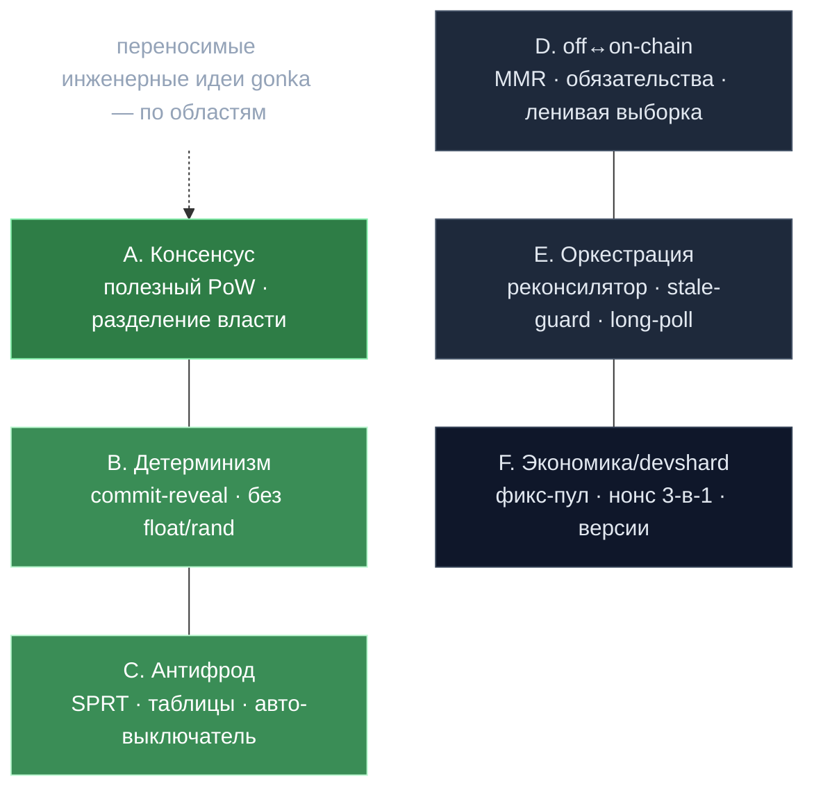

# 06 · Каталог идей — что переносимо в другие системы

> Цель этого файла — не описать Gonka, а **извлечь инженерные приёмы**, которые работают сами по себе. Каждая идея: суть → где в коде → где ещё применима.
> Назад к [индексу](../ARCHITECTURE.md).

---

## 🗺️ Обзор

---

## A. Консенсус и распределённые системы

### A1. «Полезный» Proof of Work
Замена бессмысленных хешей PoW на работу с трансформер-моделями, релевантную нагрузке сети. Voting power = доказанный compute. **Идея:** если у сети уже есть «полезная» дорогая работа (рендеринг, ML, симуляции), её можно превратить в сам механизм Сивилл-устойчивости вместо сжигания энергии впустую.
📁 `docs/gonka_poc.md`, `x/inference/module/chainvalidation.go`

### A2. Отвязка consensus power от токена через форк staking
`PowerReduction: 1_000_000 → 1`, бондинг обойдён, `Slash` не сжигает токены, а уменьшает абстрактную власть и через **хук** уведомляет отдельный модуль, который применяет реальный штраф. **Идея:** разделить «кто решает» (консенсус) и «кто рискует деньгами» (collateral) на два модуля, связанных хуком, — каждый меняется независимо.
📁 `docs/cosmos_changes.md`, `x/staking/keeper/compute.go` (форк)

### A3. Один «мастер-часовой» + модули-исполнители
Вся синхронизация эпох — в одной стейт-машине `EndBlock`; соседние модули — пассивные исполнители, вызываемые на границах фаз. Сбой соседа эмитит событие, но **не валит цепь**. **Идея:** централизуй *тайминг* в одном месте, децентрализуй *исполнение*; делай межмодульные вызовы fault-tolerant.
📁 `x/inference/module/module.go:368-568`

### A4. Буфер активации в 2 блока
Новый набор валидаторов активируется на `H+2`, а не сразу, — чтобы off-chain узлы успели подгрузить модели под новую эпоху. **Идея:** при смене конфигурации, требующей «прогрева» на стороне исполнителей, закладывай явный лаг между «решено» и «вступило в силу».
📁 `x/inference/module/module.go` (`onSetNewValidatorsStage`)

---

## B. Детерминизм и верифицируемая случайность

### B1. Дисциплина детерминизма на пути консенсуса
Никаких `math.*` float; вся арифметика — `shopspring/decimal` или **ряды Тейлора** для `exp`/`tanh`. Любая «случайность» — `DeterministicFloat(SHA256(seed...))`. **Идея:** в любой системе, где несколько узлов должны прийти к *байт-в-байт* одинаковому результату (консенсус, репликация, идемпотентные джобы), float и `rand` — враги.
📁 `x/inference/calculations/sprt.go`, `stats_table.go`

### B2. Сид = подпись, выборка проверяема постфактум
Участник выбирает, что валидировать, **приватным секретным сидом**; на claim сид раскрывается и цепь **переисполняет** ту же функцию выборки, проверяя, что сделано ровно положенное. **Идея:** «commit секретный сид → действуй → reveal → проверь детерминированным повтором» даёт непредсказуемость *и* аудируемость без доверенного рандома.
📁 `docs/specs/inference-validation-flow.md`, `internal/validation/inference_validation.go`

### B3. Свежий challenge-хеш против предсказания
Для выборки листьев на проверку берётся **отдельный** свежий sampling-хеш (≠ хеш старта работы), чтобы прувёр не мог заранее знать, какие части проверят. **Идея:** разделяй «сид работы» и «сид аудита» — иначе исполнитель оптимизирует именно проверяемые куски.
📁 `decentralized-api/poc/proof_client.go`

### B4. Анти-thundering-herd через детерминированную задержку
Каждый участник выводит задержку клейма в `[1,500]` блоков из `SHA256(своего адреса)` — нагрузка размазывается без координатора. **Идея:** децентрализованный джиттер из стабильного идентификатора заменяет централизованное расписание.
📁 `decentralized-api/internal/event_listener/new_block_dispatcher.go:424-439`

---

## C. Статистика для антифрода

### C1. SPRT вместо порога на одном измерении
Последовательный критерий Вальда копит log-likelihood ratio по потоку исходов; решение «виновен/чист/мало данных» принимается с контролируемыми ошибками I/II рода и **минимумом наблюдений**. **Идея:** для «банить/не банить по серии событий» SPRT эффективнее фиксированного окна — быстрый на явных случаях, осторожный на пограничных.
📁 `x/inference/calculations/{sprt,status}.go`

### C2. Предвычисленные таблицы критических значений
Биномиальный тест на горячем пути заменён O(log n) lookup'ом по предрассчитанным таблицам (ускорение ~10⁴–10⁵×, zero-alloc). **Идея:** если дорогая статпроверка вызывается в hot-loop с дискретными параметрами — предсчитай критические значения в таблицу.
📁 `x/inference/calculations/stats_table.go`, `docs/binom-stattest.md`

### C3. Авто-выключатель наказания при системном сбое
Динамический порог простоя = базовый сетевой miss-rate + маржа, с верхним кэпом (500‰): при сетевом outage наказание само отключается, не карая всех за общую беду. **Идея:** baseline-relative пороги + circuit-breaker отличают «виноват ты» от «лежит вся сеть».
📁 `x/inference/keeper` (`CheckAndPunishForDowntime`)

### C4. Обратная зависимость частоты проверок от репутации
Доверенных исполнителей валидируют **реже** (вес выборки ∝ 1/репутация); накладные расходы аудита падают по мере накопления честной истории. **Идея:** риск-ориентированный сэмплинг — трать проверки там, где неопределённость выше.
📁 `x/inference/calculations/should_validate.go`

---

## D. Off-chain ↔ on-chain граница

### D1. В цепь — только обязательства, данные — off-chain
On-chain живут хеши, корни MMR, счётчики; промпты/ответы/артефакты — в off-chain хранилище, верифицируемом по корню. **Идея:** держи on-chain состояние маленьким, но криптографически привязанным; «доверяй, но проверяй по корню».
📁 `decentralized-api/payloadstorage/`, `poc/artifacts/mmr.go`

### D2. Merkle Mountain Range как append-only аккумулятор
MMR с доменным разделением (`0x00` лист / `0x01` узел), `GetRootAt(count)` для любого исторического среза, O(log n) доказательства, crash-recovery пересборкой. **Идея:** когда нужно «доказуемо, что элемент X был в наборе на момент N» при постоянном добавлении — MMR лучше перестраиваемого Merkle-дерева.
📁 `decentralized-api/poc/artifacts/mmr.go`

### D3. Ленивый Fisher-Yates для выборки из огромного множества
Детерминированный сэмплинг k индексов из миллионов за O(k) (а не O(n)) через ленивую перестановку, сид от challenge-хеша. **Идея:** выборка без материализации полного множества — для огромных аккумуляторов/логов.
📁 `decentralized-api/poc/proof_client.go`

### D4. Детект фрода через «порозность» и дубликаты
Если `maxNonce/count ≥ 100` (слишком разреженные нонсы) или есть дубль-нонсы — это фрод, дешёвая проверка до дорогой статистики. **Идея:** структурные инварианты данных ловят грубое мошенничество до запуска тяжёлой верификации.
📁 `decentralized-api/poc/proof_client.go`

---

## E. Off-chain оркестрация (паттерны Go-сервиса)

### E1. Декларативный реконсилятор (intended vs current)
Внешние команды лишь *ставят намерение*; единственный реконсилятор сводит current→intended, отменяя устаревшие in-flight задачи. **Идея:** k8s-стиль reconcile-loop вместо императивных команд устраняет гонки и упрощает восстановление после сбоев.
📁 `decentralized-api/broker/broker.go`, `broker/README.md`

### E2. Stale-result guard
Результат задачи финализируется, только если его `OriginalTarget` всё ещё совпадает с текущим намерением узла; иначе игнор. **Идея:** в асинхронных воркер-пулах помечай задачу её целью и проверяй актуальность при коммите результата — отменённые задачи не портят состояние.
📁 `decentralized-api/broker/commands.go` (`UpdateNodeResultCommand`)

### E3. Воркеры без общего состояния
Воркер исполняет команду и **возвращает результат сообщением** в единый процессор, а не мутирует общее состояние. **Идея:** «одна горутина владеет состоянием, остальные шлют ей сообщения» — устранение блокировок по дизайну.
📁 `decentralized-api/broker/node_worker.go`

### E4. Идемпотентные команды с быстрым шорткатом
`InferenceUp`/`StartPoC` сперва проверяют фактическое состояние ML-узла (вплоть до «нужная модель загружена») и делают no-op, если цель достигнута. **Идея:** дешёвая проверка состояния перед дорогой операцией экономит редеплои и делает команды повторно-безопасными.
📁 `decentralized-api/broker/node_worker_commands.go`

### E5. Конфиг из источника истины каждый «тик»
dapi каждый блок тянет `Params` цепи в локальные кэши; devshardd long-poll'ит конфиг у dapi. **Идея:** один источник истины + дешёвое распространение (per-tick pull или long-poll) > разъезжающихся локальных копий.
📁 `decentralized-api/internal/event_listener/new_block_dispatcher.go`, `devshard/docs/params-dataflow.md`

### E6. Long-poll вместо поллинга
gRPC `GetRuntimeConfig` с зажатым `max_wait` (≤60с) будит клиента ровно при изменении. **Идея:** long-poll даёт near-real-time распространение без шторма поллинга и без push-инфраструктуры.
📁 `decentralized-api/nodemanager/runtime_config_*.go`

---

## F. Производительность транзакций

### F1. Конкурентность без account-sequence
Cosmos **unordered tx mode**: account number кэшируется один раз, sequence опущен, уникальность — через `TimeoutTimestamp` (наносекунды). Устраняет contention по sequence-локу, разрешая конкурентный broadcast. **Идея:** если у транзакций есть другой источник уникальности (timestamp/nonce), монотонный счётчик-секвенсор можно убрать ради параллелизма.
📁 `decentralized-api/cosmosclient/cosmosclient.go`

### F2. Батчинг с флашем по размеру-ИЛИ-таймауту + мерж
Три независимых потока tx копятся и флашатся по порогу размера *или* по таймауту; однотипные мержатся (~90% экономии комиссий). **Идея:** классический size-or-time батчинг + семантический мерж однотипных операций.
📁 `decentralized-api/cosmosclient/tx_manager/batch_consumer.go`

### F3. Durable-очередь с классификацией ошибок и дедлайном по типу
NATS JetStream-очередь, до 100 ретраев с джиттером, ошибки делятся на транзиентные (ретрай) и перманентные (drop), у каждого типа сообщения — свой дедлайн в блоках для отбраковки «зомби». **Идея:** ретраить не «всё одинаково», а по классу ошибки и с TTL, осмысленным для домена.
📁 `decentralized-api/cosmosclient/tx_manager/{errors,tx_deadline_config}.go`

### F4. Warm/cold-key делегирование (authz + feegrant)
«Горячий» операционный ключ оборачивает сообщения в `authz.MsgExec`, «холодный» аккаунт — fee granter. **Идея:** разделяй ключ-владелец-средств и ключ-оператор; делегируй права, а не раздавай приватный ключ.
📁 `decentralized-api/cosmosclient/`, devshard `signing/`

---

## G. Платёжные каналы / эскроу (devshard)

### G1. Пользователь как секвенсор, нонс как тройной идентификатор
Один монотонный нонс служит сразу: id инференса, порядковым номером diff'а и **ключом маршрутизации** на хост (`group[nonce % size]`). **Идея:** один хорошо выбранный счётчик может нести несколько ролей, схлопывая сложность маршрутизации и упорядочивания.
📁 `devshard/state/machine.go`, `types/domain.go`

### G2. Детерминированный state root + кворум подписей = дешёвый расчёт
Стороны со-подписывают детерминированно вычисляемый корень состояния; цепь пересчитывает корень и проверяет кворум 2/3+1 — расчёт за одну tx вместо тысяч. **Идея:** payment-channel для любой метрируемой услуги: считай off-chain, рассчитывайся on-chain по подписанному коммитменту.
📁 `devshard/state/hash.go`, `x/inference/keeper/devshard_settlement.go`

### G3. Phase-byte как структурный фильтр
В корень входит байт фазы; цепь при пересчёте жёстко прошивает «Settlement», поэтому любое нефинализированное состояние даёт другой хеш и автоматически отвергается. **Идея:** вшивай контекст/фазу в хеш-коммитмент — это бесплатно отсекает невалидные состояния.
📁 `devshard/state/hash.go`

### G4. Sealed-accumulator: сворачивание истории в 32 байта
Терминальные записи сворачиваются в одно значение (`FoldSealedAccumulator`), чтобы state root не материализовал всю историю; живыми держатся только in-flight записи. **Идея:** «свернул и забыл» для завершённых элементов — состояние не растёт линейно по объёму обслуженного.
📁 `devshard/state/hash.go`

### G5. Удаление фазы, которую никто не читает
Аудит показал: on-chain `MsgRevealSeed` стоил газ каждую сессию, но его выход не читал никакой код. Фазу убрали, сохранив деривацию сида. **Идея:** периодически проверяй, *читается* ли то, что ты дорого пишешь on-chain; мёртвые коммитменты — чистый расход.
📁 `devshard/docs/inference-lifecycle.md`

### G6. Спекулятивный прогрессивный fanout
Запрос — растущий список попыток; следующий хост стартует по таймауту/мгновенному fail; победитель — первый, выдавший вывод. Т.к. нонс сам маршрутизирует на следующий хост, fanout бесплатен. **Идея:** для хвостовых задержек гоняй параллельные попытки с эскалацией по сигналам, а не фиксированную пару primary/secondary.
📁 `devshard/cmd/devshardctl/speculative.go`

### G7. Drain-after-disconnect
При обрыве клиента прокси переключает upstream на `context.Background()` и продолжает дренить ответ, чтобы финализирующая транзакция всё равно прошла. **Идея:** разделяй lifetime клиентского соединения и lifetime backend-операции, если её завершение нужно для консистентности.
📁 `devshard/` (`metaDrainTimeout`)

### G8. Тихие ghost-пробы для карантинных узлов
Карантинный хост всё равно «получает» нонс (собирается локально, без HTTP), чтобы детерминированная ротация по `nonce % size` не разъехалась. **Идея:** при выводе узла из ротации сохраняй консистентность схемы маршрутизации, «сжигая» его слот, а не пропуская.
📁 `devshard/` (`ParticipantRequestLimiter`)

---

## H. Эволюция, версии, хранилище

### H1. Два независимых концепта версии
**Binary version** (кто может работать) и **protocol/state-root version** (что означает коммитмент) разведены: багфикс бампит первую, не вторую. Несколько версий бинаря работают одновременно на общем хранилище. **Идея:** не путай «версию кода» и «версию контракта данных» — их жизненные циклы разные.
📁 `devshard/types/protocol_version.go`, `docs/protocol-version.md`

### H2. Forward-only append-only схема, охраняемая CI
Деструктивный DDL запрещён (CI-скрипт), потому что старые ещё работающие бинари делят те же таблицы. **Идея:** при rolling-апгрейдах с共享 хранилищем миграции должны быть только аддитивными; принуждай это автоматикой, не дисциплиной.
📁 `devshard/storage/migrate/`, `scripts/check-storage-ddl.sh`

### H3. Партиция = единица прунинга
`epoch_id` — ключ партиции; прунинг = DROP партиции (Postgres) или удаление файла (SQLite per-epoch), без VACUUM/DELETE. **Идея:** выбирай ключ партиционирования так, чтобы устаревание данных = удаление целой партиции; это O(1) вместо построчного удаления.
📁 `devshard/storage/`, `docs/storage-design.md`

### H4. Прунинг по событию, и только после recovery
Прунинг запускается на событии смены эпохи (не по таймеру) и строго *после* восстановления, курсор двигается лишь при полном успехе. **Идея:** привязывай удаление к доменному событию, а не к настенным часам, и никогда не удаляй до завершения восстановления.
📁 `devshard/storage/`, `docs/storage-design.md`

---

## I. Криптоэкономический дизайн

### I1. Гибридный вес: бесплатная база + активируемая залогом часть
20% веса даётся за compute бесплатно, 80% нужно «выкупить» залогом, который слэшится. **Идея:** дай дешёвый вход, но привяжи основное влияние к slashable-ставке — баланс открытости и Сивилл-устойчивости.
📁 `x/collateral/`, `proposals/tokenomics-v2/collateral.md`

### I2. Дефляция через фиксированный пул эмиссии
Награда на эпоху фиксирована и убывает по экспоненте независимо от числа участников: рост сети ⇒ та же эмиссия на больше GPU ⇒ дефицит. **Идея:** фиксируй пул вознаграждения, а не выплату на участника, чтобы рост не порождал инфляцию.
📁 `x/inference/keeper/bitcoin_rewards.go`

### I3. Экономика без перераспределения
Слэш, обрезанные капом доли, просроченные награды, остатки от деления — всё идёт в gov-аккаунт, никогда соседям. **Идея:** не перераспределяй потери виновных честным — иначе доля вознаграждения становится непредсказуемой и появляются стимулы топить соседей.
📁 `x/inference/keeper/{accountsettle,bitcoin_rewards}.go`

### I4. Бонус за покрытие моделей против централизации
Множитель награды растёт за обслуживание *всех* governance-моделей (×1.2 за полное покрытие). **Идея:** если рынок естественно стягивается к популярным вариантам, доплачивай за покрытие непопулярных.
📁 `x/inference/keeper/bitcoin_rewards.go` (`*CoverageBonusFactor`)

### I5. Bootstrap-протекции с авто-истечением
Genesis Guardian (усиление власти основателей) и Restrictions (lockup переводов) активны лишь до порога зрелости/высоты и **сами выключаются**. **Идея:** защиты периода запуска должны иметь встроенный срок годности, а не зависеть от ручного отключения.
📁 `x/inference` (guardian), `x/restrictions/auto_unregistration.go`

### I6. Слот-взвешенный Shamur → «>50% веса» бесплатно
Секрет шарится на 1000 слотов, валидатор владеет диапазоном ∝ весу; «t+1 слотов» автоматически = «>50% веса» без отдельного слоя весов. **Идея:** дискретизируй вес в равные слоты — взвешенные пороговые схемы сводятся к простым счётным.
📁 `x/bls/`

### I7. Exclusion вместо slashing для криптопротоколов
В DKG единственная санкция за нечестность — исключение из набора валидных дилеров (не финансовый штраф); споры разрешаются детерминированным повторным шифрованием on-chain. **Идея:** где «плохой» участник просто не нужен результату, дешевле исключить, чем наказывать; делай адъюдикацию воспроизводимой.
📁 `x/bls/keeper/dispute_resolution.go`

---

## Сводная таблица «идея → файл»

| # | Идея | Файл (от `repo/`) |
|---|---|---|
| A1 | Полезный PoW | `docs/gonka_poc.md` |
| A2 | Власть ⊥ токен через хук | `docs/cosmos_changes.md` |
| B2 | Commit-secret-seed → reveal → re-verify | `internal/validation/inference_validation.go` |
| C1 | SPRT для бан-решений | `x/inference/calculations/sprt.go` |
| C2 | Таблицы критических значений | `x/inference/calculations/stats_table.go` |
| D2 | MMR-аккумулятор | `decentralized-api/poc/artifacts/mmr.go` |
| E1 | Декларативный реконсилятор | `decentralized-api/broker/broker.go` |
| F1 | Tx без account-sequence | `decentralized-api/cosmosclient/cosmosclient.go` |
| G1 | Нонс = тройной id | `devshard/state/machine.go` |
| G2 | State root + кворум = расчёт | `devshard/state/hash.go` |
| H1 | Binary ⊥ protocol версия | `devshard/types/protocol_version.go` |
| H3 | Партиция = единица прунинга | `devshard/storage/` |
| I2 | Дефляция через фикс-пул | `x/inference/keeper/bitcoin_rewards.go` |
| I6 | Слот-взвешенный Shamir | `x/bls/` |
