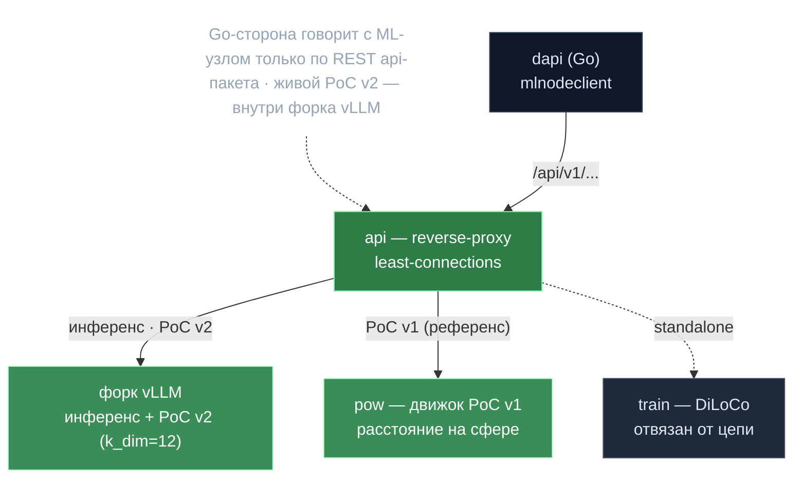

# 07 · ML-узел — где реально считается compute (Python)

> Контекст: **`repo/mlnode/`** (Python/Poetry, GPU). В прежних доках был «чёрным ящиком». Здесь — механика на уровне математики.
> Назад к [индексу](../ARCHITECTURE.md).

ML-узел — GPU-воркер, с которым Go-сторона (`mlnodeclient`/dapi) говорит **только** по REST API пакета `api` (`/api/v1/...`). Монорепо из пакетов: `pow`, `api`, `common`, `client`, `train`, `benchmarks`.

> **Главное открытие:** существуют **две разные реализации Proof of Compute**, и та, что цепь использует сегодня (PoC v2), живёт **не в пакете `pow`**, а внутри форка vLLM, который пакет `api` лишь проксирует.

## 🗺️ Обзор



---

## 0. Две реализации PoC (важное разграничение)

| | **PoC v1 (`pow`)** | **PoC v2 (форк vLLM + прокси `api`)** |
|---|---|---|
| Где считается | `mlnode/packages/pow/` — отдельный PyTorch | внутри процесса vLLM; mlnode только проксирует |
| Модель | кастомная **nano-Llama 3.1**, веса random-init из block hash | **реальная обслуживаемая LLM** (напр. Qwen3-0.6B), форвард-пассы |
| Артефакт | полный `vocab_size` (8192) вектор расстояний | компактный **k_dim=12 fp16** вектор (`vector_b64`, 24 байта) |
| HTTP | `/api/v1/pow/*` | `/api/v1/inference/pow/*` (проксируется в vLLM) |
| Статус | референс/старый движок, полностью реализован | живой протокол on-chain (целевой для Go-флагов `k_dim`, `poc_stronger_rng`) |

Пакет `pow` — лучшее место понять **математику**; PoC v2 переиспользует тот же статистический тест на продакшен-LLM. `packages/pow/docs/description.md` устарел (эскиз про «ведущие нули SHA256») — реальный алгоритм основан на **расстоянии**, не на ведущих нулях.

> ⚠️ **Точность (после review):** называть пакет `pow` «v1» — упрощение. Его README озаглавлен «Proof of Work v2», и он несёт оба набора параметров (`PARAMS_V1` и `PARAMS_V2`, `models/utils.py`). Точнее: `pow` — это **standalone GPU-движок** (референс математики), а различие «v1/v2» по сути про то, **где исполняется живой compute** (внутри форка vLLM), а не про номер пакета.

## 1. PoC-движок — как работает на уровне математики

Референс: `mlnode/packages/pow/src/pow/`.

### Детерминированная работа из хеша блока
Всё засеяно SHA256 от строк, собранных из `block_hash`, `public_key`, `nonce`
(`random.py`). `get_extended_entropy` конкатенирует `sha256(f"{seed}_{i}")` → `numpy SeedSequence` → `default_rng`. Это кросс-машинно воспроизводимый RNG.

### Хеш → случайная модель (pool-трюк)
Модель — кастомный трансформер (`models/llama31.py`, nano-Llama 3.1; дефолт
`dim=2048, n_layers=16, vocab_size=8192, seq_len=16`). **Веса случайны и выведены из
хеша блока — никогда не обучены.** Наивная отрисовка миллиардов весов через RNG —
медленно. Трюк (`random_pool_optimized.py`): отрисовать малый пул `max(50000, 0.05·N)`
значений `N(0,0.02)` один раз, затем для каждого тензора по `sha256(f"{hash}_{name}")`
нарезать/тайлить/вращать пул. Цель: <30с инициализации модели на 18B параметров.

> Это и есть фокус детерминизма: каждый узел пересобирает **точно ту же** случайную
> модель из одного лишь хеша блока. См. [[Хеш в случайную модель — pool-трюк]] в Wiki.

### Что такое нонс и как считается батч (`compute/compute.py`)
1. **Нонс → входной эмбеддинг.** RNG засеян `f"{block_hash}_{public_key}_nonce{nonce}"`,
   рисует нормальный тензор `(1, seq_len, dim)` как **прямые эмбеддинги** (без токенизатора), fp16.
2. **Перестановка на нонс** — `f"..._nonce_{nonce}_permutations"`, случайная перестановка `[0,vocab)`.
3. **Форвард-пасс** → логиты последней позиции `outputs[:,-1,:]` → CPU numpy.
4. **Перестановка + нормализация + расстояние:** применить перестановку, L2-нормировать
   на единичную сферу, посчитать евклидово **расстояние до target-вектора**.
5. **Target** (`get_target`): засеян `f"{block_hash}_target"`, один равномерный единичный
   вектор на `vocab`-мерной сфере.

`ProofBatch` = `{public_key, block_hash, block_height, nonces[], dist[], node_id}`.
**«Расстояние» = L2 от перестановленного+нормированного выхода модели до target из хеша.**
Нонс «побеждает», если `dist < r_target` (`r_target` — ручка сложности).

> Это **неустранимая GPU-работа**: чтобы узнать расстояние нонса, нужно прогнать
> форвард-пасс; срезать нельзя, а ответ детерминирован при данном железе.

### Разбиение пространства нонсов
`NonceIterator` (`compute/utils.py`): `value = (node_id + group_id·n_nodes) + x·(n_groups·n_nodes)`
— узлы и GPU-группы покрывают **непересекающиеся** нонсы без координации.

### Конвейер
`Worker` (процесс на GPU-группу, фазы IDLE/GENERATE/VALIDATE/STOP, **двойная
буферизация** prefetch) → `ParallelController` (один воркер на GPU-группу, авто-размер
батча под VRAM) → `PowManager` → `Sender` (отдельный процесс, POST'ит батчи в callback
`{url}/generated`, `{url}/validated`, который дала Network-Node-сторона).

## 2. Валидация — как переисполняется чужой батч

### PoC v1 (математика, `data.py`)
`Compute.validate` **пересчитывает расстояния для тех же нонсов** (тот же `public_key`,
`block_hash`). Для каждого нонса — mismatch, если принятое расстояние ≥ `r_target`
(заявлен победитель, а он не он) ИЛИ пересчитанное > `r_target`. Затем **биномиальный тест**:
```python
p = binomtest(k=n_invalid, n=len(batch), p=PROBABILITY_MISMATCH, alternative='greater').pvalue
fraud = p < fraud_threshold   # PROBABILITY_MISMATCH = 5e-4 (ожидаемый шум железа)
```
> Тест: «при базовой вероятности mismatch от шума железа, насколько вероятно, что
> честный узел даст столько mismatch'ей?» Толерантен к fp16-недетерминизму, ловит
> систематически-неверные (мошеннические) узлы. **Порозности/KS-теста в живом пути нет**
> — продакшен-тест именно биномиальный.

### PoC v2 (живой путь цепи)
Та же структура через `/api/v1/inference/pow/generate` с блоком `validation:{artifacts}`
и `stat_test:{dist_threshold=0.02, p_mismatch=0.001, fraud_threshold=0.01}`
(`pow_v2_routes.py`). Mismatch нонса, если **L2 между принятым и пересчитанным 12-мерным
вектором > 0.02**, затем тот же биномиальный тест. Эмпирически (`test_pow_v2_e2e.py`):
честная ре-валидация → ≤2 mismatch; **чужой public_key** → другой сид → всё mismatch →
фрод (привязка к идентичности); 20% порчи → фрод; крошечное возмущение (~1e-3) → проходит.

> Порог 0.02 **калиброван по железу** (`docs/inference-validation.md`): одинаковая
> точность → L2 < 0.002; **разная квантизация** (fp8 vs fp16) → ~0.02+ — то есть
> подмена квантизации детектируется как фрод. Поэтому квантизацию требуется пиновать явно.

## 3. Инференс-сервинг

Пакет `api` запускает **форк vLLM** (`inference/vllm/runner.py`): по одному
`vllm.entrypoints.openai.api_server` на GPU-группу (авто-шардинг
`--tensor-parallel-size`×`--pipeline-parallel-size`), каждый на своём порту, форсит
**`VLLM_USE_V1=0`** (legacy-движок нужен PoC-форку). Главный FastAPI встраивает
httpx-реверс-прокси (`proxy.py`): `/v1/...` (OpenAI-совместимо) → бэкенд по
**least-connections**, стриминг, health-loop каждые 2с. Совместимый сервер на порту 5000.

**Жизненный цикл** (строго single-service, `service_management.py`: `POW|INFERENCE|TRAIN|STOPPED`,
вторая служба при работающей первой → **HTTP 409**): `/inference/up[/async]`,
`/inference/down`, `/state`, `/stop`, `/pow/*`, `/models/*`, `/gpu/*`, health.
При потере GPU (`503` на `/pow/init`) узел делает `os._exit(1)` — оркестратор перезапустит.

**Инференс-валидация** (отдельно от PoC): прувер пишет top-k логпробы на позицию,
валидатор переисполняет и сравнивает нормированной по-токенной дистанцией; одинаковая
модель < 0.002, кросс-квантизация ~0.02. Известная слабость — prefill-атака (дешёвая
модель генерит, полная пруфит); предложенный фикс (seed-replay top-k) — WIP.

## 4. Обучение (`train`) — реально, но отвязано от цепи

`mlnode/packages/train` — это форк `zeroband` (родословная OpenDiLoCo): **реальный**
рабочий DiLoCo, не заглушка. Внешний оптимизатор SGD (lr 0.7, nesterov), псевдо-градиент
`θ_offloaded − θ_gpu`, GLOO all-reduce между пирами, синк каждые `inner_steps` (50–100),
эластичный device-mesh с heartbeat'ами и live-recovery, **TLS-защищённый транспорт**
(`GLOO_DEVICE_TRANSPORT=TCP_TLS`, Ed25519-сертификаты). Сервис: `/api/v1/train/{start,stop,status}`.

> **Но:** в пакете **ноль ссылок** на цепь/cosmos/PoC/«gonka». Нет on-chain координации
> и нет валидации обучающей работы. TLS даёт аутентичность узлов, не верифицируемость
> обучения. Координационный слой обучения был **удалён из цепи и API в v0.2.12** —
> подробности в [09](09-testing-and-evolution.md). См. [[Обучение — построено и удалено]].

## Переносимые идеи отсюда
- **Хеш → детерминированная случайная модель** через pool-тайлинг (<30с на 18B).
- **PoC «расстояние на сфере»** вместо ведущих нулей: непрерывная сложность `r_target`
  + **биномиальный фрод-тест, толерантный к шуму fp16** (`5e-4`).
- **k_dim=12 fp16 артефакт** (24 байта): подмена квантизации всплывает как L2 ≥ 0.02.
- **Привязка к идентичности:** сид включает `public_key` → чужие артефакты под другим
  ключом гарантированно дают фрод.
- **Разбиение нонсов** даёт бесконфликтное деление работы без координации.
- **Самоубийство при потере GPU** (`os._exit(1)`) как грубый, но рабочий сигнал рестарта.

## Главные файлы
`packages/pow/src/pow/{random,data,random_pool_optimized}.py`, `.../compute/{compute,model_init,worker,controller,utils}.py`, `.../models/{llama31,utils}.py`, `.../service/{manager,sender,routes}.py` · `packages/api/src/api/inference/{pow_v2_routes,routes,vllm/runner}.py`, `.../{proxy,service_management}.py` · `mlnode/docs/inference-validation.md`, `packages/api/tests/integration/test_pow_v2_e2e.py` · обучение: `packages/train/src/zeroband/{train,dist/diloco,dist/device_mesh,service/manager}.py`
