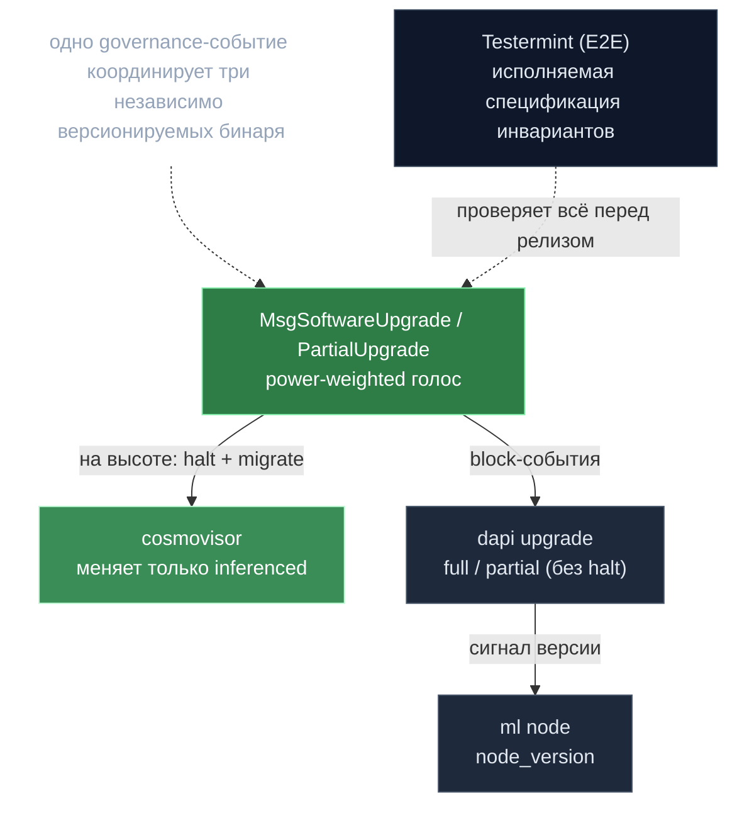

# 09 · Тестирование, эволюция и судьба обучения

> Testermint (E2E), upgrade-каденция/ops, и честная история обучения (DiLoCo).
> Назад к [индексу](../ARCHITECTURE.md).

---

## 🗺️ Обзор

---

## 1. Обучение (DiLoCo) — построено, затем удалено

README репозитория рекламирует geo-distributed training. **Реальность: это удалённая фича, не roadmap и не live.**

### Что реально есть (ML-сторона)
`mlnode/packages/train` — форк `zeroband` (родословная OpenDiLoCo): рабочий DiLoCo (внешний SGD lr 0.7 nesterov, псевдо-градиент, GLOO all-reduce, эластичный device-mesh с heartbeat'ами и live-recovery, **TLS-транспорт `TCP_TLS` + Ed25519-сертификаты**), сервис `/api/v1/train/{start,stop,status}`. Но **ноль ссылок** на цепь/cosmos/PoC. Нет on-chain координации и нет валидации обучающей работы. Подробнее — [07](07-mlnode-compute.md).

### Что удалено (координационный слой)
- `proposals/training-removal-v0.2.12/` — **жёсткое удаление** (явная цель: «без deprecated-заглушек, без флагов, без исторических запросов»). Вырезаны: training `Msg`/`Query` в proto, gRPC-координация ML-узлов, обработчики, AutoCLI, sim-операции; на API — wiring в `main.go`, эндпоинты `/training/...`, executor/assigner, broker-команды, методы ML-клиента.
- Хендлер апгрейда v0.2.12 **активно стирает** остаточное состояние: `app/upgrades/v0_2_12/upgrades.go:122` → `clearTrainingState` → `keeper/training_state_cleanup.go` чистит `TrainingExecAllowList/StartAllowList` и префикс-удаляет `TrainingTask/{value,sequence,queued,inProgress,sync}/` (последнее держало on-chain barrier/heartbeat координацию DiLoCo).

### Рудименты (доказательство, что было реально)
- `types/key_training_task.go` + training-префиксы в `keys.go` — оставлены *только* чтобы апгрейд детерминированно удалил состояние.
- `hardware_node.proto:28` всё ещё перечисляет `TRAINING=3` в `HardwareNodeStatus`, но не используется; в `broker/broker.go` enum выживает **только как комментарий**.
- mock-сервер Testermint всё ещё имеет состояние `TRAIN` и роут `/api/v1/train/start`.

> **Вердикт:** ML-движок DiLoCo реален и работает автономно, но trustless-история
> децентрализованного обучения (on-chain координация задач, валидация работы, награды)
> была построена, признана не стоящей поддержки и **вырезана в v0.2.12**. В roadmap
> (`proposals/gonka-network-development-roadmap.md`) обучение — один из 12 *будущих*
> треков, не текущая возможность. См. [[Обучение — построено и удалено]].

---

## 2. Testermint — де-факто спецификация инвариантов

### Что это
Kotlin (JVM 21) / Gradle интеграционный проект (`testermint/`). Поднимает **реальные
`inferenced` + `decentralized-api` в Docker** и **мокает только ML-слой**. Зависимости:
docker-java, WireMock, Fuel HTTP, gRPC, tinylog.

### Как поднимает систему
Оркеструет реальные compose-файлы (`local-test-net/docker-compose-*.yml`) через
`DockerGroup.kt`; каждый участник = `LocalInferencePair` (узел + API + mock); цепь — через
реальный CLI `inferenced` (`ApplicationCLI.kt`), API — по HTTP. Реальный P2P/RPC, реальный
genesis+join, опциональный Postgres. Модель `EpochStage` (`Epochs.kt`) проводит тесты
через реальный жизненный цикл эпохи.

### Как мокает ML-узлы
`testermint/mock_server/` — собственный **Kotlin Ktor**-сервер, воспроизводящий API и
стейт-машину ML-узла (`STARTED/POW/INFERENCE/TRAIN/STOPPED`): `/api/v1/pow/init/generate`,
`/pow/validate`, `/inference/up`, `/responses/{inference,poc}`, `/health`. Ответы
программируются на участника.

### Что тестируется (~46 классов) → что несущее
> Широта E2E-покрытия — **самый честный сигнал реальных инвариантов**:
- **PoC — жемчужина:** `ConfirmationPoC{Pass,Fail,MultiNode}Tests`, `MultiModelPoCTests`
  (агрегация весов), `PoCOffChainTests` (off-chain артефакты + on-chain корни), `LargePayloadPocTest`.
- **Расчёт/учёт инференса:** `Inference{,Accounting,FailureAccounting,Retry}Tests`,
  `StreamingInferenceTests` (failed → refund).
- **BLS/DKG устойчивость:** `BLSDKGSuccessTest`, `BLSDisputeApiRestartTest`, `BLSNetworkRecoveryTest`.
- **Governance/апгрейды:** `GovernanceTests`, `UpgradeTests`.
- **Экономика/власть:** `CollateralTests`, `DelegationTests`/`ParticipantPowerTests`,
  `StreamVestingTests`, `GenesisTransferTests`, `DynamicPricingTest`, `BandwidthLimiterTests`.
- **Devshard:** `DevshardTests`, `DevshardStandaloneTests`, `DevshardPostgresStorageTests`,
  `DevsharddRuntimeConfigTests` (hot-reload, 30с SLA, параллельные изолированные сессии).
- **Топология/восстановление:** `MultiNodeTests`, `KubernetesTests`, NodeManager-тесты.

**Несущие инварианты:** (a) PoC как Sybil-защита со справедливой мульти-модельной
агрегацией и целостностью off-chain-артефакт/on-chain-корень; (b) атомарность
эскроу→валидация→расчёт с возвратами; (c) детерминизм границы эпохи для смены
валидаторов и наград; (d) BLS/DKG переживает рестарты/партиции; (e) координация
апгрейда двух бинарей. **Заметного E2E-покрытия обучения нет** — согласуется с §1.

### Инструмент
`testermint/mcp_log_examiner/` — **Kotlin MCP-сервер** (SQLite/Exposed), грузит логи тестов
в SQLite и даёт MCP-тулы `load-log`/`log-query`, чтобы Claude SQL-запросами анализировал
падения. Чисто dev-помощник.

---

## 3. Эволюция: governance-driven dual-binary апгрейды

### Genesis-церемония (`genesis/README.md`)
5-фазная, на PR: (1) валидаторы шлют метаданные `genesis/validators/<NAME>/`; (2)
координатор публикует `genesis-draft.json`; (3) офлайн `gentx` (`MsgCreateValidator` +
authz cold→warm) + `genparticipant`; (4) координатор агрегирует
(`collect-gentxs`+`patch-genesis`), фиксирует финальный `genesis.json` (хеш в исходниках);
(5) валидаторы сверяют хеш и стартуют до `genesis_time`. Founders — `add_founders_to_genesis.sh`
(вестинг 2025-08-21 → 2029-08-21).

### Реальная история версий
Хендлеры апгрейдов живут в **`inference-chain/app/upgrades/`**:
> **v0_2_2 … v0_2_14** (+ `v2test`) — **13 поставленных on-chain апгрейдов**, высокая
> ровная каденция.

> ⚠️ Уточнение: `proposals/versioned/` — это **только README** про версионирование
> *devshard*-бинарей, не апгрейды цепи. Истинный источник — `app/upgrades/`.

Хендлеры — это **доставка фич + миграция состояния + выплата bounty**, не просто бамп
версии. Самый тяжёлый — v0.2.12: миграция мульти-модельных параметров (singular →
`Models[]`, добавлен Kimi-K2), ввод x/feegrant (авто-allowance на cold→warm), 4 миграции
BLS/bridge суб-ключей, сидирование devshard approved-versions, backfill voting-power,
init pruning-state, зашитые bounty, **и стирание training-состояния (§1)**. Бампы
`ConsensusVersion` → Cosmos SDK `RunMigrations()`.

### Cosmovisor и расщепление апгрейда
- **Cosmovisor** (`cosmovisor/v1.7.{0,2}`) оборачивает **только цепь** (`inferenced`): на
  высоте апгрейда halt → `upgrade-info.json` → скачать+SHA-проверить новый бинарь →
  рестарт → хендлер мигрирует. Реактивен.
- **dapi НЕ использует cosmovisor** (`decentralized-api/upgrade/`): слушает block-события.
  **Full upgrade** — читает `upgrade.Plan.Info` JSON (`api_binaries` по OS/arch + `node_version`),
  апгрейдится в лок-степ с цепью. **Partial upgrade** — отдельное on-chain `PartialUpgrade`
  даёт dapi/ML-узлу апгрейдиться **независимо** от цепи (хотфикс API без halt). На
  `upgradeHeight-1` пишет свой `upgrade-info.json`, внешний супервизор перезапускает.

### Сквозной жизненный цикл
`MsgSoftwareUpgrade`/`PartialUpgrade` → power-weighted голосование → на высоте: цепь
halt (cosmovisor меняет `inferenced`, хендлер мигрирует+bounty) ∥ dapi детектит план,
меняет свой бинарь, сигналит версию ML-узла. **Три независимо версионируемых артефакта**
(consensus-бинарь, dapi, ML-узел) координируются одним governance-событием. Без даунгрейда.

> ⚠️ `proposals/` (~35 папок) организованы по **фичам/доменам** (`bls/`, `multi-model-poc/`,
> `tokenomics-v2/`, `pruning_v2/`, …), не по версиям — это design-артефакты, отдельные от
> on-chain version-governance. Roadmap явно необязывающий.

## Главные файлы
Обучение: `proposals/training-removal-v0.2.12/`, `keeper/training_state_cleanup.go`, `app/upgrades/v0_2_12/upgrades.go:122` · Testermint: `testermint/{README.md,build.gradle.kts}`, `testermint/src/main/kotlin/{DockerGroup,LocalInferencePair,Epochs}.kt`, `testermint/mock_server/`, `testermint/mcp_log_examiner/` · Ops: `genesis/README.md`, `inference-chain/app/upgrades/v0_2_*/`, `app/upgrades_enabled.go`, `cosmovisor/v1.7.*`, `decentralized-api/upgrade/{types,events}.go`, `docs/upgrades.md`
