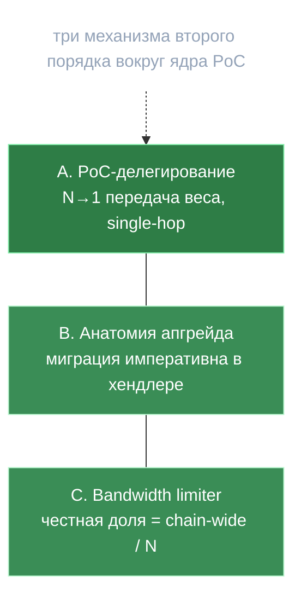

# 11 · Продвинутые подсистемы — делегирование, анатомия апгрейда, лимитер

> Три механизма второго порядка: PoC-делегирование (N→1 передача веса), анатомия тяжёлого апгрейда v0.2.12, bandwidth-лимитер (троттлинг запросов).
> Назад к [индексу](../ARCHITECTURE.md).

---

## 🗺️ Обзор



---

## A. PoC-делегирование (N→1 передача consensus-веса)

Часть multi-model PoC (`proposals/multi-model-poc/`). Код: `x/inference/module/delegation_*.go`, `keeper/poc_delegation.go`.

### Проблема
Сеть стала **мульти-модельной**: каждая governance-модель образует свою группу; *прямой* член — только тот, кто реально гоняет модель (шлёт PoC-коммит по ней). Приём PoC по модели требует **>2/3 всего сетевого веса**. Держатель веса прошлой эпохи, не запускающий данную модель, иначе считается **воздержавшимся** (а это — против принятия). Делегирование позволяет передать его consensus-вес прямому члену группы, чтобы модель добрала 2/3.

> Три РАЗНЫХ числа: `pocWeight` (сырой per-model proof), `consensusWeight` (кросс-модельный агрегат — *его* делегируют), `votingPower` (per-model: свой вес + делегированный к нему).

### Три сообщения (взаимоисключающие, last-write-wins)
`poc_delegation.proto`. Все подписаны `sender`, требуют `ParticipantPermission` + governance-модель.

| Msg | Подписант | Действие |
|---|---|---|
| `SetPoCDelegation{model_id, delegate_to}` | делегатор | `delegate_to=""` → очистить; иначе записать (цель — зарегистрированный участник, `sender≠delegate_to` иначе `ErrSelfDelegation`) |
| `RefusePoCDelegation{model_id}` | отказывающийся | `SetPoCRefusal` — не принимать делегирование |
| `DeclarePoCIntent{model_id}` | заявитель | `SetPoCDirectIntent` — намерение делать PoC (bootstrap-модель) |

**Взаимное исключение:** в любой момент на `(model_id, participant)` существует максимум одно из {delegation, refusal, intent}; любое новое стирает два других.

### N→1 и ограничения
- **Per-model**, ключ `(model_id, delegator)`. **N→1 да** (многие → один); **один target на (model, delegator)** (split нет).
- **Single-hop, без транзитивности.** Если delegate_to сам прямой член — **DIRECT приоритетнее**, его собственная запись делегирования игнорируется. Если target не прямой член — делегирование к нему резолвится в **ModeNone** (штраф за неучастие, не передача). Это структурно исключает циклы.

### Потоки веса
- **(a) Per-model voting power:** каждый прямой член засеян своим финальным весом; для каждого делегатора в `ModeDelegate` чей target — член: `votingPower[target] += finalWeights[delegator]` (**стекается аддитивно**). Кап `max_model_voting_power_percentage`: превышение **обрезается и сжигается, не перераспределяется** (перераспределение тихо переназначило бы доверие делегатора).
- **(b) Consensus weight:** делегирование напрямую его *не* формирует; влияет только через **штраф-перенос** `delegation_share` (ниже).

### Штрафы (аддитивный аккумулятор, кап 1.0)
`delegation_weight_adjustment.go`. DIRECT — без штрафа; **REFUSE** → `+= refusal_penalty`; **NONE** → `+= no_participation_penalty`; **DELEGATE** → перенос `delegation_share·originalWeight` от делегатора к target (клампится остатком веса — сохранение веса). Доли суммируются по всем моделям, `min(1.0)`, `penalty = totalFrac·originalWeight`.

> ⚠️ **Слой АКТИВЕН с v0.2.12** (поправка после review): апгрейд ставит ненулевые
> `DelegationParams` — `RefusalPenalty=0.1`, `NoParticipationPenalty=0.15`,
> `DelegationShare=0.05`, `CapFactor=0.75`, `MaxModelVotingPowerPercentage=0.3`,
> `DeployWindow=500` (`v0_2_12/upgrades.go:651-661`). Дремать может лишь применение
> штрафов до per-model `penalty_start_epoch`, но сами параметры живые.

### Жизненный цикл
Снимок делегирований замораживается на `poc_validation_start` (intent'ы исключены); на `start_poc − deploy_window` отдельный bootstrap-снимок. В конце валидации PoC прогоняется пайплайн весов. **Очистка:** refusals и intents удаляются каждую эпоху (**одноразовые**, надо слать заново); **делегирования стоят** до явной очистки/перезаписи.

### Крайние случаи
- Делегирование к выбывшему участнику: tx-проверка пройдёт при отправке, но при резолве станет ModeNone → стоящее делегирование превращается в **штраф**, не no-op.
- Концентрация (один добирает 2/3) — смягчена per-model VP-капом со сжиганием.
- Открытый вопрос дизайна: штрафы бьют по consensus-весу, хотя дизайн сомневается — «может, только по наградам».

---

## B. Анатомия апгрейда — миграция живёт в хендлере, не в `RegisterMigration`

`inference-chain/app/upgrades/v0_2_12/` — самый тяжёлый апгрейд. Кросс-ссылка: [09](09-testing-and-evolution.md).

### Главный архитектурный факт
**Реальная логика миграции — императивно внутри `CreateUpgradeHandler`, до `RunMigrations`.** Колбэки `RegisterMigration` для модуля inference **no-op'ы с версии 8** (`return nil`); версия 7 ещё делает реальную работу (`MigrateLegacyBridgeState` + `MigrateConfirmationWeights`, `app/upgrades.go:88-94`). Бамп `ConsensusVersion` (inference = 14) — лишь бухгалтерия version-map. Каждый хендлер: лог → гард версии capability → N императивных шагов (fail-fast) → `mm.RunMigrations` → лог.

### 13 шагов v0.2.12 (по порядку)
1. **removeTopMiner** — очистка коллекции TopMiners + strip removed-полей TokenomicsData.
2. **clearTrainingState** — вайп обучения (5 KV-префиксов + 2 allow-list'а). См. [[Обучение — построено и удалено]].
3. **clearLegacyPoCv2Data** — PoC-v2 ключи получили `model_id` (префиксы 38/39/40 → 58/59/60); старые байты не декодируются новым кодеком → **сырая итерация+удаление**.
4. **migrateParams** — singular поля PoC → `Models[]`; добавлен **Kimi-K2**; инициализированы `DelegationParams`; очищены deprecated-поля.
5. **updateGovernanceModels** — регистрация Kimi + **GC** governance-моделей не из approved-набора.
6. **backfillVotingPower** — засеять `voting_power` (= вес) для всех (пред-апгрейд = single-model, все DIRECT), иначе валидация первой эпохи сломалась бы на нулях.
7. **initNewPruningState** — засеять 4 маркера прунинга до текущей эпохи, иначе первый `Prune()` обошёл бы всю историю.
8. **adjustParameters / adjustBLSParameters** — discard-unknown roundtrip + бэкфилл нулевых BLS-параметров.
9. **Четыре BLS/bridge sub-key миграции** — *см. ниже*.
10. **setFeeParams** — включение комиссий чейн-вайд (`MinGasPriceNgonka=0` «временно, из-за оценки газа»).
11. **setDevshardApprovedVersions** — засеять devshard v1 (имя/URL/SHA256), чтобы versiond было что скачать.
12. **distributeBountyRewards** — 13 баунти на сумму **$35 200 USDT** через CosmWasm `withdraw_ibc` с контракта community-sale (не минт; при нехватке баланса — пропуск, не ошибка).
13. **migrateFeegrantsForFees** — авто-`BasicAllowance` (100 GNK, 365 дн) cold→warm на каждую пару (маркер — authz-грант `MsgStartInference`), чтобы при включённых комиссиях «тёплый» ключ dapi платил с «холодного».

### Чинённый баг O(N²) газа (шаг 9 — самое инженерно-плотное)
Несколько BLS/bridge-структур копили данные **инлайн** в одной proto-записи (`DealerParts`, `VerificationSubmissions`, `DealerComplaints`, `PartialSignatures`, bridge `Validators`). Каждая новая отправка ре-маршалила растущий слайс → O(N) газа на запись, O(N²) суммарно (поздние отправители «дорожали» и валили DKG). Фикс: разнести в **per-entry sub-keys** (константный газ на горячем пути). Миграция переносит остаточные инлайн-данные в sub-keys **до** первой tx новой версии (иначе новые хендлеры, обнуляющие инлайн-поля, потеряли бы их). Паттерн «собрать-потом-писать» (буфер ключей → закрыть итератор → запись); комментарий честно отказывается полагаться на COW-семантику cache-kv как на footgun.

### Что вскрывает набор миграций
- **Пивот single→multi-model** — доминирующая тема (PoC-параметры, GC моделей, кодек PoC-v2, per-model VP/прунинг, `DelegationParams`).
- **Реальный баг газа** в DKG/bridge — шрамы от инлайн-аккумуляции.
- **Включение комиссий** потянуло компенсирующий feegrant («добавили экономику — досыпь сантехнику»).
- **v0.2.14 — почти целиком ремонт** за v0.2.13: бэкфилл `DevshardEscrowParams`, fee-снимков и seal-grace, которые «mainnet выполнил до того, как бэкфиллы подъехали» — операционный промах, потребовавший доп-апгрейда. Урок про полноту миграций.

### Идемпотентность (т.к. halt/повтор должен сходиться)
Гарды empty-check, presence-loop, монотонный `<`, existence-check, «у мигрированной записи нет инлайна → повтор no-op». Hard-error только для реально обязательного (tokenomics, genesis-only params); soft-skip для опционального (нет эффективной эпохи → пропуск voting-power/прунинга).

---

## C. Bandwidth limiter — честная доля узла (троттлинг запросов)

> ⚠️ **Два НЕсвязанных механизма делят один proto-struct `BandwidthLimitsParams`:**
> 1. **dapi-локальный лимитер** (`decentralized-api/internal/bandwidth_limiter.go`) — троттлинг входящих запросов на Transfer-Agent пути. *Это и есть «троттлинг запросов».*
> 2. **Чейн-сайд лимитер инвалидаций** (`msg_server_validation.go` + `ModelInferenceCountRollingWindowMap`) — ограничивает число одновременных инвалидаций валидатора. Живёт on-chain, к допуску запросов отношения не имеет.

### Что лимитируется (dapi)
Два независимых капа, **только на Transfer-Agent пути**:
- **KB-cap:** оценка KB по скользящему окну vs `limitsPerBlockKB`.
- **Inference-count cap:** число in-flight запросов vs `maxInferencesPerBlock` (0 = выкл).

Per-node, in-memory; **не** per-model и **не** per-developer — единый агрегат узла. KB оценивается из токенов: `promptTokens·kbPerInput + maxTokens·kbPerOutput`.

### Алгоритм — скользящее среднее (не token-bucket)
```
windowSize = requestLifespanBlocks + 1            # из ValidationParams.ExpirationBlocks
avgUsage   = sum(usagePerBlock[h .. h+lifespan]) / windowSize
reject if avgUsage + estimatedKB/windowSize > limitsPerBlockKB
```
Учёт «размазан» на блок завершения (`completionBlock = start + lifespan`), `RecordRequest` при допуске + `defer ReleaseRequest` после → ведёт себя как лимитер in-flight concurrency на окне жизни запроса. Фоновая чистка каждые 30с.

### Ключевая механика — деление чейн-вайд капа на число участников
```
participantCount = len(epochGroupData.ValidationWeights)
limitsPerBlockKB     = EstimatedLimitsPerBlockKb / participantCount
maxInferencesPerBlock = MaxInferencesPerBlock     / participantCount   # min 1
```
> Каждый узел делит **общесетевой** лимит на число участников эпохи → сумма локальных капов ≈ общесетевому. TA не может пере-подписать сеть. Пересчёт на смене эпохи.

### Поведение и параметры
- **Превышение:** `HTTP 429` + «Transfer Agent capacity reached. Try another TA…» — клиентский load-shedding между TA, без авто-ретрая в dapi. Исполнительский путь лимитер **не** зовёт.
- **Оценка промпта = `len(text)`** (число символов как прокси токенов!) — настоящий токенайзер есть, но в лимитер не подключён (используется позже для эскроу).
- Параметры (`BandwidthLimitsParams`, дефолты): `estimated_limits_per_block_kb=10752`, `kb_per_input_token=0.0023`, `kb_per_output_token=0.64`, `max_inferences_per_block=1000`. Окно — `ValidationParams.ExpirationBlocks=20`. Тянутся в `ConfigManager` каждый блок.

### Расхождения (флаги)
- Fallback-дефолты dapi ≠ чейн-дефолты (`limitsPerBlockKB` 21504 vs 10752; lifespan 10 vs 20) — применяются только если params не подтянулись.
- `max_inferences_per_block` в proto описан как «chain-wide», но **enforce'ится per-node после деления** — чейн-сайд enforcement этого поля нет.
- Один struct `BandwidthLimitsParams` соединяет две несвязанные подсистемы — источник путаницы.

## Главные файлы
Делегирование: `proto/.../poc_delegation.proto`, `keeper/{msg_server_poc_delegation,poc_delegation}.go`, `module/{delegation_weight_calculator,delegation_weight_adjustment,delegation_pipeline,bootstrap_penalty}.go`, `proposals/multi-model-poc/` · Апгрейд: `app/upgrades/v0_2_12/upgrades.go`, `app/upgrades.go`, `keeper/{training_state_cleanup,legacy_poc_v2_cleanup}.go` · Лимитер: `decentralized-api/internal/bandwidth_limiter.go`, `.../server/public/post_chat_handler.go:372-380`, `keeper/rolling_window_state.go`, `keeper/msg_server_validation.go:350-397`
