# Devshard Proxy Architecture

This note explains how the main `devshardctl` runtime pieces fit together:

- `Gateway`
- `Proxy`
- `Redundancy`
- `user.Session`
- `GatewayStore`
- `CapacityState`
- request filters / parameter validators
- response cache / request accounting
- escrow rotation
- `ParticipantRequestLimiter`
- metrics / connection observation

It focuses on responsibilities, dependencies, and what is intentionally independent.

## High-Level Picture

```mermaid
flowchart TD
    Client[OpenAI-compatible client]
    Gateway[Gateway]
    GLimiter[GatewayLimiter]
    PLimiter[ParticipantRequestLimiter]
    Capacity[CapacityState]
    Store[GatewayStore / gateway.db]
    Filters[ChatRequestPipeline]
    Cache[ResponseCache]
    Rotation[EscrowRotation]
    Metrics[DevshardMetrics]
    ConnTrack[HostConnectionTracker]

    subgraph Runtime["Per-escrow devshardRuntime"]
        Proxy[Proxy]
        Redundancy[Redundancy]
        Perf[PerfTracker]
        Session[user.Session]
        SM[state.StateMachine]
        Clients[transport.HTTPClient&#40;s&#41;]
    end

    Client --> Gateway
    Gateway --> GLimiter
    Gateway --> PLimiter
    Gateway --> Capacity
    Gateway --> Store
    Gateway --> Cache
    Gateway --> Rotation
    Gateway --> Metrics
    Gateway --> Proxy

    Proxy --> Filters
    Proxy --> Redundancy

    Redundancy --> Session
    Redundancy --> Perf
    Redundancy --> Metrics

    Session --> Clients
    Session --> SM

    Clients --> PLimiter
    Clients --> ConnTrack
    PLimiter --> Store
    Rotation --> Store
    ConnTrack --> Metrics
    PLimiter --> Metrics
    Capacity --> Metrics
```



## Mental Model

There are two layers:

1. A **gateway layer** that accepts public HTTP requests and chooses an escrow runtime.
2. A **per-escrow execution layer** that actually runs devshard protocol logic for one escrow.

The easiest way to think about it is:

- `Gateway` decides **which escrow** gets the request.
- `Proxy` decides **how to present the request and response** (HTTP in/out).
- `ChatRequestPipeline` decides **what upstream request shape is allowed**.
- `Redundancy` decides **how many nonces to race** for reliability.
- `user.Session` owns **protocol state, nonce lifecycle, and protocol consequences** (finish, timeout).
- `transport.HTTPClient` performs **real network calls to hosts**, streaming output directly to per-send writers.
- `ParticipantRequestLimiter` is a **cross-runtime shared guard** on those host calls.
- `CapacityState` converts chain capacity, PoC preservation, and live host availability into routing weights.
- `GatewayStore` persists settings, devshard membership, throttle state, perf samples, and rotation state.
- `DevshardMetrics` and `HostConnectionTracker` are **observers**, not core business logic.

## Component Responsibilities

### `Gateway`

`Gateway` is the top-level HTTP multiplexer in front of all runtimes.

It is responsible for:

- serving pooled OpenAI-compatible endpoints like `/v1/chat/completions`
- exposing admin, OpenAPI/Swagger, debug, and metrics endpoints
- choosing a `devshardRuntime` when multiple escrows are active
- enforcing gateway-wide admission control:
  - `GatewayLimiter` for request concurrency and input-token reservation
  - `ParticipantRequestLimiter` for participant/nginx safety
- tracking per-runtime load (`activeRequests`, `reservedTokens`)
- applying model access controls (`open`, `api_key`, `admin_only`)
- managing persisted gateway settings and runtime membership via `GatewayStore`
- activating, deactivating, importing, cleaning, and settling devshards through admin APIs
- coordinating capacity-aware routing and automatic escrow rotation

It is **not** responsible for devshard protocol execution details. Once it forwards a request to a runtime, the runtime-specific logic takes over.

### `GatewayStore`

`GatewayStore` is the SQLite-backed persistence layer (`gateway.db`) for the gateway process.

It persists:

- `GatewaySettings`, including request limits, model limits, access modes, throttle settings, redundancy settings, perf settings, and escrow rotation settings
- active/inactive devshard records and runtime configuration
- participant throttle/quarantine state
- performance samples used to seed `PerfTracker`
- escrow rotation progress and rotation failure guards

This keeps operational state outside process memory. A restarted gateway can rebuild runtimes, reload throttle state, preserve admin changes, and continue rotation decisions without relying only on environment variables.

### `CapacityState`

`CapacityState` is the in-memory view used for capacity-aware routing.

It combines:

- per-host raw chain weights (`poc_weight`) from phase/capacity polling
- per-model host capacity views when the chain reports model-specific capacity
- per-escrow membership and host slot counts
- PoC preservation state
- live availability from `ParticipantRequestLimiter`

It exposes effective weights:

- `W(e)`: per-escrow effective capacity used by the gateway picker
- `W_tot`: gateway-wide currently available capacity
- `W_ref`: gateway-wide baseline capacity outside PoC/throttle reduction

`GatewayLimiter` can scale admission by `W_tot / W_ref`, while `Gateway` uses `W(e)` and current runtime load to pick the escrow with the most spare effective capacity.

### `devshardRuntime`

`devshardRuntime` is the per-escrow container object.

It groups:

- `Proxy`
- `user.Session`
- `PerfTracker`
- per-runtime HTTP handler
- runtime metadata like escrow id, model, and participant keys
- runtime status such as imported/active/disabled state and capacity membership

This is the boundary between:

- shared process-wide routing state
- escrow-specific protocol state

### `Proxy`

`Proxy` is the OpenAI-facing handler for one escrow.

It is responsible for:

- parsing chat completion requests
- running `ChatRequestPipeline` to normalize/validate request bodies
- building `user.InferenceParams`
- serving cached responses when the request body/model matches a prior successful response
- switching between streaming and non-streaming response handling
- mapping runner errors to HTTP responses
- serving debug/status/finalize/request-accounting/OpenAPI endpoints

It is intentionally thin. It does not know about nonces, attempts, hosts, or protocol messages. It delegates execution to `Redundancy`.

`Proxy` does **not**:

- know about nonce routing or host selection
- parse protocol messages like MsgFinishInference or MsgTimeoutInference
- manage the stream registry (removed — writers are passed per-send now)

### Request filters and parameter validators

`ChatRequestPipeline` is the gateway boundary for OpenAI-compatible chat requests.

It is responsible for:

- parsing the raw JSON body into a mutable document and typed request view
- applying model-aware parameter rules before and after output-token limits
- normalizing message shape and rejecting malformed conversations
- enforcing conservative bounds on structured JSON fields (`tools`, `response_format`, `metadata`, `chat_template_kwargs`, etc.)
- stripping or rejecting unsupported / unsafe vLLM parameters before hosts see them
- forcing validation-related fields such as `logprobs`, `top_logprobs`, and `return_token_ids`
- applying Kimi/thinking-specific compatibility rules

The pipeline is intentionally outside `user.Session`. Request filtering is an HTTP/API compatibility concern, not protocol state.

### Response cache and request accounting

The gateway has a short-lived in-memory chat response cache keyed by normalized model + request body.

It is responsible for:

- serving repeated equivalent requests without consuming another devshard nonce
- caching both streaming and non-streaming successful responses
- avoiding cache entries for retriable capability errors
- preserving request/escrow headers when serving cached responses

Request accounting records per-request attempts and cache aliases so operators can explain which request produced a cached response and which escrow/nonce attempts were involved.

### `Redundancy`

`Redundancy` is the multi-nonce orchestration policy for one escrow request.

It is responsible for:

- preparing one or more inference nonces via `Session`
- deciding when to start additional nonces (escalation policy)
- racing nonces across hosts
- picking the streaming winner (first nonce to produce output)
- forwarding the winner's stream to the client, suppressing losers
- recording host performance samples
- triggering timeout handling via `Session` for failed nonces

This is where the **redundancy / speculative behavior** lives:

- start primary host
- maybe start secondary immediately (unresponsive primary, faster secondary)
- maybe escalate later on receipt timeout / first-token timeout / response timeout / immediate failure

It depends on:

- `user.Session` for nonce progression, protocol execution, and timeout handling
- `PerfTracker` for host-health estimates

It does **not**:

- own a stream registry (removed — writers are passed directly through Session/transport per-send)
- know about multi-escrow routing (that is a `Gateway` concern)
- own protocol message handling (finish detection, timeout vote collection — that is `Session`)
- hold a reference to `StateMachine` (removed — only `Session` owns it)

### `user.Session`

`user.Session` is the devshard protocol state owner.

It is responsible for:

- maintaining the local `StateMachine`
- composing diffs
- assigning the next host via nonce progression (`nonce % len(group)`)
- preparing requests for hosts (`PrepareInference`)
- sending requests to hosts (`SendOnly`) with per-send stream writers and receipt handlers
- processing host responses into local protocol state (`ProcessResponse`)
- tracking per-nonce protocol outcome (confirmed, finished)
- detecting whether an inference finished (`IsNonceFinished`)
- handling the full timeout protocol for a failed nonce (`HandleTimeout`):
  - calculating protocol deadlines from chain config
  - waiting with periodic heartbeat logs
  - collecting timeout votes from verifier hosts
  - submitting MsgTimeoutInference via pending diff
- collecting timeout votes and sending pending diffs
- managing the finalization protocol

`CollectTimeoutVotes` fans out one `VerifyTimeout` RPC per verifier host. To
keep one bad executor from flooding the network with simultaneous verifier
RPCs (M concurrent timeouts × N verifiers worth of outbound connections),
every `Session` uses a **process-wide** per-verifier semaphore
(`user.SharedVerifierQueue`, capacity `MaxConcurrentVerifierRPCs`, default `1`)
keyed by the verifier's validator address. The queue is shared by every
`Session` in the process — one proxy running K escrows can't stack K
simultaneous `VerifyTimeout` calls onto the same verifier just because the
same validator appears in K groups. Each goroutine in the fan-out
acquires its verifier's slot before issuing the RPC and releases it
after, so at any instant at most `MaxConcurrentVerifierRPCs` calls are
open against any single verifier across the whole proxy — regardless of
how many in-flight `HandleTimeout`s (or Sessions) share that verifier.
Different verifiers are still hit in parallel, so per-call latency is
unaffected.

Goroutines waiting on the queue are bounded by `VerifierQueueWaitTimeout`
(default 120s). If a verifier hangs and holds its slot for the full
transport-level deadline, new goroutines that cannot acquire within the
wait cap abandon the queue and are reported as verifier errors — the
same way a transport-level failure is reported — so vote collection
continues with the remaining verifiers. This bounds goroutine count
under persistent verifier failure (`depth ≤ request_rate ×
VerifierQueueWaitTimeout`) and guarantees no RPC is ever fired for a
timeout that has been queued more than `VerifierQueueWaitTimeout`. After
acquiring a slot, goroutines re-check the parent ctx; if
`CollectTimeoutVotes` has returned early (vote-weight threshold met, or
caller cancellation), the slot is released without issuing the RPC.
Tests may inject a private queue via `user.WithVerifierQueue` to
isolate concurrency assertions.

Important relationships:

- `Redundancy` may start multiple nonces, but every nonce goes through `Session.PrepareInference()`
- `Session` tracks protocol outcome per nonce: confirmed-at, finished status
- `Session` owns the timeout protocol end-to-end; `Redundancy` only decides **when** to trigger it

### `ParticipantRequestLimiter`

`ParticipantRequestLimiter` is a shared process-wide **reactive** limiter keyed by participant identity (gonka validator address, bech32).

It is responsible for:

- quarantining a host after upstream `429`/`503`, transport failures on inference paths, repeated empty streams, or stalled winners
- applying time-based quarantine (30 min for transport/empty-stream/stalled, 60 min for 429/503)
- persisting throttle state to `gateway.db` so it survives reboots
- letting `Gateway` reject escrows whose participant set includes a quarantined host
- providing an admin endpoint (`POST /v1/admin/participants/unquarantine`) to manually clear quarantine

Transport failures on non-inference paths (verify-timeout, gossip, etc.) are logged but do **not** trigger quarantine.

Hosts that have never triggered any quarantine signal are **not tracked** and are never rate-limited. When a tracked host's quarantine expires and tokens recover to the full burst value, the host is removed from tracking and its persistent record is deleted.

See [host-health.md](host-health.md) for the full quarantine trigger table, PerfTracker interaction, and diagnostic log signals.

It is intentionally **outside** any one runtime, because the same participant can appear:

- in multiple slots
- in the same escrow multiple times
- across different escrows

So this limiter must be shared globally, not attached per runtime.

### Escrow rotation and chain transactions

Escrow rotation is the automation layer that keeps gateway capacity available across epoch changes and escrow depletion.

It is responsible for:

- creating temporary bridge escrows before PoC when configured
- retiring or settling temporary escrows after PoC
- replacing low-balance or high-nonce regular escrows before they become unusable
- respecting per-model target counts, temp counts, amounts, and private-key env bindings
- persisting rotation progress and failures in `GatewayStore`
- optionally submitting settlement/finalization chain transactions through REST helpers

Rotation acts on runtime membership, not on individual request execution. When it activates or deactivates a devshard, `Gateway` updates the runtime map and `CapacityState` membership.

### Gateway disabled mode

Gateway disabled mode is a persisted operational switch.

When enabled, non-admin requests receive a redirect-shaped JSON response with a configured message/new URL. Admin/status/debug flows remain available so operators can inspect or recover the gateway.

### `DevshardMetrics`

`DevshardMetrics` is the observability façade.

It is responsible for:

- HTTP request metrics
- gateway rejection counters
- speculative decision counters
- timeout counters
- host latency histograms
- exposing gateway collector gauges

It should stay observational:

- it reads state
- it increments counters
- it should not decide routing or protocol behavior

The only slight coupling is that some components call metrics helpers directly when events happen.

### `HostConnectionTracker`

`HostConnectionTracker` observes transport connection lifecycle.

It tracks:

- active connections
- idle keepalive connections
- recently closed connections

It is used to understand the network footprint of host traffic. It is not part of request routing, devshard logic, or participant budget enforcement.

### `transport.HTTPClient`

`transport.HTTPClient` is the real network boundary to remote hosts.

It is responsible for:

- signing outbound requests
- sending host protocol RPCs
- parsing SSE receipts and metadata
- streaming inference output directly to per-send writers (no global registry)
- calling per-send receipt handlers when devshard_receipt arrives
- reporting upstream status codes back to the participant limiter
- participating in connection tracking

Stream output and receipt observation are now per-send: the caller passes an `io.Writer` and a receipt handler directly to `Send(...)`. There is no global callback or registry.

### `logging`

All layers use `logging.Stage(ctx, stage, kv...)` for structured log output.

The format is:

```text
request=req-... stage=some_stage escrow=... nonce=17 host=a1b2c3d4 key=value
```

- `request` is always first (extracted from context)
- `stage` identifies what happened
- remaining fields are layer-specific

Request ID is propagated via `context.Context` using `logging.WithRequestID(ctx)`. This ensures logs from Proxy, Redundancy, and Session for the same user request share one request ID and can be correlated.

## Request Lifecycle

For a pooled request:

1. Client calls `Gateway` on `/v1/chat/completions`.
2. `Gateway` checks disabled state, model access mode, and request admission.
3. `Gateway` applies `GatewayLimiter` using model-specific limits and capacity scaling.
4. `Gateway` skips escrows blocked by `ParticipantRequestLimiter` or unavailable by phase/import/active state.
5. `Gateway` uses `CapacityState` plus current runtime load to choose a runtime.
6. `Gateway` forwards the request to that runtime's `Proxy`.
7. `Proxy` runs `ChatRequestPipeline` and builds `InferenceParams`.
8. `Proxy` checks response cache for the normalized model/body.
9. `Proxy` calls `Redundancy.RunInference(ctx, params, clientWriter)` on a cache miss.
10. `Redundancy` prepares one or more nonces through `Session.PrepareInference`.
11. For each nonce, `Redundancy` creates a `raceWriter` and calls `Session.SendOnly(ctx, prepared, raceWriter, receiptHandler)`.
12. `Session.SendOnly` calls `transport.HTTPClient.Send(ctx, req, raceWriter, receiptHandler)`.
13. `transport.HTTPClient`:
    - checks participant admission
    - sends the HTTP request
    - reports upstream status like `429` / `503`
    - streams SSE data lines directly to the per-send writer
    - calls the per-send receipt handler when devshard_receipt arrives
14. `raceWriter` forwards output only from the winning nonce to the client writer.
15. `Redundancy` finalizes the race, updates performance history, and for any failed nonce calls `Session.HandleTimeout(...)`.
16. `Session.HandleTimeout` waits for the protocol deadline, collects timeout votes, and submits MsgTimeoutInference.
17. `Proxy` stores eligible responses in the cache and request-accounting log.
18. `Proxy` returns the final client response.

## Dependency Map

### Shared / global pieces

These are effectively process-wide:

- `Gateway`
- `GatewayLimiter`
- `ParticipantRequestLimiter`
- `GatewayStore`
- `CapacityState`
- `DevshardMetrics`
- `HostConnectionTracker`
- response cache

### Per-runtime pieces

These belong to one escrow runtime:

- `devshardRuntime`
- `Proxy`
- `Redundancy`
- `PerfTracker`
- `user.Session`
- `state.StateMachine`
- request accounting for that runtime/request path

### Boundary pieces

These connect the runtime to the outside world:

- `transport.HTTPClient`
- bridge / chain REST access during runtime construction
- chain transaction REST helpers for create/finalize/settle/deactivate operations

## What Is Independent

The cleanest independence boundaries are:

### `Gateway` vs `Proxy`

- `Gateway` is about routing and admission across escrows.
- `Proxy` is about serving one escrow.
- `GatewayStore` persists gateway-wide settings and runtime membership used by both.

You can reason about speculative logic without understanding multi-escrow routing.

### `Proxy` vs `Redundancy`

- `Proxy` is about HTTP in/out.
- `Redundancy` is about multi-nonce policy.

`Proxy` does not know about nonces, hosts, or race groups. It just calls `RunInference` and gets back a result or error.

### `Redundancy` vs `Session`

- `Redundancy` decides **when** to start nonces, **which** wins, and **when** to trigger timeout.
- `Session` decides **how** a nonce executes, **what** the protocol consequence is, and **how** timeout is handled.

`Redundancy` does not read protocol messages (MsgFinishInference, MsgTimeoutInference) directly. It asks Session: "is nonce N finished?" and "handle timeout for nonce N."

### `Redundancy` vs `ParticipantRequestLimiter`

- `Redundancy` decides when to add more attempts.
- `ParticipantRequestLimiter` decides whether transport calls are allowed at all.

They influence the same request outcome, but they solve different problems:

- speculation = latency / resiliency
- participant limiter = reactive upstream capacity safety (after observed HTTP 429/503, transport failures, repeated empty streams, or stalled winners)

### `CapacityState` vs `ParticipantRequestLimiter`

- `CapacityState` computes how much effective capacity each escrow has.
- `ParticipantRequestLimiter` decides whether a participant is currently safe to call.

`CapacityState` consults the limiter as a live availability source, but it does not own quarantine state or recovery timers.

### `GatewayStore` vs runtime objects

`GatewayStore` owns persisted configuration and membership. Runtime objects (`Gateway`, `devshardRuntime`, `Proxy`, `Session`) are reconstructed from that persisted state and then updated in memory as admin actions occur.

### `HostConnectionTracker` vs business logic

`HostConnectionTracker` is almost entirely orthogonal to devshard behavior.

### `Metrics` vs control flow

Metrics should remain downstream of events. If you deleted metrics collection, the proxy should still behave the same.

## What Is Not Fully Independent

Some parts are intentionally coupled:

### `Redundancy` and `user.Session`

These are tightly coupled.

Redundancy relies on session semantics for:

- nonce assignment
- host rotation
- response processing
- timeout triggering

You usually cannot modify one deeply without understanding the other.

### `transport.HTTPClient` and `ParticipantRequestLimiter`

Transport is the enforcement point for participant-bound host calls. That is intentional, because this is the one place that sees every outbound host request and every upstream status code.

## Remaining Boundary Gaps

### `Proxy` still holds `session` and `sm` directly

`Proxy` has direct references to `session` and `sm` for debug/status/finalize endpoints. These endpoints bypass `Redundancy` entirely:

- `/v1/finalize` calls `session.Finalize()` directly
- `/v1/status` reads `sm.Phase()` and `session.Nonce()` directly
- `/v1/debug/pending` reads `session.PendingTxs()` directly
- `/v1/debug/state` reads `sm.SnapshotState()` directly

This is a pragmatic shortcut: these are admin/debug endpoints, not the inference path. But it means `Proxy` is not a pure "HTTP in/out" wrapper — it still reaches into Session for operational endpoints.

### `Redundancy` still reads raw host responses

During the in-flight race loop (before `ProcessResponse` is called), `Redundancy` checks the raw response mempool via `inflightFinished(inf)` to detect whether an attempt finished. This is necessary because `ProcessResponse` hasn't been called yet at that point (it runs after the race settles). After `ProcessResponse`, `Redundancy` uses the clean `session.IsNonceFinished(nonce)` instead.

### `Redundancy` still tracks attempt-level timing

`Redundancy` tracks per-attempt timing (sendTime, receiptTime, firstToken) in its `inflight` struct for:

- escalation decisions (receipt wait, first-token wait)
- perf sample recording
- race arbitration

These are orchestration-level observations, not protocol state, so they belong in `Redundancy`. But `sendTime` is also passed to `Session.HandleTimeout` because Session needs it for protocol deadline calculation. This is a minor cross-boundary data flow.

### `Proxy` error mapping knows about transport errors

`gatewayStatusCodeForError` in `Proxy`/`Gateway` inspects `transport.UpstreamStatusError` to map upstream 429/503 to client-facing 429. This means `Proxy` has awareness of transport-level error types.

## Practical Rule Of Thumb

If you are changing:

- **escrow selection**: start in `Gateway`
- **persisted gateway settings / devshard membership**: start in `GatewayStore`
- **capacity-aware routing / PoC capacity scaling**: start in `CapacityState`
- **client HTTP API behavior**: start in `Proxy`
- **chat request normalization / parameter compatibility**: start in `ChatRequestPipeline` and `paramvalidators`
- **multi-nonce racing / fallbacks / escalation policy**: start in `Redundancy`
- **protocol state / diffs / nonces / timeout votes / finish detection**: start in `user.Session`
- **participant capacity protection**: start in `ParticipantRequestLimiter`
- **automatic escrow creation/replacement/settlement**: start in `EscrowRotator` and chain transaction helpers
- **cache hits / cache aliases / request accounting**: start in response cache and request accounting
- **network socket visibility**: start in `HostConnectionTracker`
- **Prometheus exposure**: start in `DevshardMetrics`
- **structured log format / request ID propagation**: start in `logging`

## Short Summary

The system is layered like this:

- `Gateway` chooses an escrow.
- `Proxy` converts client requests into devshard inference requests (HTTP in/out).
- `ChatRequestPipeline` normalizes and validates request bodies before hosts see them.
- `GatewayStore` persists settings, membership, throttle, perf, and rotation state.
- `CapacityState` turns chain capacity and live participant availability into routing weights.
- `Redundancy` runs one request across one escrow's hosts (multi-nonce policy).
- `user.Session` owns protocol state, nonce lifecycle, and protocol consequences (finish, timeout).
- `transport.HTTPClient` performs the real network calls with per-send stream writers.
- `ParticipantRequestLimiter` is a shared safety rail across all runtimes.
- Escrow rotation changes runtime membership over time to maintain capacity.
- Response cache and request accounting explain repeated requests without extra nonces.
- `DevshardMetrics` and `HostConnectionTracker` observe the system rather than drive it.
- `logging.Stage` provides uniform structured logging across all layers.

That split is the main architectural idea.
