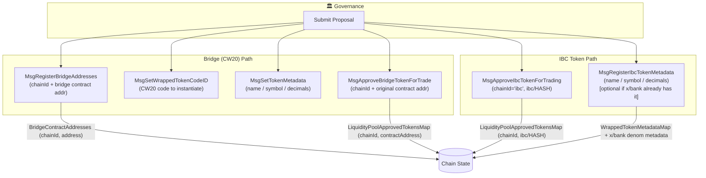
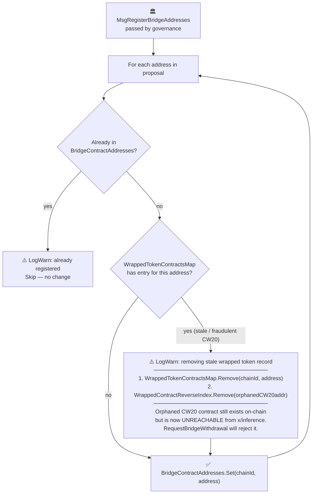
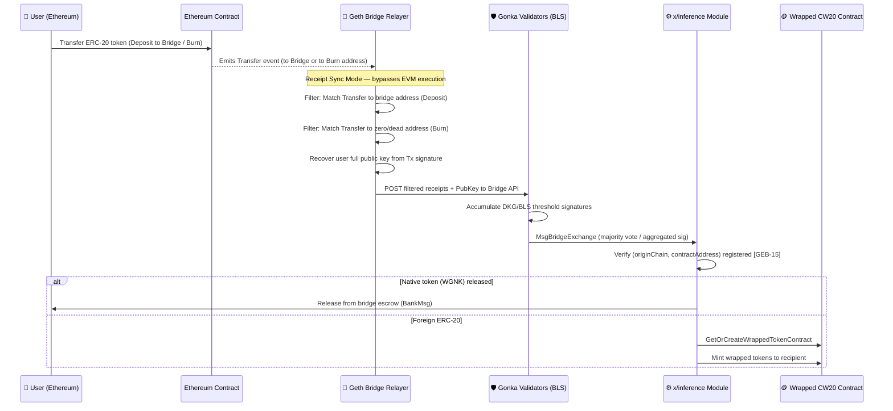
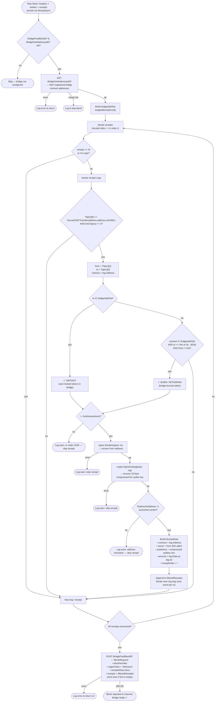
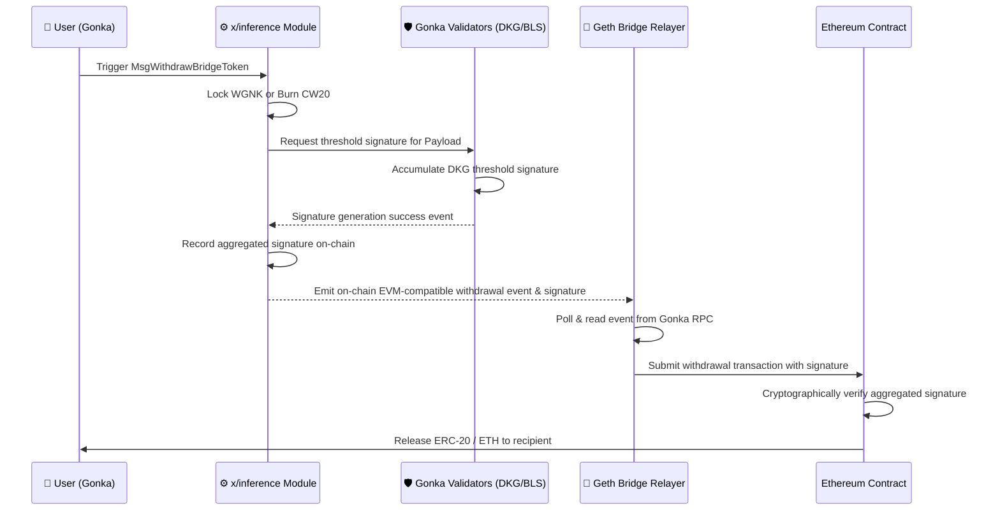
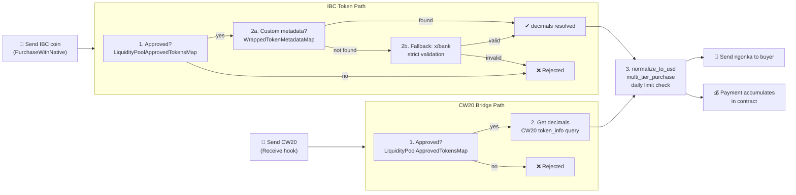
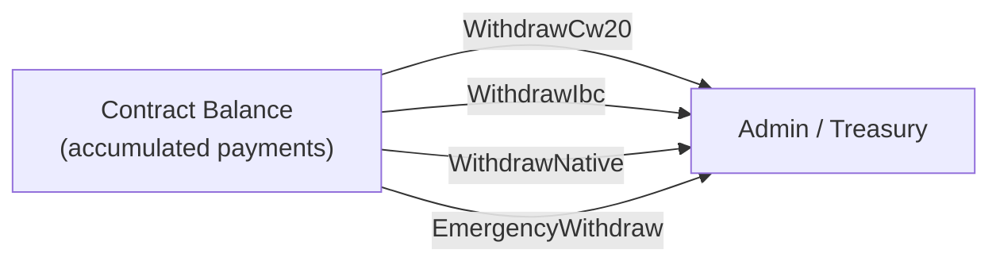
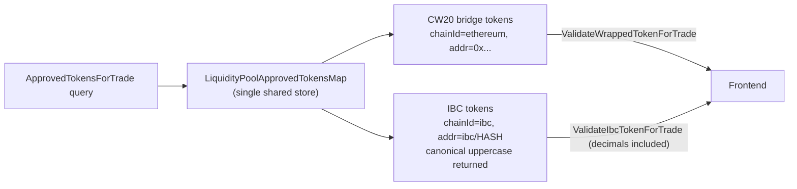

# IBC & Wrapped Token Cycle

Two parallel token paths lead into the Gonka Liquidity Pool. Both go through governance approval before any user can trade with them.

---

## 1 · Governance Setup Phase

---

## 1a · Bridge Address Registration — Conflict Guard (GEB-46)

> What happens inside `MsgRegisterBridgeAddresses` when the address being registered already
> exists as a CW20 wrapped token (either from a legitimate earlier registration or from a
> fraudulent `MsgBridgeExchange` during the governance voting window).

### Why This Matters

If attacker validators co-sign a fake `MsgBridgeExchange` during the 24-hour governance voting
window — specifying the would-be bridge address as a token contract — the system would
incorrectly create a CW20 entry for that address. Once governance passes and the address enters
`BridgeContractAddresses`, the stale CW20 would create a routing collision:
- **Inbound** transactions correctly hit the native escrow-release path (the bridge-address check wins)
- But the orphaned CW20 could still be burned via `RequestBridgeWithdrawal`, generating a valid
  BLS-signed withdrawal payload where `tokenContract == address(BridgeContract)` on Ethereum —
  triggering the ETH-release branch in `withdraw()` and draining real funds.

The cleanup in `MsgRegisterBridgeAddresses` atomically closes this window the moment governance passes.
A second guard in `GetOrCreateWrappedTokenContract` prevents the collision state from ever being
created once the bridge address is registered.

| Guard | Location | Prevents |
|---|---|---|
| Cleanup on registration | `msg_server_register_bridge_addresses.go` | Stale CW20 surviving after governance passes |
| Pre-create check | `bridge_wrapped_token.go → GetOrCreateWrappedTokenContract` | New CW20 creation for any registered bridge address |

---

## 2 · Bridge (Ethereum → Gonka) Token Inbound

---

## 2a · Geth Bridge Relayer — Transaction Filtering Detail

> How `eth/bridge/bridge.go` → `ProcessBlocks()` decides which ERC-20 transfers get forwarded to the Cosmos bridge node.

### Filtering Rules Summary

| Rule | Condition | Classification | Description |
|---|---|---|---|
| **Deposit** | ERC-20 `Transfer` where `to` ∈ bridge contract addresses | ✅ Deposit (lock) | The user sent tokens **into** a registered bridge contract. The bridge contract address set is fetched fresh from `BridgeGetAddressesEP` on every block, so newly registered contracts are picked up automatically without a relayer restart. |
| **Burn** | ERC-20 `Transfer` where the **emitting contract** ∈ bridge addresses AND `to` == `0x0000…0000` or `0x000…dEaD` AND `from` ≠ `0x0` | ✅ Burn (withdraw) | The bridge token contract itself burned tokens to a well-known dead address, signalling a withdrawal back to Ethereum. The `from ≠ 0x0` guard explicitly excludes **mint** events (which appear as Transfer from `0x0`), so mints are never misclassified as burns. The two accepted burn addresses are the EVM zero address and the canonical `0xdead` address. |
| **Skip** | `Topics[0]` is not `keccak256("Transfer(address,address,uint256)")` OR fewer than 3 topics | ⛔ Ignored | Non-Transfer events (e.g. `Approval`, custom events) are discarded at the topic-signature gate before any address matching is attempted. Logs with fewer than 3 topics are malformed Transfer events and are also dropped. |
| **Skip** | Transfer does not match deposit OR burn criteria | ⛔ Ignored | Ordinary peer-to-peer ERC-20 transfers between two user wallets produce no receipt entry. Only transfers **to** bridge contracts or **from** bridge contracts **to** burn addresses are relevant to the bridge. |
| **Skip** | Receipt index `i` ≥ number of transactions in block | ⛔ Skipped with warning | Guards against a data-consistency bug where receipts and transactions are misaligned. Logged as a warning so it is visible in metrics without halting the relayer. |
| **Skip** | `types.Sender()` recovery fails | ⛔ Skipped with warning | The transaction signature is invalid or the signer type cannot be determined. The receipt is dropped; the block POST still proceeds with other valid receipts. |
| **Skip** | `crypto.SigToPub()` fails or recovered address ≠ `types.Sender()` | ⛔ Skipped with warning | The full uncompressed public key could not be recovered, or the key does not hash back to the expected Ethereum address. The public key is required by the Cosmos bridge to verify the depositor's identity on-chain, so the receipt is dropped if it cannot be reliably obtained. |
| **One event per tx** | After the first matching log in a receipt, the inner log loop `break`s | ℹ️ At most one ReceiptData per transaction | Prevents double-counting when a single transaction emits multiple Transfer events (e.g. a router hop). Only the first matching bridge-relevant log in each receipt is forwarded. |

---

## 3 · Bridge (Gonka → Ethereum) Token Outbound

---

## 4 · Trading in the Liquidity Pool

---

## 5 · Admin Withdrawal

---

## 6 · Unified Token Discovery (UI / Frontend)

---

## Key Design Principles

| Concern | CW20 (Bridge) | IBC |
|---|---|---|
| **Registration** | `MsgRegisterBridgeAddresses` + `MsgApproveBridgeTokenForTrade` | `MsgApproveIbcTokenForTrading` |
| **Metadata** | `MsgSetTokenMetadata` (custom store) | `MsgRegisterIbcTokenMetadata` → also writes x/bank |
| **Decimals source** | CW20 `token_info` query | governance store → fallback to x/bank |
| **Validation query** | `ValidateWrappedTokenForTrade` | `ValidateIbcTokenForTrade` |
| **Payment accumulation** | Contract holds CW20 | Contract holds IBC coins |
| **Admin withdrawal** | `WithdrawCw20` | `WithdrawIbc` |
| **Approval store** | `LiquidityPoolApprovedTokensMap` | same map (unified) |
| **Casing** | lowercase normalized | original casing preserved (`ibc/UPPERCASE`) |
